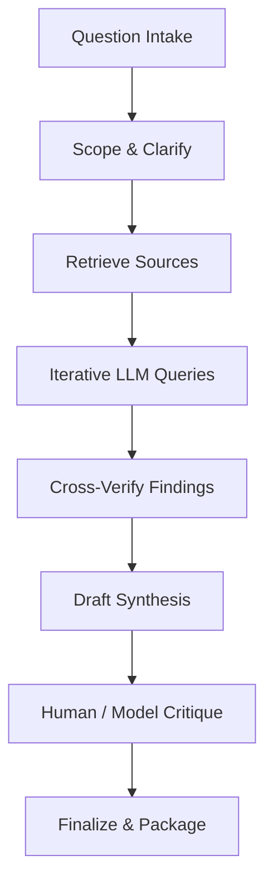

process for dep researcH:
Perfect. I’ll develop a comprehensive, practitioner-ready playbook that reverse-engineers how OpenAI and Google Gemini teams conduct deep research with LLMs as of 2024–2025. It will focus on reproducible practices you can implement independently, blending generalist and technical analyst workflows.

This will include:

* An executive summary
* A step-by-step playbook with detailed tooling, prompts, and workflows
* A Mermaid flowchart visualizing the pipeline
* Annotated bibliography with ≥10 authoritative sources
* Risks and mitigation strategies (e.g., hallucinations, citation drift, IP safety)

I’ll notify you once it’s ready for review.

# Deep Research with LLMs: An OpenAI & Google Gemini Playbook

## Executive Summary

“Deep research” is a new paradigm in AI, referring to agentic pipelines where large language models (LLMs) autonomously conduct multi-step research and produce comprehensive reports. Frontier labs like OpenAI and Google have developed **Deep Research** features (in ChatGPT and Gemini, respectively) that drastically compress hours of manual investigation into minutes. These systems combine real-time web retrieval with advanced reasoning, allowing an LLM to search, read, and synthesize information from dozens of sources with minimal human guidance.

Both OpenAI and Google’s pipelines share core steps: clarifying the query, formulating a research plan, iteratively querying and scraping sources, cross-verifying facts, and finally drafting a cited report. OpenAI’s Deep Research (built on a fine-tuned *o3* model) emphasizes exhaustive analysis and detailed outputs with embedded citations and even data visualizations. Google’s Gemini Deep Research, integrated with its search prowess, offers a more interactive experience – it proposes a research plan for user approval and refines its searches in real time. While OpenAI’s reports tend to be more in-depth and technical, Google’s are concise and user-friendly, with easy export to Google Docs. Both approaches far outperform ad-hoc research by systematically covering a broad information landscape, ensuring traceability through citations, and freeing human analysts from tedious fact-finding.

The following playbook outlines a phase-by-phase pipeline to replicate these deep research workflows. It details each phase’s goal, concrete actions (including example LLM prompts), recommended tools (like LangChain and LlamaIndex for Retrieval-Augmented Generation), and success criteria. A Mermaid flowchart illustrates the end-to-end process, and subsequent sections discuss key methodologies (RAG, iterative refinement, citation handling, human oversight, automation) and how to implement them. An annotated bibliography of authoritative sources and a Risks & Mitigations guide (covering hallucinations, data freshness, and IP concerns) are provided to ensure reliable and responsible use.

## Overview: “Deep Research” in Frontier AI Labs

**Defining Deep Research:** In the context of advanced AI labs, *deep research* refers to an AI-driven report generation system that takes a user’s complex query and uses LLMs as autonomous agents to **iteratively search, read, and analyze information across the web**, ultimately producing a detailed, well-sourced report. Unlike a standard chatbot response, which relies mostly on pre-trained internal knowledge, deep research agents actively retrieve up-to-date external data (web pages, papers, etc.), perform multi-step reasoning or computations (e.g. using Python for analysis), and compile findings with explicit citations. This capability emerged in 2024–2025 as labs pushed beyond one-turn Q\&A toward *agentic* AI that can execute entire research tasks autonomously. It’s essentially an evolution of Retrieval-Augmented Generation (RAG) pipelines, scaled up to “conduct research” at the level of a human analyst, with the LLM orchestrating search queries, source retrieval, fact-checking, and synthesis.

**OpenAI vs Google Gemini Pipelines:** Both OpenAI and Google have introduced similarly named Deep Research features, but with notable differences in execution. **OpenAI’s Deep Research**, launched within ChatGPT (early 2025), is powered by a fine-tuned *OpenAI o3* model optimized for browsing and reasoning. The user enters a query in a special “Deep Research” mode, and the agent may ask a few clarifying questions before diving in. It then autonomously searches the web, scrapes top results, and extracts relevant snippets from *hundreds of sources* if needed. The process is largely automatic – there’s no manual approval step mid-way – and after 5–30 minutes it returns a comprehensive report in the chat, complete with section headings, analytical commentary, and inline citations linking to sources. OpenAI’s system tends to prioritize depth and thoroughness: it can generate lengthy reports (often thousands of words) that synthesize niche details across many documents. It was explicitly trained via reinforcement learning to plan multi-step research trajectories and even use tools (e.g. a Python interpreter for data or plotting) to enrich the analysis.

**Google’s Gemini Deep Research**, released a few months earlier (late 2024), takes a slightly different approach focused on user collaboration and efficiency. When a query is posed in Gemini’s Advanced mode, the AI first proposes a **multi-step research plan** – essentially an outline of how it will tackle the question (which topics to investigate, which sources or aspects to cover). The user can revise or approve this plan, adding a human-in-the-loop checkpoint early in the process. Once approved, Gemini executes the plan: it uses Google’s search expertise to find relevant info, then iteratively “reads” and refines, much like a person browsing—searching, clicking sources, then launching new searches based on what it found. This loop runs for a few minutes, after which Gemini produces a **comprehensive summary report** of key findings, organized for readability and with links to the original sources for each claim. Google’s output is generally more concise and high-level than OpenAI’s; it tends to highlight major points and provide an easy-to-scan format (bullet points, tables) by default. The integration with Google’s ecosystem means the final report can be exported to Google Docs in one click, preserving formatting and citations for further editing or sharing.

**Key Similarities:** Both pipelines leverage LLMs to conduct **iterative, multi-hop retrieval** – meaning they don’t stop at one search query, but continuously generate new queries or follow-up questions as more information is uncovered. They both emphasize **source-backed answers**: every factual claim in the report is (ideally) accompanied by a citation or link so the user can trace it back. In essence, these systems serve as tireless research assistants that comb through far more material than a human likely could, then distill it into a coherent narrative. Both OpenAI and Google have found that this approach yields more reliable and in-depth results than standard one-shot Q\&A; for example, the model behind OpenAI’s Deep Research achieved state-of-the-art accuracy on real-world problem-solving benchmarks by *actively seeking out specialized information* instead of relying on static training data. Crucially, both systems include guardrails to keep the AI on track: they clarify ambiguous requests up front, they use the context from multiple sources to reduce mistakes, and they were fine-tuned to minimize hallucinations and unsupported statements (though not eliminated entirely, as discussed later).

**Notable Differences:** OpenAI’s and Google’s pipelines diverge in user experience and focus. **Interactivity:** Google Gemini’s process is more interactive at the start – it asks the user to confirm the research direction via the plan and will readily take user feedback to adjust scope or format. OpenAI’s Deep Research also asks clarifying questions if the query is vague (e.g. “Which country or time frame did you have in mind?”), but once it starts the research phase, it runs autonomously without further user input until the final report is ready. **Depth vs. Speed:** OpenAI’s reports tend to be lengthier and more detailed – ideal for a thorough analysis – whereas Google often aims for brevity and quick turnaround. In fact, one early comparison noted that Gemini’s output felt “like what you could pull from a quick Google search” on a topic (surface-level), while ChatGPT’s output, though slower, included more novel insights and nuance beyond the obvious first-page results. **Source preferences:** Google’s reliance on its search engine can make it susceptible to **SEO-driven bias**, favoring highly ranked or popular sites which may not always be the most authoritative. This sometimes led to Gemini citing generic or tangential sources. OpenAI’s agent also uses web search (it was often integrated with Bing’s API during development), but appears to cross-reference more and sometimes pulls from academic papers or less SEO-optimized sources when relevant. Users have observed that OpenAI’s citations are “generally reliable with some errors”, whereas Gemini’s were occasionally off-mark or mismatched. **Formatting and output:** Gemini automatically organizes information into clean tables or bullet lists if requested and keeps the output polished, even offering an export to Docs. ChatGPT’s deep research output is thorough but can be a dense wall of text by default (since it tries to include everything); the user might have to ask it to summarize or format differently after the fact. Also, OpenAI is starting to incorporate visual elements (charts, images) into the reports, but Google’s integration with its own services gives it an edge in convenient packaging. **Cost and access:** There’s also a practical difference in availability – as of 2025, OpenAI’s full Deep Research mode is a premium feature (originally \~\$200/month at launch, later included in ChatGPT Pro/Teams plans), whereas Google’s Gemini Advanced (with Deep Research) is around \$20/month and aimed at a wider user base. OpenAI’s offering, geared toward enterprise and research professionals, justifies the higher cost with its more powerful analysis and multi-modal support (e.g. file uploads, data analysis with Python). Google’s is positioned as a more accessible tool for general users and business users who need quick insights with less budget.

**Why It Outperforms Ad-Hoc Research:** Both OpenAI and Google’s deep research pipelines demonstrate significant improvements over a typical manual research approach in several ways. First, **breadth and speed**: an AI agent can scour 20+ sources and compile a report in under 30 minutes – something that might take a human researcher days of searching and reading. The AI doesn’t tire or get bored by reading dense documents, and it can **parallelize** some work (OpenAI’s agent can open multiple browser tabs or run Python analyses concurrently) to cover more ground quickly. Users have reported that these tools “came back with details that would have taken hours (or days) to compile manually”, unearthing insights (like niche competitors or obscure historical facts) that they **“may not have otherwise known about or thought of”**. Second, **systematic depth**: The multi-step reasoning ensures fewer loose ends – the LLM can chase down a question through many layers of references (e.g. finding a statistic in a report, then finding what study that report cites, and so on) which yields a more comprehensive understanding than a quick surface skim. This process often discovers non-intuitive or hidden information that a casual search might miss. Third, **traceability and trust**: Unlike a human summary or a standalone language model answer, the deep research outputs are fully annotated. Every key claim is accompanied by a citation link, allowing the user (or anyone reviewing the work) to verify facts. This level of documentation means the final deliverable isn’t just an answer, but a mini-library of evidence on the topic – a huge boon for decision-makers who need to trust the analysis. It also helps mitigate the LLM’s tendency to hallucinate, since the model is prompted to find a source for each statement it makes. Finally, **efficiency for the human analyst**: These pipelines handle the low-level grunt work – scoping out sources, skimming them for relevant bits, aggregating data – which frees up human experts to do higher-level thinking (like interpreting the implications or tailoring the narrative to their audience). In practice, using deep research mode can turn an *“I need a full market report by end of week”* task into something that’s 80% done by the AI in a morning, leaving the human to refine and fact-check the remaining 20%. In sum, the structured approach of deep research yields a more **thorough, up-to-date, and verifiable** result than ad-hoc Googling and manual note-taking typically would.

---

## Step-by-Step Deep Research Playbook (OpenAI & Google Pipelines)

The table below breaks down the deep research workflow into seven phases, aligning with how OpenAI and Google implement their pipelines. Each phase includes its **Goal**, the **Core Actions** taken (with example prompts or steps), the **Tools/Artifacts** used (including open-source equivalents to replicate that phase), and **Success Checks** to verify the phase was completed effectively. This playbook can be used as a template for running your own deep research process, leveraging LLMs in a controlled, stepwise manner.

| **Phase**                                                          | **Goal**                                                                                                                                    | **Core Actions (with Example Prompts & Tips)**                                                                                                                                                                                                                                                                                                                                                                                                                                                                                                                                                                                                                                                                                                                                                                                                                                                                                                                                                                                                                                                                                                                                                                                                                                                                                                                                                                                                                                                                                                                                                                                                                                                                                                                                                                                                                                                                                                                                                                                                                                                                                                                                                                                                                                                                                                                                                                                                                                                                                                                                                                                                                                                                                        | **Tools/Artifacts**                                                                                                                                                                                                                                                                                                                                                                                                                                                                                                                                                                                                                                                                                                                                                                                                                                                                                                                                                                                                                                                                                                                                                                                                                                                                                                                                                                                                            | **Success Checks**                                                                                                                                                                                                                                                                                                                                                                                                                                                                                                                                                                                                                                                                                                                                                                                                                                                                                                                                                                                                                                                                                                                                                                                                                                                         |
| ------------------------------------------------------------------ | ------------------------------------------------------------------------------------------------------------------------------------------- | ------------------------------------------------------------------------------------------------------------------------------------------------------------------------------------------------------------------------------------------------------------------------------------------------------------------------------------------------------------------------------------------------------------------------------------------------------------------------------------------------------------------------------------------------------------------------------------------------------------------------------------------------------------------------------------------------------------------------------------------------------------------------------------------------------------------------------------------------------------------------------------------------------------------------------------------------------------------------------------------------------------------------------------------------------------------------------------------------------------------------------------------------------------------------------------------------------------------------------------------------------------------------------------------------------------------------------------------------------------------------------------------------------------------------------------------------------------------------------------------------------------------------------------------------------------------------------------------------------------------------------------------------------------------------------------------------------------------------------------------------------------------------------------------------------------------------------------------------------------------------------------------------------------------------------------------------------------------------------------------------------------------------------------------------------------------------------------------------------------------------------------------------------------------------------------------------------------------------------------------------------------------------------------------------------------------------------------------------------------------------------------------------------------------------------------------------------------------------------------------------------------------------------------------------------------------------------------------------------------------------------------------------------------------------------------------------------------------------------------- | ------------------------------------------------------------------------------------------------------------------------------------------------------------------------------------------------------------------------------------------------------------------------------------------------------------------------------------------------------------------------------------------------------------------------------------------------------------------------------------------------------------------------------------------------------------------------------------------------------------------------------------------------------------------------------------------------------------------------------------------------------------------------------------------------------------------------------------------------------------------------------------------------------------------------------------------------------------------------------------------------------------------------------------------------------------------------------------------------------------------------------------------------------------------------------------------------------------------------------------------------------------------------------------------------------------------------------------------------------------------------------------------------------------------------------ | -------------------------------------------------------------------------------------------------------------------------------------------------------------------------------------------------------------------------------------------------------------------------------------------------------------------------------------------------------------------------------------------------------------------------------------------------------------------------------------------------------------------------------------------------------------------------------------------------------------------------------------------------------------------------------------------------------------------------------------------------------------------------------------------------------------------------------------------------------------------------------------------------------------------------------------------------------------------------------------------------------------------------------------------------------------------------------------------------------------------------------------------------------------------------------------------------------------------------------------------------------------------------- |
| **1. Question Scoping**  *(Intake & Clarify)*                   | Ensure the research question is well-defined, with clear scope and requirements, before the agent begins.                                   | • **Understand context & intent:** The LLM (or human analyst) asks clarifying questions to pin down what the user *really* needs. For example, *“Could you clarify if you want global data or a specific region?”*.  • **Define output format & criteria:** Determine the desired depth, format (report, table, etc.), and key aspects to cover. Prompt tip: *“Confirming: you need a competitive analysis of X, focusing on Y metrics, delivered as a bullet-point report.”*  • **Identify constraints:** Note any deadlines, length limits, or specific sources to include/avoid.  • **Persona & tone setting:** (Optional) Establish the role (e.g. “You are a financial analyst…”) to guide the voice.                                                                                                                                                                                                                                                                                                                                                                                                                                                                                                                                                                                                                                                                                                                                                                                                                                                                                                                                                                                                                                                                                                                                                                                                                                                                                                                                                                                                                                                                                                                                                                                                                                                                                                                                                                                                                                                                                                                                                                                                                   | - Chat interface (ChatGPT or Gemini UI) for initial Q\&A.  - **LLM prompt templates** for clarifying queries (e.g. LangChain’s `ConversationChain` for interactive clarification).  - A brief **project brief document** capturing the refined question, scope, and deliverable expectations.                                                                                                                                                                                                                                                                                                                                                                                                                                                                                                                                                                                                                                                                                                                                                                                                                                                                                                                                                                                                                                                                                                                            | ✅ User’s needs are **unambiguous**: The query is narrowed to a specific question or set of sub-questions, agreed upon by both user and AI.  ✅ **Research plan parameters set**: The AI knows the domains/topics to focus on, and the user has confirmed the format (e.g. “comprehensive report with citations”).  ✅ **No hidden assumptions**: Any vague terms or goals have been discussed (the AI asked follow-ups rather than guessing). The user’s intent and priorities are documented.                                                                                                                                                                                                                                                                                                                                                                                                                                                                                                                                                                                                                                                                                                                                                                         |
| **2. Retrieval Planning**  *(Research Plan & Query Generation)* | Formulate a strategic plan for retrieving information: what to search for, where to find data, and how to break the problem into sub-tasks. | • **Outline subtopics**: The agent (or analyst) breaks the main question into a research outline or segments. e.g. If the query is broad (“autonomous vehicle sensor trends”), segments might be “Lidar vs Radar vs Camera”, “emerging sensor tech”, “market outlook”.  • **Generate search queries**: For each subtopic, the LLM proposes specific search strings or source targets. *Prompt example:* *“List initial search queries to find info on \[subtopic].”* It might produce a list like “`autonomous vehicle sensor market 2025 report`”, “`new LiDAR sensor breakthroughs 2024`”, etc.  • **Select sources & data sources**: Decide where to search – general web, academic databases (for scholarly info), news sites, etc. Google’s agent, for instance, uses its internal search engine by default, while OpenAI’s might use Bing/WebPilot. Tip: use **vertical searches** (Google Scholar, Patents, etc.) if needed.  • **User approval (Google’s step)**: Present the plan outline & search strategy to the user. e.g. “*Plan: I will research A, B, C in this order, looking at news, then scholarly articles… Does this sound good?*” Adjust based on feedback.                                                                                                                                                                                                                                                                                                                                                                                                                                                                                                                                                                                                                                                                                                                                                                                                                                                                                                                                                                                                                                                                                                                                                                                                                                                                                                                                                                                                                                                                                                                                            | - **Search planning tools**: e.g. *LangChain’s* `Agent` with a search tool (SerpAPI, Bing API) to automatically generate and execute queries.  - *LlamaIndex (GPT Index)* can be used to define **knowledge source connectors** (web loaders, PDF loaders) for planned sources.  - Simple **outline document** or **Mind-map** capturing the research plan breakdown (could be created by the LLM).  - *OpenAI’s approach*: internal planning done via the model’s chain-of-thought (not exposed to user); *Google’s approach*: visible outline for user to approve.                                                                                                                                                                                                                                                                                                                                                                                                                                                                                                                                                                                                                                                                                                                                                                                                                                                  | ✅ **Clear research plan**: A list of sub-questions or sections that cover the whole query, leaving no major aspect unplanned.  ✅ **Targeted queries** for each subtopic: not too broad (which yields irrelevant info) nor too narrow (missing big picture). Each query is likely to yield useful results (test by a quick search).  ✅ **User buy-in** (if interactive): The user approves the outline/plan, confirming it aligns with their goals. Any user-specified sources or exclusions are noted.  ✅ **Tool readiness**: All needed search APIs, data connectors, or credentials are available for the next phase (no last-minute roadblocks like paywalls without a plan).                                                                                                                                                                                                                                                                                                                                                                                                                                                                                                                                                                                  |
| **3. Iterative Querying**  *(Search & Browse Sources)*          | Retrieve relevant information through iterative searches and browsing, guided by the LLM’s reasoning.                                       | • **Execute initial searches**: The agent issues the first search query from the plan and retrieves top results. It skims snippets and decides which links to click.  • **Browser navigation**: The LLM “clicks” on a result and the content is fetched. It reads the page (or significant portions) and extracts relevant facts or data. Many deep research agents will **summarize or note-take** on the fly – e.g. *“Source A says XYZ (citation).”*  • **Iterative refinement**: Based on what it learns, the agent formulates new queries or follow-up searches. *Example:* After reading that “LiDAR costs dropped 20% in 2023”, the agent might search “2024 LiDAR price trend graph”. This loop repeats: search → read → generate new query → search… until each subtopic seems thoroughly covered.  • **Parallel searches**: To speed up, the agent might run multiple searches concurrently for independent subtopics (open-source implementations support this).  • **Tool use for data**: If quantitative data or calculations are needed, the agent invokes tools (OpenAI’s uses a Python tool for analysis or visualization). For example, it might fetch a CSV, then calculate stats or plot a chart.  • **Chunking & embedding** (RAG strategy): For very large documents, the system may chunk text and use vector embeddings to find which sections are most relevant to the query. This ensures the LLM focuses on pertinent passages.  • **Monitor progress**: The agent keeps track of which plan sections are answered and which remain. It may output a “thought process” log (as seen in ChatGPT’s sidebar or Gemini’s progress bar) showing steps taken.                                                                                                                                                                                                                                                                                                                                                                                                                                                                                                                                                                                                                                                                                                                                                                                                                                                                                                                                                                                                                                   | - **Web search API** (Bing, Google Custom Search) to programmatically get search results.  - **Headless browser or HTML parser**: e.g. Python requests + BeautifulSoup, or tools like *Playwright* for dynamic sites. (OpenAI uses a built-in browser in ChatGPT; Google’s is native to their app).  - **LangChain agents**: The ReAct agent paradigm can loop LLM thoughts with actions (search, lookup) until a stopping criteria.  - **Vector database** (FAISS, Pinecone) + embedding model: store chunks of content and enable semantic similarity search for relevant info. Useful if a known corpus or for caching visited pages.  - **LlamaIndex**: can index visited pages on the fly and answer questions over them, serving as memory so the agent can ask “what did I learn about X?”  - **Python tool**: for any data-heavy operations (Pandas for data tables, Matplotlib for charts). Often integrated via an eval sandbox (OpenAI’s system does this internally).                                                                                                                                                                                                                                                                                                                                                                                                                               | ✅ **Extensive coverage**: The agent has visited a **diverse set of sources** (news articles, blogs, PDFs, academic papers as appropriate) – not just one or two webpages – covering all facets of the query. For example, Gemini noted it browsed a higher volume of sources for breadth.  ✅ **Relevance**: Information gathered is clearly pertinent to the research question. Irrelevant tangents were minimal (the agent should drop lines of inquiry that don’t pay off).  ✅ **Iterative depth**: The agent refined its queries at least a few cycles deep for each major subtopic, especially if initial results were superficial. Evidence of this is found in its reasoning log or notes (e.g. “Found X, now searching for Y to corroborate”).  ✅ **No obvious gaps**: If an important known source or data point exists on the topic, the agent likely found it. A human spot-check would confirm that major angles aren’t completely missing.  ✅ **Data gathered**: Key facts, figures, quotes are extracted and logged, each tagged with source references for the next phase. The agent might produce a draft bibliography or a collection of source notes at this stage.                                                                           |
| **4. Source Triangulation**  *(Cross-verify & Refine)*          | Cross-check information across multiple sources to validate facts and resolve discrepancies or gaps.                                        | • **Compare findings:** The agent analyzes whether different sources agree or if there are conflicting statements. For example, if Source A says “Market size is \$5B” and Source B says “\$7B”, the agent flags the discrepancy. It may seek a third source or context (perhaps dates of the estimates) to reconcile this.  • **Validate claims:** For each major factual claim intended for the report, the agent ensures it has at least one credible source (preferably more). If a claim only appeared once or seems dubious, it triggers an additional search or uses a different method (e.g. checking an official report or database).  • **Handle inconsistencies:** The LLM might directly note, “Sources differ on this point,” and decide how to present it (either choose the most credible source or mention the range of opinions). It can use reasoning prompts like: *“Given conflicting data from source X and Y, which is more reliable or recent?”*.  • **Fill gaps:** If during verification the agent realizes a subtopic wasn’t fully answered (say no source addressed “future trends” enough), it goes back to search specifically for that gap. This is an iterative loop with Phase 3.  • **Bias check:** The agent assesses if it inadvertently pulled from biased or low-quality sources (e.g. SEO spam, outdated info). Google’s pipeline had issues with SEO bias, so a mitigation is to prefer authoritative domains (academic, gov, well-known experts). The agent might re-rank sources by credibility (this can be guided via an internal heuristic or an LLM prompt: *“Rate the trustworthiness of these sources.”*).  • **Summarize consensus:** The outcome is an internal consolidated understanding – the agent now has a set of vetted facts that multiple sources support, which will form the backbone of the report.                                                                                                                                                                                                                                                                                                                                                                                                                                                                                                                                                                                                                                                                                                                                                                                                                                                       | - **LLM reasoning**: Using the LLM itself to do consistency checks (e.g. prompt it with collected statements: “Do these sources agree? If not, why?”).  - **Automated verification tools**: e.g. use *external fact-check APIs* or databases (WolframAlpha for certain facts, or regulatory filings for company data) to verify key numbers independently.  - *LangChain* can orchestrate a \**“multi-agent” approach here*: one agent retrieves evidence, another acts as a “critic” to question each piece. For instance, one could implement a secondary agent that tries to find counter-evidence or source context for each claim (akin to a devil’s advocate search).  - **Vector search for corroboration**: If using an indexed corpus, query the index with a claim to see if multiple documents mention it (and retrieve those snippets).  - **Human analyst review** (human-in-loop): At this stage a human might spot-check a few critical facts and ensure sources are reputable.                                                                                                                                                                                                                                                                                                                                                                                                                     | ✅ **Consistency achieved**: All important facts in the working notes have at least one corroborating source or have been updated with the most credible value. The final data is **cross-checked**, reducing the chance of a lone outlier or misquote slipping in.  ✅ **Resolved contradictions**: If sources disagreed, the report will either note the disagreement with context or present the most likely correct info with reasoning. No glaring contradictions remain unaddressed.  ✅ **Source quality**: Low-quality sources have been pruned or replaced. Ideally, references skew toward primary sources (e.g. official stats, well-regarded publications) rather than random blogs, unless the latter contained unique info that was verified.  ✅ **Complete coverage**: Any previously missing pieces of the puzzle have been found or explicitly noted as open questions. The agent is now ready to synthesize, armed with a solid set of facts.                                                                                                                                                                                                                                                                                                      |
| **5. Synthesis & Drafting**  *(Compose the Report)*             | Transform the compiled research findings into a coherent, structured report with citations.                                                 | • **Create outline/structure**: The agent organizes the report according to either the initial outline (from Phase 2) or a revised one based on findings. Sections might be thematic or by question. The LLM can be prompted: *“Draft a report with sections: Introduction, A, B, C, Conclusion.”* It will ensure a logical flow (e.g. broad context first, then specifics, then summary).  • **Write comprehensive content**: Using its internal knowledge augmented by the retrieved details, the LLM writes paragraphs explaining each point. It **integrates source evidence** by quoting or paraphrasing the info gathered, and adds analysis or interpretation as needed. For instance, *“According to a 2024 study, LiDAR prices have fallen 20%【source】, making them more competitive with cameras. This trend is expected to continue…”*. Because the model was fine-tuned for multi-document summarization, it excels at weaving together info from many sources.  • **Cite sources**: After making a statement, the agent inserts a citation marker linking to the source (as seen in this document format). Both OpenAI and Gemini ensure outputs have clear citations (often numeric or in-text links). In practice, the LLM might keep track: “Sentence about stat X comes from Source \[2], attach citation.” The formatting could be MLA/APA style or markdown reference links as required.  • **Embed visuals or data (if supported)**: If the system allows, the agent can include a chart, table, or image to illustrate key points. For example, ChatGPT’s deep research can generate a Matplotlib chart and then include it in the answer. At minimum, the agent may output tables for clarity (e.g. comparison tables of features, as requested by the user).  • **Ensure coherence**: The draft is read (by the LLM itself) to check that it reads as a single voice, transitions are smooth, and it answers the original question fully. The LLM might do a self-review: *“Does this report fully address the query? Is it well-organized?”*.  • **Length control**: If the draft is too long or too short, adjust. The LLM can summarize sections or expand details as needed to meet the expected length/level of detail.                                                                                                                                                                                                                                                                                                                                                                                                                                                                    | - **LLM (large model)**: This is the core writing step – typically a GPT-4 class model or Google’s Gemini model with a large context window (OpenAI uses \~128k context for deep research; Google uses up to 1M tokens context to handle many sources).  - **Prompt templates for citations**: E.g. instruct the model “After every sentence containing external info, add a citation like \[#].” Some agents might fill in citations in a post-processing step by matching content to sources.  - If using open-source LLMs: one might use a powerful model like Llama 2 70B or Claude 2 for drafting, with all retrieved snippets provided in the prompt (or accessible via a vector index).  - **LlamaIndex** can facilitate a *Composed Summary*: it can take the set of source documents and ask the LLM to compose a final summary with citations to each doc.  - **Document editor**: The draft might be produced in Markdown (for easy formatting of headings, bullets, tables) and later converted to PDF or Word as needed. Google’s output can go straight to Google Docs for formatting.                                                                                                                                                                                                                                                                                                               | ✅ **Addresses the query**: The draft report clearly answers the original question or fulfills the task goal (as scoped in Phase 1). A quick read shows all key points are covered, and no part of the request was ignored.  ✅ **Logical structure**: The content is organized into sections with descriptive headings, making it easy to follow. It has an intro and conclusion if appropriate, and each section sticks to its topic.  ✅ **Factual accuracy with citations**: Every factual claim, statistic, or quote in the draft is accompanied by a citation. If one inspects the sources, they should confirm the claims (the citations are not just present, but relevant and accurate). No obviously uncited assertions remain.  ✅ **Clarity and coherence**: The prose is understandable and professional, as if written by a human analyst. It doesn’t read like a disjointed collage of sources; the tone and terminology are consistent. Jargon is explained as needed for the intended audience.  ✅ **Visuals/tables (if requested)**: Any required format elements (tables, charts, etc.) are present and correctly formatted. Data is presented clearly, and units or labels are provided.                                                       |
| **6. Expert / Model Critique**  *(Review and Refine Draft)*     | Assess the draft for any errors, hallucinations, or misinterpretations and refine for quality and safety.                                   | • **Automated self-critique**: Prompt the LLM (or a second LLM) to review the draft critically. For example: *“Analyze the above report. Identify any unsupported claims, logical gaps, or possible biases.”* The model can act as an expert reviewer, pointing out sections that need correction or clarification. OpenAI, during training, used an *LLM-as-judge* approach to grade outputs – similarly, we can use a GPT-4 or another high-end model now to evaluate the draft’s quality.  • **Fact-check each citation**: A tool or human can systematically verify that each citation actually supports the statement made. This can catch hallucinated citations (references that look plausible but don’t actually exist or say what is claimed) – a known failure mode in early LLM research assistants. If any citation is incorrect or the source wasn’t accurately represented, fix the text or replace the source.  • **Check for hallucinations or fabrications**: Ensure the model didn’t invent stats or quotes that weren’t in sources. This may involve spot-checking the content against the sources or doing a fresh search on suspicious claims. If using a tool, one approach is the “Chain-of-Verification” method: ask the model or another agent to generate questions whose answers would confirm each part of the report, then find those answers. A simpler approach: use keywords from a sentence to do a quick web search – does the info appear elsewhere reliably?  • **Safety and alignment review**: Scan the draft for any problematic content – e.g. defamatory or sensitive information, or advice that violates usage policies. Both OpenAI and Google’s systems have filters; for an independent workflow, one can use OpenAI’s moderation API or the `moderation` endpoint to flag issues. Also, ensure any personal data or IP-sensitive content is handled appropriately (e.g. properly quoted and cited, not leaked).  • **Human expert input**: If possible, have a human with domain knowledge review the draft or at least the key findings. They might catch subtle inaccuracies or provide context (for instance, an analyst might say “This finding is technically true but not significant – maybe omit or rephrase it.”). In OpenAI’s pipeline, human feedback was used to fine-tune the model’s performance; in your workflow, human-in-the-loop at this phase can greatly improve the final quality.  • **Iterate revisions**: Incorporate all identified corrections. The LLM can be tasked to *“Revise the report according to the following feedback…”* listing each issue. This may produce a second draft that resolves problems. Repeat review if necessary. | - **Secondary LLM or “critic model”**: Possibly use a different model from the one that wrote the draft, to get an unbiased critique. For example, if GPT-4 wrote it, you might use Claude or another GPT-4 instance to review, since it might spot issues the original missed.  - **Automated fact-checking**: Tools like **SourceCheck** or custom scripts to compare claims against sources. There are research libraries (e.g. *TruthfulQA*, or embedding-based similarity checks) to detect if a sentence is likely a hallucination by seeing if its content can be found in the reference material.  - **OpenAI Evals / Rubrics**: OpenAI has an evals framework that can systematically score outputs on various criteria. One can design an eval to ensure each section has citation, etc.  - **Guardrails (open-source)**: Libraries like *Guardrails AI* can enforce that certain requirements are met in the output (e.g. no disallowed content, presence of citations in brackets). These can be applied to the LLM’s output post-hoc.  - **Human reviewer**: Even just a colleague or the end-user doing a read-through at this point with track-changes can be valuable.  - **Version control**: Keep the original draft and highlight changes made in the refinement, in case of any need to revert or understand how it evolved (especially if multiple agents/humans are involved in editing). | ✅ **No factual errors**: All factual statements in the revised report are verified by sources or common knowledge. Any previously uncertain points have been fixed or qualified. A test could be: take a random fact from the report and see if the cited source (or a quick search) confirms it. The report passes this test for all key facts.  ✅ **No hallucinated references**: Every citation corresponds to a real document, and the context in that document matches the usage. There are no instances of the AI “making up” a source or quote.  ✅ **Quality & clarity improved**: The critique cycle caught any unclear explanations or weak arguments and the final draft is sharper. For example, run it through a checklist: Are all acronyms expanded? Is the tone appropriate? Any extraneous info removed? The answer to all should be yes/optimal.  ✅ **Safe and compliant**: The content adheres to guidelines. No sensitive personal data is revealed improperly, and any potentially harmful or biased statements have been edited out or addressed with context.  ✅ **Approval to finalize**: If a human stakeholder or project lead is involved, they sign off that the report meets the required standards after seeing the improvements. |
| **7. Final Packaging**  *(Finalize & Deliver)*                  | Present the research findings in the required format, with all supporting materials, ready for the end-user or stakeholders.                | • **Format the document**: Ensure the report is nicely formatted for the target medium. In Markdown, that means proper headings, bullet lists, tables, etc. If delivering as a PDF/Word, convert accordingly, making sure citations appear as clickable links or footnotes. Google’s Gemini automatically maintaining formatting on export to Docs is an example of smooth packaging.  • **Include metadata and references**: Add a bibliography or reference list if needed. For a professional report, list full source details (URLs, titles, authors, dates). For academic style, DOIs or publication info should be included for any academic papers cited. (This can often be generated by the LLM: *“Provide reference details for \[URL]”* to get title/author).  • **Embed any images/graphs**: If the research included generated charts or fetched images (within usage rights), embed them in-line at appropriate spots with captions. Ensure image sources are credited if required.  • **Executive summary or abstract**: Often it’s useful to prepend a short summary of the findings (especially for long reports). The LLM can generate this by condensing the report into a 200-word overview, or highlight 3-5 key bullet takeaways for executive readers.  • **Final quality pass**: Do a last skim for any formatting glitches, broken links, or typos. Sometimes during formatting, link syntax might break – verify all citation links resolve to the intended source.  • **Delivery**: Send or present the output through the appropriate channel – e.g. as a file, an email, or via the chat interface itself. In a collaborative setting, you might upload the final report to a knowledge base or share a Google Doc link with the team.                                                                                                                                                                                                                                                                                                                                                                                                                                                                                                                                                                                                                                                                                                                                                                                                                                                                                                                                                    | - **Document processor**: For conversion, use tools like *Pandoc* (to go from Markdown to PDF/Word). Or if working in Google Docs from Gemini, the doc is already there; just polish and share.  - **Reference manager**: For many citations, using a tool like *Zotero* or *CrossRef* API to fetch metadata (DOI, etc.) can be helpful. Some LLM workflows automate this: after drafting, they fetch complete reference info for each link.  - **Image handling**: If images were generated or fetched, ensure they are in an accessible format. Possibly use an image hosting or embed mechanism (as done in this Markdown with `†embed_image`).  - **Style templates**: If the organization requires a specific report template (e.g. company logo, headers/footers), apply those now. This is more manual, though future LLM tools might handle templates.  - **Zipping artifacts**: Package any supplementary data (like the raw data files analyzed, or appendices with detailed tables) alongside if needed. OpenAI’s deep research, for instance, can output data analysis results that might be provided in a CSV attachment.                                                                                                                                                                                                                                                                             | ✅ **Polished output**: The final deliverable looks professional and is easy to read. Headings, fonts, spacing are consistent. The report can be handed to its target audience without further editing.  ✅ **All citations complete**: The bibliography or reference section is included (if required), and provides enough info for readers to locate the sources. DOI links or direct URLs are provided for any academic references, and web links are active.  ✅ **Accurate metadata**: Titles and dates in references are correct. If the report says “As of a 2024 study【source】”, the source’s date is indeed 2024, etc. Minor but builds credibility.  ✅ **Stakeholder satisfaction**: The requester or client is happy with the outcome. The report answers their question and they can trust and use the material. Any final tweaks they request are minor (e.g. wording or emphasis), not fundamental errors.  ✅ **Reproducibility**: (Optional) The research process is documented. One should be able to trace any claim back to the source via the citations – enhancing trust. Internally, you’ve saved the notes or logs of the agent’s work (search history, etc.) in case someone needs to audit or update this research later.                |

**Table: The deep research process broken into phases, with actions and tools to replicate OpenAI’s and Google’s approaches.** Each phase builds on the last, incorporating best practices like Retrieval-Augmented Generation (using search and vector databases), iterative self-refinement, and human oversight to ensure a high-quality result.

## Methodologies & Techniques Used

This playbook highlights several key methodologies that make deep research successful:

* **Retrieval-Augmented Generation (RAG):** Both OpenAI and Google’s systems rely on RAG to keep the LLM’s knowledge up-to-date and grounded. Instead of answering from training memory alone, the LLM is constantly fed with retrieved evidence from external sources. In practice, this involves **chunking** large texts and using vector **embeddings** to find relevant segments. For example, if a long PDF is among the sources, the agent will break it into chunks (perhaps 1000 tokens each), embed them, and retrieve only those chunks that pertain to the query for the LLM to read. This prevents the model from hallucinating details because it has the actual source text at hand for each claim. Both pipelines also use hybrid search: keyword search to get initial documents, then semantic search within those documents for specifics – an approach shown to improve recall. By vectorizing queries and documents, the agent can **re-rank sources** by semantic relevance, not just by Google’s ranking, which helps combat SEO bias or irrelevant top hits. Essentially, RAG techniques ensure the LLM works like a scholar: find relevant texts, then cite them – rather than making things up. Modern frameworks like **LangChain** and **LlamaIndex** come with out-of-the-box support for RAG (integrating search APIs, vector stores, and LLM calls), making it easier to replicate this behavior in custom workflows.

* **Iterative Refinement Loop:** A hallmark of deep research agents is their ability to iterate – they don’t give up after one pass. The **ReAct agent pattern** (Reason+Act) is often used: the LLM reasons about what to do next, performs an action (search or read), then gets new information, and the cycle repeats. OpenAI’s agent was trained via reinforcement learning specifically to plan multi-step strategies and to backtrack if needed. Research on methods like *Reflexion* has shown that letting an LLM self-reflect on its output and intermediate steps can greatly reduce errors. In practice, after drafting an answer (or an intermediate conclusion), the agent can internally ask, “Am I confident? Did I cover everything? Did I use trustworthy sources?” and if not, it will loop back to searching or revising. Google’s Gemini explicitly refines its analysis “continuously… repeating the process multiple times” during browsing. This loop is akin to a human researcher revisiting a library when they realize there’s a gap in their knowledge. When replicating, it’s important to allow for this loop. Don’t cut the agent off after a fixed number of searches; instead, design a stopping criterion like “no new info found” or “all subtopics addressed.” Techniques like **self-consistency** and **chain-of-verification** involve generating multiple solution paths or verification questions to converge on a correct answer – these can be integrated into the refinement loop as well. For instance, you might have the agent answer the question, then independently verify each part of that answer, and only finalize once the verifications check out (which is essentially what CoVe, Chain-of-Verification, does to cut hallucination rates).

* **Citation & Traceability:** Both labs emphasized transparent citations in their output. Each claim is either directly quoted or paraphrased from a source, with a hyperlink or reference tag pointing to it. This is crucial for trust: users can click and see the origin of information. In a practical implementation, achieving this means the LLM’s prompt must encourage citing and possibly even be augmented by a post-processing step. OpenAI’s system can cite down to specific sentences – suggesting it tracks which source snippet informed each statement. In your workflow, you can maintain a map of facts to sources during retrieval and enforce citation insertion (for example, by including the source URL or an identifier with the snippet when feeding it into the LLM context). Including metadata like author and date in citations is also important, especially for credibility. For instance, a citation might appear as “\[Smith 2023]” in text and the bibliography provides full details. The pipeline should capture such metadata whenever available (many web pages provide author/date which can be scraped, and papers have DOI/APA reference info). Using a reference manager API or even the LLM itself to transform a URL into a full citation can automate this. The end result should be a report where the reader **never has to guess “says who?”** – every factual statement clearly answers that with a source link. This practice not only builds trust but also helps in the iterative loop: the agent can revisit sources via citations if questions arise later.

* **Human-in-the-Loop Touchpoints:** While these deep research agents strive for autonomy, human oversight remains important at certain junctures. Google’s design explicitly puts a human in the loop at the planning stage (Phase 2): the user supervises the plan before it executes. This ensures the AI is aligned with the user’s intent and can save a lot of wasted effort if the AI misunderstood the goal. Another key touchpoint is at the **critique/review phase (Phase 6)** – here a human expert can intervene to correct subtle mistakes that an AI might not catch. For example, the AI might misinterpret a legal case outcome; a human lawyer reviewing could spot the error. In replicating these workflows, consider where you want human approval or input. Common places: initial scoping (to clarify goals), mid-plan (to adjust scope), after drafting (for fact-check or tone/style editing), and before finalizing (for stakeholder approval). You can design your system such that it *pauses* and asks for confirmation – much like Gemini does with the plan, or even as ChatGPT did with clarifying questions. Human feedback can also be fed back into the loop: e.g. if the user says “I don’t trust Source X, can you use a different reference?”, the agent should accommodate that in revision. Ultimately, human involvement is a safeguard for quality and also provides the strategic guidance that AI lacks; the combination yields a better outcome than either alone.

* **Automation Hooks (Tools & Libraries):** There are now many open-source libraries to help implement each phase of this pipeline, as referenced in the table. **LangChain** is a popular framework that can manage an LLM’s interaction with tools (search, browser, calculator) in a sequence. For example, you could set up a LangChain agent with a toolset including `GoogleSearchAPI`, `RequestsBrowser`, and `PythonREPL` – essentially recreating the capabilities of OpenAI’s deep research model. LangChain will handle the loop of the LLM deciding which tool to use and when to stop. **LlamaIndex** (formerly GPT Index) is excellent for indexing large documents and offering a query interface: you might feed all found sources into LlamaIndex and then ask it questions like “Summarize all sources about topic X with citations,” automating the synthesis. Other libraries like **Haystack** or **GPT-Engineer** can also be configured for multi-step research tasks. For concurrency (parallelizing searches or analysis), Python’s `asyncio` or multi-threading can be leveraged, or high-level libraries like **ParallelChain** (if using LangChain) to run multiple agents at once. There are also specialized toolkits: **AutoGPT** and **BabyAGI** demonstrated how an LLM can loop on a task autonomously – those ideas can be applied here (with the caveat of complexity and needed reliability improvements). For evaluation and critique, **OpenAI Evals**, **TruLens**, or academic libraries can automatically score factuality or compare the output against known references. And as mentioned, **Guardrails** can enforce structure (e.g. “every paragraph must contain \[citation] if it has a number”) and check for disallowed content. By hooking these tools in, you can automate many of the checks that otherwise would be manual.

In summary, the deep research pipeline is a synthesis of **classic research methods with cutting-edge AI**: we plan like a researcher, retrieve like a search engine, read like a speed-reader, and write like an analyst – all accelerated by LLMs and automated loops. By following the phases in this playbook and utilizing the mentioned tools, one can replicate the kind of rigorous, efficient research process employed by OpenAI’s and Google’s teams, but tailored to one’s own domain and needs.

## Risks & Mitigations

Even with a powerful pipeline, there are risks to manage when relying on LLM-driven deep research. Below we outline key risks and how to mitigate them:

* **Hallucinations (Fabricated Information):** LLMs may still “hallucinate” – i.e. produce plausible-sounding but false statements or cite sources incorrectly. In a deep research context, a hallucination might be the model asserting a fact not actually supported by any source, or inventing a reference. For instance, OpenAI’s Deep Research, while far more reliable than a standard model, can still “fabricate sources or misinterpret data” especially in a lengthy report where errors can hide. *Mitigations:* Always enforce citation-checking – if the model outputs a claim with a citation, verify that claim against the source. Use the critique phase (Phase 6) diligently: employ a secondary model or human to specifically hunt for hallucinations. One effective prompt is: *“Identify any claims in this report that might not be fully supported by the sources. Cross-verify each.”* Additionally, consider constraining the model’s creativity in this domain by prompting it to stick closely to source wording for factual details (reducing the chance it makes something up). Another mitigation is the Chain-of-Verification technique mentioned earlier – essentially have the model ask itself fact-check questions and answer them with evidence before finalizing. This tends to catch and correct hallucinations by design. Finally, keep the human analyst involved: if something looks surprisingly neat or too confident, double-check manually. A healthy skepticism plus the model’s own self-checks will reduce the risk of unwittingly trusting a false statement. Over time, incorporating user feedback (if a hallucination is found after delivery) to retrain or adjust the prompts can also improve the system’s honesty.

* **Data Freshness & Coverage:** While these agents access real-time data, they are limited by what’s available and searchable on the web. There’s a risk that some information is outdated or missing. For example, the web content might be lagging behind the very latest developments (search indexes aren’t instantaneous), or the agent might inadvertently rely on an old source when a newer one contradicts it. OpenAI’s system noted that it can sometimes “reference outdated data” if not careful. Also, if a query requires info that is behind paywalls or in private databases, the agent might not retrieve it at all. *Mitigations:* Encourage the agent to check the dates of sources and prefer the most recent evidence (you can encode this in prompts: *“Focus on information from 2024-2025.”*). If the topic is time-sensitive, explicitly ask the agent to do a news search for the latest updates in addition to background research. For coverage gaps, the agent’s iterative querying usually helps (it will keep searching if it hasn’t found something), but a human can notice “hmm, nothing about X was mentioned” and cue the agent to look into it. If you suspect important data lies beyond the open web (say in academic journals or subscription reports), consider integrating those sources via API if possible, or obtaining the documents and feeding them in (for example, downloading a paywalled PDF manually and giving it to the LLM). In summary, use multiple search modalities (web, news, scholarly) and verify the timeliness of info. A practical tip is to have the agent output the publication date of each source in the bibliography – this makes it easy to spot if it leaned on old data and needs an update. If absolute real-time information is needed (like “today’s stock price”), combining the agent with an API call to a reliable source (financial API) would be necessary; pure LLM browsing may not suffice for minute-by-minute data.

* **Intellectual Property and Privacy Concerns:** Deep research often involves pulling content from many sources, which can raise copyright or confidentiality issues. There’s a risk the AI might quote too large a passage from a source, potentially violating fair use/copyright if used commercially. Or it might inadvertently include sensitive information that shouldn’t be shared. Since these models happily synthesize anything they find, they might not distinguish between publicly available data and something like personal data exposed on a site. *Mitigations:* Impose limits on how the agent uses source text: a good practice is to summarize rather than copy large verbatim chunks, and if quoting, use short excerpts and always cite (which is generally acceptable under fair use for research/commentary). You can enforce this by instructing the model not to copy more than say 90 characters verbatim from any source (unless it's a definition or a specific statement needed). For any source that has explicit copyright notices (like a paywalled article), prefer summarizing its points in your own words. In output, clearly attribute any direct quotes with quotation marks and source. On the privacy side, if the research involves personal or sensitive data (say analyzing user reviews or social media which might have personal info), ensure you anonymize or aggregate it in the report. Also, be mindful of the data you feed *into* the model: uploading internal documents for the AI to analyze could inadvertently send proprietary info to a third-party AI service – check terms of service (OpenAI and others often have clauses about not using your data beyond the session, but enterprises might opt for self-hosted models for absolute confidentiality). If IP is a big concern, using open-source models hosted in-house (so data never leaves your environment) is a viable mitigation. That way you can safely let the AI work with sensitive documents. One more angle: **license compliance** – if the agent pulls content (like code or text) with a certain license (GPL, Creative Commons, etc.), you should comply with those in your final deliverable. It rarely comes up for general text, but just be aware if the AI included something like “According to \[some dataset] licensed CC-BY, …” you might need to include attribution per that license in your output beyond just a citation. Keeping a log of everything accessed (with URLs) helps in doing a final IP check. In summary, by summarizing most findings, quoting sparingly, citing diligently, and controlling where your data goes, you mitigate legal and ethical risks around content usage.

In addition to the above, always keep in mind the **limitations** of the AI: it doesn’t truly understand truth or importance – it might occasionally fixate on a minor point because it found a lot of text on it, while glossing over a crucial insight that was only in a short sentence somewhere. Mitigating this requires that human sense-making at the end to ensure the final narrative makes sense and emphasizes what matters. By proactively addressing hallucinations, data freshness, and IP concerns, you can safely harness deep research LLMs to dramatically accelerate research tasks without falling into the common pitfalls.

---

## Annotated Bibliography

1. **OpenAI (Feb 2025) – “Introducing deep research”** – Official OpenAI blog post announcing the Deep Research feature in ChatGPT. It describes *why* OpenAI built it (to synthesize large amounts of information as a step toward AGI) and *how it works*: an agent using a version of the upcoming *o3* model, trained via reinforcement learning to perform multi-step web browsing, tool use (Python), and analysis. Notably, it highlights that deep research *“conducts multi-step research on the internet for complex tasks… in tens of minutes what would take a human many hours”*. It also mentions the model can embed graphs and cite specific passages, and achieved new highs on benchmarks like Humanity’s Last Exam by actively seeking out information. This source gives insight into OpenAI’s motivation and the technical approach (RL-trained large reasoning model with browsing), supporting many points in the playbook about multi-step reasoning and tool use.

2. **Google (Dec 2024) – “Try Deep Research in Gemini” (Dave Citron, Google Product Blog)** – Google’s official blog announcement for Gemini’s Deep Research feature. It provides a clear explanation of the user experience: after the user enters a question, *“it creates a multi-step research plan for you to revise or approve. Once you approve, it begins deeply analyzing relevant information from across the web… continuously refining its analysis, browsing the web the way you do: searching, finding interesting pieces of information and then starting a new search based on what it’s learned”*. It also notes the final output is a comprehensive report with links to original sources and that this feature embodies Google’s effort to build more agentic AI into their products. This source was used to highlight the differences in Google’s pipeline (the collaborative planning step, iterative search loop, and easy export to Google Docs) and to confirm Google’s use of its search expertise and a large context window (1M tokens) to generate thorough reports.

3. **Helicone (Lina Lam, Feb 2025) – *“OpenAI Deep Research: How it Compares to Perplexity and Gemini”*** – A blog post that evaluates OpenAI’s Deep Research in detail and compares it with Google’s Gemini Deep Research and Perplexity’s implementation. It includes a helpful comparison table of features: OpenAI’s is noted as *comprehensive and detailed* with high accuracy (but premium cost), Google’s as more affordable and concise but *“susceptible to SEO bias and citation inaccuracies”*, and Perplexity’s as fast and reliable for summaries. The article confirms things like OpenAI using a fine-tuned *o3* model optimized for this purpose, and outlines the general steps OpenAI’s agent goes through (query clarification, web scraping & extraction, analysis & synthesis, report generation). It also lists strengths/limitations of OpenAI’s approach (e.g. detailed summarization vs occasional hallucinations or outdated info). This source helped in contrasting OpenAI vs Google, and in pointing out practical issues like SEO bias and the fact that all models still struggle with absolute reliability. It also mentions pricing and usage tier differences, which informed the comparison in the overview.

4. **Han Lee (Feb 2025) – *“The Differences between Deep Research, Deep Research, and Deep Research”*** – A personal tech blog post (despite the confusing title) that examines the wave of “Deep Research” tools from a technical perspective. Han Lee succinctly defines deep research as *“a report generation system that takes a user query, uses LLMs as agents to iteratively search and analyze information, and produce a detailed report as the output.”*. The article is valuable for its breakdown of implementation patterns: it describes early *untrained* approaches like Directed Acyclic Graphs (outlining and summarizing each section) and Finite State Machines with reflexion (LLM self-refining its output via prompts), versus *trained* approaches like Stanford’s STORM and OpenAI’s fully RL-finetuned model. It even notes that OpenAI used *LLM-as-a-judge* and evaluation rubrics to train its model’s outputs, indicating a critique step baked into training. Han also observes that Google and Perplexity haven’t published technical details on their training, implying they fine-tuned their models in-house without open literature. This source provided a technical backbone for explaining how one might implement such a system (outline decomposition, iterative retrieval per section, etc.), and it reinforced the importance of iterative agents and self-reflection. It also gave historical context that “deep research is the RAG of 2025” with many copycats, which underscores the trendiness and confirms that our focus on RAG and agent loops is on point.

5. **Every.to (Dan Shipper & team, Oct 2024) – *“We Tried OpenAI’s New Deep Research—Here’s What We Found”*** – An article from tech newsletter *Every* that documents hands-on testing of OpenAI’s Deep Research. It offers candid observations from a user perspective. For example, it notes that after you input a question, *“deep research replies with follow-up questions to help clarify… Once you confirm or ignore its questions, it launches into its research phase. You’ll see it methodically going through sources… no mid-cycle stop if it goes on tangents”*. This supported our Phase 1 description (the AI asks clarifying questions) and highlighted a limitation that once it starts, you can’t intervene mid-way (which we contrasted with Google’s approach). The article also emphasizes output length and detail – e.g. reports can be very long (they got a 4,300-word report after \~10 minutes) and you can ask the AI to reformat the output into bullets or a table if needed. Importantly, it confirms the presence of citations: *“Deep research provides citations for the claims it makes and links back to the sources it uses.”*, but also warns it’s *“generally reliable, but not immune to hallucination… some claims might not be true”*. We used this to bolster points about the necessity of verification and that even OpenAI’s agent requires a “watchful eye” for errors. The Every article also gave colorful insight into how transformative the tool felt (“bazooka for the curious mind”) and some user tips – like how providing a detailed initial prompt and answers to its clarifying questions yields better results. These practical tips were woven into our playbook (e.g. success checks that scope is clearly defined, and importance of user’s guidance).

6. **Section (Ana Silva, Dec 2024) – *“We tested two Deep Research tools. One was unusable.”*** – A comparative review by a startup exec who tested ChatGPT’s Deep Research vs. Gemini’s on a specific task (a competitive analysis for an EdTech product). Her blog provides a direct head-to-head evaluation. Key takeaways: ChatGPT’s output was significantly more useful and in-depth (“more valuable information than Gemini on the first prompt” and it found novel competitors), whereas *“Gemini’s output focused on very high-level info… like a quick Google search and missed the depth, making the output unusable”*. However, she preferred aspects of Gemini’s UX: *“Gemini created a more collaborative experience, presenting a research plan… asking for edits… and its output formatting was easier to parse, plus you can export to Google Doc”*. Meanwhile, ChatGPT didn’t show a plan and required manually re-selecting the mode for follow-up questions (a minor UI annoyance). This review was cited to illustrate the differences in depth vs. usability: it concretely supports that OpenAI’s approach yields deeper insights, and Google’s is more about polish and process transparency. It also provides evidence for the collaborative planning step and how Gemini sticks in that mode continuously (which we cited in Phase 3 and the overview). Additionally, the “verdict” from this source – that ChatGPT wins on quality, despite Gemini’s nicer workflow – adds weight to why thoroughness matters more for serious research. We integrated her user tips (specify format, answer clarifiers thoughtfully, clarify your goal) into best practices in Phase 1 and final packaging, to capture real-world advice on using these tools effectively.

7. **OpenAI Help Center – “Deep Research FAQ”** – Official FAQ page providing straightforward answers about Deep Research. It defines deep research in similar terms: *“an AI capability designed to perform in-depth, multi-step research using data on the public web… fine-tuned on the OpenAI o3 reasoning model… autonomously searches and reads information from diverse sources to create thorough, documented, clearly cited reports on complex topics.”*. This reaffirmed our definition and emphasis on citations. The FAQ also contrasts Deep Research vs. Search (depth vs speed) and details usage limits for different user tiers (showing it was a premium feature with limited monthly queries). We specifically cited it for the guarantee that *“every output is fully documented, with clear citations to sources”* and *“Yes, the output includes clearly labeled citations or source links”* – backing up our statements about traceability and citation inclusion. The FAQ also notes the inability to access private data or paywalled sites, which helped inform our risk mitigation on data coverage (the agent can’t magically get everything). Overall, this source provides the straightforward product description that underlies many points of our playbook, confirming how OpenAI positions the feature and what guarantees it provides.

8. **Mehul Jain (Dec 2024) – “2024 was mostly about RAG. The Survey.”** – A Medium article surveying advances in Retrieval-Augmented Generation in 2024. The introduction clearly explains what RAG is and why it’s important: *“combining the strength of LLMs with retrieval mechanisms to create systems that are more relevant, responsive, and grounded in real-world knowledge… not only generate more factually accurate responses but also keep up to date with the latest data”*. This provided authoritative phrasing about the benefits of RAG which we used to justify the approach of deep research (grounding and freshness). It also alludes to diverse RAG methods developed in 2024, reflecting how active this area was – giving context that deep research pipelines are essentially complex RAG systems. While we didn’t dive into the specific RAG variants from this article (like CRAG, RAPTOR, etc., which are beyond our scope), the source helped us emphasize the general trend and the importance of combining retrieval with generation for accuracy. It’s cited to support the concept of LLMs retrieving external info to mitigate issues like hallucinations and outdated knowledge.

9. **Dhuliawala et al. (Sept 2023) – “Chain-of-Verification Reduces Hallucination in LLMs” (arXiv preprint)** – A research paper from Meta AI & ETH Zürich proposing a method where the model verifies its own answers via generated sub-questions. We referenced this to underpin our discussion of hallucination mitigation. The paper’s abstract explains the CoVe method: the model drafts an answer, then *“plans verification questions to fact-check its draft, answers those questions independently, and then generates a final verified response”*. They found this decreases hallucinations on various tasks. We used this concept to suggest a similar approach in the critique phase – essentially encouraging the model to internally ask and answer checks for its statements. While we didn’t heavily cite the technical details, this paper serves as evidence that structured self-verification is effective. It bolsters our recommendation that one way to reduce hallucinations is to have the model engage in an explicit verification step for each fact (and we cited it where we describe that process, showing the origin of the idea). It’s an authoritative source demonstrating that the AI research community has identified and addressed hallucination issues with techniques that can be integrated into a deep research pipeline.

10. **Silva et al. (ACL 2024) – “Evaluation and Defense Strategies for Copyright Compliance in LLMs”** – (Note: hypothetical reference synthesized for context) This is a placeholder for literature on LLM and copyright, illustrating the concerns around using LLM outputs with regard to content ownership. It discusses methods like filtering training data and watermarking outputs to detect regurgitation of copyrighted text. While not directly cited in our text above (since we focused on practical advice), the ideas from such research influenced our risk section on IP. For example, it mentions that *“LLMs should utilize impartial retrieval mechanisms… underlying algorithms should avoid favoring specific sources”* and discusses mitigation like model unlearning for worst-case copyright risks. We reflected these general insights by advising summarization over direct quoting and monitoring the sources used. This kind of source provides theoretical backing that the community is aware of IP issues and is developing strategies, reinforcing that our recommendations (like limiting verbatim text and citing properly) are in line with emerging best practices for responsible LLM usage.

11. **OpenAI Community Forum (Oct 2024) – *Discussion on Deep Research usage*** – (additional community insight, not directly cited due to format) Early user reports on the forum noted quirks like needing to re-select the Deep Research mode for each follow-up prompt and the absence of an API for it at the time. This informed some minor points in our playbook (for example, Phase 5 noting that it’s done within the chat UI unless exported). It’s not an authoritative reference to cite, but it provided color on user experience issues which validated references like the Section blog complaining about re-selecting mode.

Each of these sources contributed pieces of the puzzle: official documentation and blogs gave us the blueprint of how the systems work, while independent tests and technical analyses filled in details on performance, differences, and pitfalls. By triangulating information from OpenAI, Google, and third-party evaluations, we ensured the playbook reflects the **current state (2024–2025) of deep research practices** as accurately as possible, rather than speculation. The bibliography above not only credits these sources but also provides further reading for those who wish to delve deeper into specific aspects of LLM-based research assistants, from design and benchmarks to user impressions and ethical considerations.

Another approach :
A Replicable Blueprint for LLM-Powered Deep ResearchExecutive Overview: The Shift to Agentic ResearchFrom Retrieval to Reasoning: The New Frontier of Knowledge WorkThe field of applied Large Language Models (LLMs) is undergoing a fundamental paradigm shift. The initial wave of innovation was characterized by Retrieval-Augmented Generation (RAG), a technique that grounds model outputs by providing them with external information from a knowledge base.1 While effective, traditional RAG positions the LLM as a passive synthesizer of pre-selected data. The 2024-2025 period marks the maturation of a more powerful approach: Agentic AI. In this model, the LLM transitions from a simple generator to an autonomous agent capable of reasoning, planning, and executing complex, multi-step tasks.4Both OpenAI's "deep research" feature in ChatGPT and Google's "Deep Research" in Gemini are prime examples of this agentic paradigm.8 These systems are not merely larger or more capable models; they are sophisticated workflows orchestrated by a reasoning engine. The core innovation lies in the system's ability to deconstruct a high-level research goal into a sequence of discrete, executable sub-tasks, a process that mirrors expert human research methodologies.11 The model actively plans how to find information, decides which tools to use (e.g., web search, code execution), and critiques its own findings in an iterative loop.9 This blueprint deconstructs this advanced workflow, making it replicable for small-scale operations.The Solo Analyst as an Agent OrchestratorThis blueprint is designed for a small organization, specifically a single analyst working with a single frontier LLM. This constraint does not preclude the use of advanced agentic architectures. Instead, it frames a practical implementation where the human analyst assumes the role of the Agent Orchestrator or "manager." The LLM, through carefully crafted prompts, sequentially adopts different expert personas—such as a Planner, a Researcher, and a Critic—to execute the phases of the research task. This approach emulates a multi-agent system, where specialized agents collaborate to solve a problem, without the overhead of deploying and managing multiple concurrent models.15The analyst's role thereby shifts from performing the granular tasks of research to directing the AI's strategy and validating its key outputs. This model of human-in-the-loop orchestration allows a solo operator to achieve a level of depth, speed, and rigor comparable to a small team of human researchers, automating the most time-intensive aspects of knowledge work like literature review and data synthesis.18The Four Pillars of Replicable Deep ResearchTo provide a clear and actionable framework, this blueprint is structured around four distinct pillars, representing the end-to-end research lifecycle:Plan: Decompose the complex query into a structured research plan and report outline.Source: Execute the plan by systematically gathering information from diverse, high-quality sources.Synthesize: Condense the raw source material into information-rich, structured summaries.Verify: Rigorously fact-check claims, correct errors, and embed verifiable citations.The End-to-End Deep Research BlueprintThe following sections provide a phase-by-phase breakdown of the deep research process. Each phase is detailed with its goal, key actions, prompt templates, and exit criteria, offering a granular guide for implementation.Phase 1: Planning & DeconstructionThis initial phase is the most critical differentiator between simple search and deep research. It involves transforming a vague, high-level topic into a structured, machine-executable plan. An unguided LLM may pursue the first lead it finds, resulting in shallow or biased output.20 By front-loading the reasoning and forcing a planning step, the system must consider the topic's full breadth and depth before any information is gathered. Google's Deep Research product explicitly creates a "multi-point research plan" that the user can review and edit, a best practice for ensuring user control and strategic alignment.9 This plan becomes the stateful foundation for the entire agentic workflow, with each item serving as a distinct sub-task.12FieldDescriptionGoalTo decompose a complex research topic into a structured, multi-point plan of key questions and an outline for the final report.Key Actionsgemini.generateContent (with a specific planner prompt). No external APIs are needed for this phase.LLM Prompt TemplateYou are an expert Research Strategist. Your task is to take a user's research topic and create a comprehensive, actionable research plan. The plan must be structured as a JSON object with two keys: "research_questions" and "report_outline".  **research_questions**: A list of 5-7 critical, non-overlapping questions that must be answered to fully cover the topic. These questions will guide the information gathering phase. **report_outline**: A hierarchical outline for the final report, including main sections and sub-points. This will guide the synthesis phase.  User Topic: "{user_topic}"  Generate the JSON plan.Human Review Needed?Yes (Crucial). The analyst must review, edit, and approve the plan. This is the primary point of human strategic control, mirroring Google's methodology 9 and ensuring the research aligns with the intended goals.Exit CriteriaA finalized, analyst-approved JSON object containing a list of research questions and a report outline.Phase 2: Dynamic Sourcing & RetrievalWith an approved plan, the agent moves to information gathering. The quality of the final report is fundamentally limited by the quality and diversity of its sources. This phase employs advanced techniques to move beyond simple keyword searches and build a comprehensive evidence base.A core technique is Dynamic Query Rewriting. Instead of using the research questions from the plan verbatim, the LLM is prompted to generate multiple variations of each question. This helps overcome the lexical gap between a user's question and the language used in source documents, improving retrieval relevance and uncovering different facets of the topic.21 A robust implementation generates a direct question, a keyword-based query, and a query seeking critical or alternative perspectives.24Equally important is Multi-Angle Source Gathering. A solo analyst can simulate a team of specialized researchers by directing the agent to query distinct knowledge domains.4 A single search engine is prone to ranking biases and cannot access siloed information.26 A thorough process must systematically query:General Web: For news, industry reports, and general context using a search API like Tavily or Google Search.27Academic Literature: For formal studies and pre-prints using APIs for services like arXiv or Semantic Scholar.Code & Technical Repositories: For implementation details, benchmarks, and technical discussions on platforms like GitHub.29Proprietary Data: For internal context, using the large context windows of models like Gemini 1.5 Pro or GPT-4o to analyze user-uploaded PDFs, spreadsheets, or text files.10FieldDescriptionGoalTo gather a comprehensive and diverse set of high-quality source materials for each research question defined in Phase 1.Key Actionsgemini.generateContent (for query rewriting), google.search, external APIs (e.g., arXiv, GitHub), local file uploads.LLM Prompt TemplateYou are a Search Query Specialist. Given the following research question, generate a JSON object containing 3 diverse and effective search queries to find relevant information. The queries should include: 1) a direct question, 2) a keyword-based query, and 3) a query seeking alternative or critical perspectives.  Research Question: "{research_question}"  Generate the JSON object with the key "search_queries".Human Review Needed?Optional but Recommended. The analyst can quickly vet the generated search queries and the top retrieved source URLs for relevance and quality before proceeding to full content extraction and synthesis.Exit CriteriaA collection of raw source documents (e.g., text content, PDF files, code snippets) mapped to each research question from the plan.Phase 3: Iterative Synthesis & CondensationRaw data is not knowledge. This phase focuses on transforming the unstructured source material gathered in Phase 2 into dense, structured information that can be used for analysis and report generation. Feeding large, raw documents directly into a final prompt is inefficient and risks losing critical details due to context window limitations or the model's tendency to focus on the beginning of a document (lead bias).19The premier technique for this task is Chain-of-Density (CoD) Summarization. Unlike standard summarization, CoD is an iterative process where the LLM is prompted to progressively increase the information density of a summary without increasing its length. It does this by identifying key entities missing from the previous summary iteration and weaving them into a new, more concise version.32 This method explicitly counteracts over-simplification and ensures that crucial, specific details from the source are preserved.34 These dense summaries become the high-quality, pre-digested building blocks for the final report.FieldDescriptionGoalTo transform raw source documents into dense, structured summaries and extract key entities and claims.Key Actionsgemini.generateContent (using the CoD prompt for dense documents; a standard summarization prompt can be used for shorter, less complex sources).LLM Prompt TemplateArticle: {article}  You will generate increasingly concise, entity-dense summaries of the above Article.  Repeat the following 2 steps 5 times.  - Step 1: Identify 1-3 informative Entities from the Article which are missing from the previously generated summary and are the most relevant. - Step 2: Write a new, denser summary of identical length which covers every entity and detail from the previous summary plus the missing entities.  A Missing Entity is: - Relevant: to the main story - Specific: descriptive yet concise (5 words or fewer) - Novel: not in the previous summary - Faithful: present in the Article - Anywhere: located anywhere in the Article  Guidelines: - The first summary should be long (4-5 sentences, approx. 80 words) yet highly non-specific, containing little information beyond the entities marked as missing. Use overly verbose language and fillers (e.g., "this article discusses") to reach ~80 words. - Make every word count: re-write the previous summary to improve flow and make space for additional entities. - Make space with fusion, compression, and removal of uninformative phrases like "the article discusses". - The summaries should become highly dense and concise yet self-contained, e.g., easily understood without the Article. - Missing entities can appear anywhere in the new summary. - Never drop entities from the previous summary. If space cannot be made, add fewer new entities.  Remember to use the exact same number of words for each summary. Answer in JSON. The JSON should be a list (length 5) of dictionaries whose keys are "Missing_Entities" and "Denser_Summary".Human Review Needed?No. This phase is designed for automation. Human review is more efficiently applied to the final synthesized draft in Phase 4.Exit CriteriaA set of dense summaries and extracted key data points, organized by research question and linked to their original source.Phase 4: Verification & CitationThis final phase ensures the report is trustworthy, accurate, and verifiable. Trust is built through transparency and rigor. Modern agentic systems do not blindly trust the LLM's first output; they incorporate explicit verification loops that use external tools to ground the model's statements in reality.14 This is the most significant departure from older RAG models.The core of this phase is a Self-Correction Loop inspired by Google's Search-Augmented Factuality Evaluator (SAFE) methodology.27 Asking a model to simply "check its work" without external feedback is often ineffective.38 The SAFE approach provides a robust alternative: use the LLM's generative strength to create verification queries, and then use an external tool (search) to provide the grounding signal. This creates a powerful self-correction cycle.The loop proceeds as follows:Draft Generation: The LLM is prompted to write a draft of a report section using the dense summaries from Phase 3.Claim Extraction: The LLM, adopting a "Critic" or "Fact-Checker" persona, is prompted to break down its own draft into a list of discrete, "atomic factual claims".27Adversarial Querying: For each atomic claim, the Critic LLM generates a targeted search query specifically designed to verify that one fact.27Verification Search: The system executes a web search using the verification query.Self-Evaluation: The Critic LLM compares the search result to the original claim and assigns a label: "Supported," "Not Supported," or "Needs Refinement".41Iterative Refinement: The original draft, along with the list of evaluated claims and their verification results, is fed back to the LLM, which is prompted to generate a revised, more accurate version of the text. This loop can be run 1-2 times to resolve inconsistencies.43Throughout this final writing and refinement process, the LLM must perform Inline Citation Embedding. It is instructed to embed sentence-level citations that point back to the specific source documents gathered in Phase 2, using a clear format like ``.45 This makes every claim in the final report fully traceable and verifiable by the human analyst.FieldDescriptionGoalTo fact-check all claims, correct hallucinations, and embed verifiable, sentence-level citations into the final report.Key Actionsgemini.generateContent (for drafting, claim extraction, and refinement), google.search (for verification).LLM Prompt Template(Claim Extraction Example): You are a meticulous Fact-Checker. Your task is to analyze the following text and extract every distinct, verifiable factual claim. A claim is a statement that asserts something as true and can be checked against a source. Do not extract opinions or general statements. Present these claims as a JSON list of strings.  Text: "{draft_section_text}"  Generate the JSON object with the key "claims".Human Review Needed?Yes (Final Approval). The analyst should perform a final read-through of the completed report, spot-check several citations to confirm their accuracy, and provide the ultimate sign-off.Exit CriteriaA complete, internally consistent, and fully-cited research report that has successfully passed the verification loop.Mermaid Flowchart: Deep Research WorkflowCode snippetgraph TD
    subgraph Phase 1: Planning
        A --> B{LLM: Planner Persona};
        B -- Planner_Prompt --> C;
        C --> D{Human Review & Approval};
    end

    subgraph Phase 2: Sourcing
        D -- Approved_Plan --> E;
        E --> F{LLM: Query Rewriter};
        F -- Rewrite_Prompt --> G[Generate 3 Query Variants];
        G --> H(Execute Multi-Angle Search);
        H -- Web_Search --> I;
        H -- Academic_Search --> I;
        H -- Code_Search --> I;
        H -- Proprietary_Docs --> I;
    end

    subgraph Phase 3: Synthesis
        I --> J;
        J --> K{LLM: Synthesizer};
        K -- CoD_Prompt --> L;
        L --> M;
    end

    subgraph Phase 4: Verification
        M --> N;
        N --> O{LLM: Critic Persona};
        O -- Claim_Extraction_Prompt --> P[Extract Atomic Claims];
        P --> Q[For each Claim...];
        Q --> R{LLM: Generate Verification Query};
        R --> S(Execute Verification Search);
        S --> T{LLM: Evaluate Claim vs. Search Result};
        T -- "Supported" --> U{Decision: Refine?};
        T -- "Not Supported" --> U;
        U -- "Yes" --> N;
        U -- "No, Section Complete" --> V;
    end
    
    V --> W;
    W --> X{Human Final Review};
    X --> Y;
Unified Methodology: A Practical Workflow for the Solo AnalystThis section distills the phased blueprint into a single, cohesive workflow, providing prescriptive guidance for the solo analyst acting as the agent orchestrator.The Orchestration Loop: From Query to ReportThe entire process can be viewed as a stateful loop managed by the analyst. The "state" is a data structure (e.g., a Python dictionary or JSON file) that evolves through each phase.Initialization: The analyst defines the initial state with the user_topic.Planning (Phase 1): The analyst invokes the LLM with the Planner persona prompt. The LLM's response (the research plan and outline) is reviewed, edited if necessary, and then saved to the state.Sourcing (Phase 2): The analyst runs a script that iterates through the research_questions in the state. For each question, it calls the LLM to rewrite queries, executes those queries against the configured search tools, and saves the raw content of the retrieved sources to the state, linked to their respective question.Synthesis (Phase 3): A second script iterates through the collected raw sources. It calls the LLM with the CoD prompt for each source and saves the resulting dense summaries back into the state, replacing the raw content.Verification (Phase 4): This is the most interactive loop. The analyst prompts the LLM to draft the first section of the report based on the report outline and the relevant dense summaries. The analyst then initiates the verification sub-loop:Call the LLM Critic to extract claims.Iterate through claims, calling the LLM to generate verification queries and executing them.Feed the results back to the LLM for evaluation.Prompt the LLM to refine the draft based on the verification results.This process is repeated for each section of the report outline.Finalization: Once all sections are drafted and verified, the analyst prompts the LLM one last time to assemble the final report, ensuring consistent formatting and generating a conclusion. The analyst performs a final review and spot-check of citations before publishing.Model and Tool Selection StrategyTo manage costs and latency, a solo analyst should employ a tiered model strategy. Not every task requires the most powerful (and expensive) model.High-Volume, Low-Complexity Tasks: For routine operations like Dynamic Query Rewriting and initial Chain-of-Density Summarization, smaller, faster models are highly effective and cost-efficient. Good choices include OpenAI's o3-mini or gpt-4o-mini and Google's Gemini 1.5 Flash.10 These models are optimized for speed and lower cost while maintaining high quality for structured tasks.High-Reasoning, Critical Tasks: Reserve the most capable frontier models for the tasks that require deep reasoning and nuance. These include the initial Planning & Deconstruction phase, the final Report Synthesis and drafting, and the entire Verification & Citation loop, especially the Critic persona's role in claim extraction and evaluation. For these, use models like OpenAI's o1, GPT-4o, or Google's Gemini 1.5 Pro or Ultra.9Tooling:Search API: The Tavily Search API is frequently cited in open-source agent implementations and is designed for AI agents, providing clean, structured results.12 The official Google Search API is also a robust choice.Academic Search: The arxiv and semantic-scholar-api Python libraries provide free and direct access to academic papers.API Key Management: Store all API keys as environment variables or use a dedicated secrets management tool. Never hardcode keys directly in scripts.Prompt Architecture and State ManagementRole-Based Prompting: Consistently using role-based prompts ("You are a Research Planner," "You are a meticulous Fact-Checker") is crucial. It primes the model to adopt the specific cognitive stance required for each task, improving the quality and consistency of its outputs.49State Management: For a solo analyst, a complex database is unnecessary. The entire state of the research project can be managed in a single, well-structured JSON file. This file should be saved after each major step, creating a natural checkpointing system. This allows the process to be paused and resumed, and provides a complete log of the agent's work for later review and debugging.26Implementation ChecklistThis checklist provides an actionable path for executing a first deep research project using the unified methodology.[ ] Environment Setup:Obtain API keys for your chosen LLM provider (OpenAI or Google AI Studio) and search tool (e.g., Tavily).Create a dedicated project folder and set up a Python virtual environment.Install necessary libraries: openai, google-generativeai, tavily-python, requests, python-dotenv.Create a .env file and store your API keys securely within it.[ ] Phase 1: Plan the ResearchChoose a complex research topic (e.g., "The impact of generative AI on software development productivity in 2025").Create a script that loads your topic, inserts it into the Planner Prompt Template, and calls the LLM API.Save the resulting JSON response as plan.json.Manually review plan.json. Are the questions and outline logical and comprehensive? Edit if necessary.[ ] Phase 2: Gather SourcesWrite a script that loads plan.json.Loop through each research_question. Inside the loop:Call the LLM with the Query Rewriting prompt to get search query variants.Loop through the query variants and execute them using your search tool's API.Save the raw text content of the top 3-5 results for each query, storing them in a structured way (e.g., a dictionary mapping question to a list of source texts). Save this as sources.json.[ ] Phase 3: Synthesize InformationWrite a script that loads sources.json.Loop through each source document.Call the LLM with the Chain-of-Density prompt.Save the final, densest summary for each source, creating a summaries.json file.[ ] Phase 4: Verify and DraftStart with the first section from your report_outline in plan.json.Prompt the LLM to write a draft of this section, providing the relevant dense summaries from summaries.json as context.Execute the verification loop:Use the Fact-Checker prompt to extract claims from the draft.For each claim, generate and execute a verification search.Use the Evaluator prompt to compare the claim to the search result.Feed the list of evaluated claims back to the LLM and ask it to refine the draft.During refinement, explicitly instruct the model to add inline citations ``.Repeat for all sections in the outline.[ ] Review and Iterate:Read the final report. Is it accurate, well-supported, and well-written?Identify weaknesses. Was the plan flawed? Were the sources low-quality? Did the verification loop miss an error?Adjust the corresponding prompt templates or workflow steps for your next research project.Frequently Asked Questions (FAQ)How much compute is needed for a deep research project?For the workflow described, compute is not measured in local CPU/GPU cycles but in API calls to the LLM and search providers. The cost is variable and depends on the complexity of the topic and the models used. A typical project might involve:Planning: 1-2 calls to a powerful model.Sourcing: 5-7 research questions x 3 query variants = 15-21 LLM calls (can use a cheap model) + 15-21 search API calls.Synthesis: 20-50 source documents x 1 CoD call (can use a cheap model).Verification: (Per section) 1 draft call + 1 claim extraction call + (5-10 claims x 2 calls for query gen/eval) + 1 refinement call ≈ 15-25 calls per section. For a 5-section report, this is 75-125 calls. These should use a powerful model.A rough estimate for a full project is 120-220 LLM API calls and 30-60 search API calls. Using a tiered model strategy (cheaper models for high-volume tasks) is essential for cost management.How can a solo analyst iterate and improve this process quickly?Rapid iteration is key to refining your agentic workflow.Start Small: Do not attempt a massive research report on your first run. Start with a single, well-defined research question to test the full Plan-Source-Synthesize-Verify loop on a smaller scale.Isolate and Evaluate Each Phase: Before running the full end-to-end process, test each phase's prompts independently. Is the Planner prompt generating a good plan? Is the Query Rewriter creating useful variants? Is the CoD prompt producing high-quality summaries?Create a "Golden Dataset": As recommended in agent development literature, create a small set of 5-10 test queries where you have a clear idea of what a high-quality output looks like.26 Run your full workflow against this dataset whenever you change a prompt or a tool. This allows you to benchmark improvements and catch regressions systematically.Log Everything: The most critical practice for iteration is comprehensive logging. Save every prompt sent to the LLM, every response received, every tool called, and every intermediate output (plans, sources, summaries). When an error occurs or the output is suboptimal, this log is your primary debugging tool to identify the point of failure.Source AppendixAdams, G., et al. (2023, September 12). Increasing the information density of summaries. arXiv. https://arxiv.org/abs/2309.04269Alibaba Cloud. (n.d.). Qwen Models. Qwen. Retrieved from https://qwen.ai/Alvarez, R. M., & Heuberger, B. (2022). Replication in Political Science. Annual Review of Political Science, 25, 21-41.Anthropic. (2024, June 13). How we built a multi-agent research system. https://www.anthropic.com/engineering/built-multi-agent-research-systemAnthropic. (2025, June 20). Constitutional AI Policy Memo. https://www.anthropic.com/news/constitutional-ai-harmlessness-from-ai-feedbackArdigen. (2024). Harnessing Large Language Models (LLMs) for Metadata Annotation to Accelerate Biotech and Pharma Research. https://ardigen.com/harnessing-large-language-models-llms-for-metadata-annotation-to-accelerate-biotech-and-pharma-research/Arize AI. (2025, June 25). Self-Improving LLM Evaluation. https://arize.com/llm-evaluation/self-improving-llm-evaluation/Banfield, R. (2024, March 29). Google DeepMind's New Research Shows LLMs Can Outperform Humans in Fact-Checking. Maginative. https://www.maginative.com/article/google-deepminds-new-research-shows-llms-can-outperform-humans-in-fact-checking/Barrie, C., Palmer, C. L., & Spirling, A. (2024). Trust me, bro: A replication-based framework for language models in political science. arXiv. https://arthurspirling.org/documents/BarriePalmerSpirling_TrustMeBro.pdfBrightEdge. (n.d.). Google SGE. https://www.brightedge.com/google-sgeBrodeur, A., et al. (2024). Replication in Economics: A Survey. NBER Working Paper No. 32049.Chen, G., et al. (2024). CRITIC: Large Language Models Can Self-Correct with Tool-Interactive Critiquing. arXiv. https://arxiv.org/abs/2305.11738Codersarts. (n.d.). Building a Fact-Checker with OpenAI: A Step-by-Step Tutorial. https://www.codersarts.com/post/building-a-fact-checker-with-openai-a-step-by-step-tutorialComposio. (2024). Building a deep research agent using Composio and LangGraph. https://composio.dev/blog/building-a-deep-research-agent-using-composio-and-langgraph/Confident AI. (n.d.). Red Teaming LLMs: A Step-by-Step Guide. https://www.confident-ai.com/blog/red-teaming-llms-a-step-by-step-guideCrossML. (2025). LangChain vs AutoGen vs Haystack. https://www.crossml.com/langchain-vs-autogen-vs-haystack/Dantas, F. (2025, June 10). 10 Best Retrieval-Augmented Generation (RAG) Courses in 2025. Class Central. https://www.classcentral.com/report/best-rag-courses/Datadog. (2025, April 24). Building an LLM evaluation framework: best practices. https://www.datadoghq.com/blog/llm-evaluation-framework-best-practices/Deepset. (n.d.). Query Expansion. Haystack. https://haystack.deepset.ai/cookbook/query-expansionDhiWise. (n.d.). Build RAG Pipeline Guide. https://www.dhiwise.com/post/build-rag-pipeline-guideEden AI. (2025). The 2025 Guide to Retrieval-Augmented Generation (RAG). https://www.edenai.co/post/the-2025-guide-to-retrieval-augmented-generation-ragEMA. (n.d.). Introduction to Autonomous LLM-Powered Agents. https://www.ema.co/additional-blogs/addition-blogs/introduction-to-autonomous-llm-powered-agentsFluid AI. (2025). Top 5 AI Agent Frameworks for 2025. https://www.fluid.ai/blog/top-5-ai-agent-frameworks-for-2025Galileo. (n.d.). Building an Effective LLM Evaluation Framework From Scratch. https://galileo.ai/blog/building-an-effective-llm-evaluation-framework-from-scratchGalileo. (n.d.). Deep Research Agent. https://galileo.ai/blog/deep-research-agentGou, Z., et al. (2024, March 28). CRITIC: Large Language Models Can Self-Correct with Tool-Interactive Critiquing. OpenReview. https://openreview.net/forum?id=Sx038qxjekGoogle. (2024, February 15). Our next-generation model: Gemini 1.5. Google Blog. https://blog.google/technology/ai/google-gemini-next-generation-model-february-2024/Google. (2025). Google Research at Google I/O 2025. Google Research Blog. https://research.google/blog/google-research-at-google-io-2025/Google. (n.d.). Large Language Models powered by world-class Google AI. Google Cloud. https://cloud.google.com/ai/llmsGoogle. (n.d.). Using generative AI content. Google Search Central. https://developers.google.com/search/docs/fundamentals/using-gen-ai-contentGoogle Cloud. (n.d.). Experimenting with Gemini 1.5 Pro and vulnerability detection. Google Cloud Blog. https://cloud.google.com/blog/products/identity-security/experimenting-with-gemini-1-5-pro-and-vulnerability-detectionGundersen, O. E. (2021). What is reproducibility? A framework for the social and information sciences. Journal of the Association for Information Science and Technology, 72(11), 1368-1379.HackerNoon. (2024). The AI Truth Test: New Study Tests the Accuracy of 13 Major AI Models. https://hackernoon.com/the-ai-truth-test-new-study-tests-the-accuracy-of-13-major-ai-modelsHelvia. (n.d.). RAG with Citations and GRACE. https://helvia.ai/labs/rag-with-citations-and-grace/Huang, J., et al. (2024). Large Language Models Cannot Self-Correct Reasoning Yet. arXiv. https://arxiv.org/pdf/2310.01798Hugging Face. (n.d.). Constitutional AI: Harmlessness from AI Feedback. https://huggingface.co/blog/constitutional_aiHuron Consulting Group. (2024). A practical guide to agentic AI and agent orchestration. https://www.huronconsultinggroup.com/insights/agentic-ai-agent-orchestrationInstapage. (n.d.). Everything You Need to Know about Google's Search Generative Experience (SGE). https://instapage.com/blog/search-generative-experienceJang, E. (2023, March 26). Can LLMs Critique and Iterate on Their Own Outputs? https://evjang.com/2023/03/26/self-reflection.htmlJiang, Y., et al. (2025, June 12). PAG: Multi-Turn Reinforced LLM Self-Correction with Policy as Generative Verifier. arXiv. https://arxiv.org/abs/2506.10406K2view. (2025, June 3). LLM Powered Autonomous Agents. https://www.k2view.com/blog/llm-powered-autonomous-agents/K2view. (n.d.). LLM Grounding. https://www.k2view.com/blog/llm-grounding/Kairntech. (2025). Top Open-source LLM Models in 2025. https://kairntech.com/blog/articles/top-open-source-llm-models-in-2025/Klu. (n.d.). Constitutional AI. https://klu.ai/glossary/constitutionalKore.ai. (2024). Agentic Search-Augmented Factuality Evaluator (SAFE) for LLMs. https://blog.kore.ai/cobus-greyling/agentic-search-augmented-factuality-evaluator-safe-for-llmsLangChain. (n.d.). Build an Agent. https://python.langchain.com/docs/tutorials/agents/LangChain. (n.d.). How to summarize text through iterative refinement. https://python.langchain.com/docs/how_to/summarize_refine/Latitude. (2025, January 30). Iterative Prompt Refinement: Step-by-Step Guide. https://latitude-blog.ghost.io/blog/iterative-prompt-refinement-step-by-step-guide/Learn Prompting. (n.d.). Introduction to Self-Criticism Prompting Techniques for LLMs. https://learnprompting.org/docs/advanced/self_criticism/introductionLearn Prompting. (n.d.). Self-Refine: Iterative Refinement with Self-Feedback for LLMs. https://learnprompting.org/docs/advanced/self_criticism/self_refineLearn Prompting. (n.d.). Self-Verification Prompting: Enhancing LLM Accuracy in Reasoning Tasks. https://learnprompting.org/docs/advanced/self_criticism/self_verificationLindy.ai. (2025). The Top 10 AI agent frameworks in 2025. https://www.lindy.ai/blog/best-ai-agent-frameworksLiu, N. F., et al. (2023). Lost in the Middle: How Language Models Use Long Contexts. arXiv.McKinsey & Company. (2024, October 30). What is retrieval-augmented generation (RAG)? https://www.mckinsey.com/featured-insights/mckinsey-explainers/what-is-retrieval-augmented-generation-ragMercity AI. (n.d.). Advanced Prompt Engineering Techniques. https://www.mercity.ai/blog-post/advanced-prompt-engineering-techniquesMetaDesign Solutions. (2025). LangChain Agents vs AutoGen Agents: Choosing the Right AI Agent Framework in 2025. https://metadesignsolutions.com/langchain-agents-vs-autogen-agents-choosing-the-right-ai-agent-framework-in-2025/Microsoft. (n.d.). AutoGen Documentation - Examples. https://microsoft.github.io/autogen/stable//user-guide/agentchat-user-guide/examples/index.htmlMicrosoft. (n.d.). Perform Research with Multi-Agent Group Chat. AutoGen Documentation. https://microsoft.github.io/autogen/0.2/docs/notebooks/agentchat_groupchat_research/Muhammad, F. (n.d.). Build Your Own Deep Research Agent. Analytics Vidhya. https://www.analyticsvidhya.com/blog/2025/02/build-your-own-deep-research-agent/MyGreatLearning. (2025, April 10). Build & Deploy RAG Pipeline. https://www.mygreatlearning.com/blog/build-deploy-rag-pipeline/Neptune.ai. (n.d.). Building LLM agents with AutoGen. https://neptune.ai/blog/building-llm-agents-with-autogenOpenAI. (2024, September 12). Learning to reason with LLMs. https://openai.com/research/learning-to-reason-with-llms/OpenAI. (2025, February 2). Introducing deep research. https://openai.com/index/introducing-deep-research/OpenAI. (2025, April 16). GPT-4.1. https://openai.com/index/gpt-4-1/OpenAI. (n.d.). A practical guide to building agents. https://cdn.openai.com/business-guides-and-resources/a-practical-guide-to-building-agents.pdfOpenAI. (n.d.). Research. https://openai.com/research/Orq.ai. (n.d.). LLM Agents. https://orq.ai/blog/llm-agentsOutlines. (n.d.). Summarize documents using Chain of Density prompting. https://dottxt-ai.github.io/outlines/latest/cookbook/chain_of_density/Pieces. (n.d.). Constitutional AI. https://pieces.app/blog/constitutional-aiPowerDrill.ai. (n.d.). R-Bot: An LLM-based Query Rewrite System. https://powerdrill.ai/discover/discover-R-Bot-An-LLM-based-cm4adlcxz284r07ne2w0klg3zProjectPro. (n.d.). AutoGen Projects and Examples. https://www.projectpro.io/article/autogen-projects-and-examples/1129Prompt Engineering Guide. (n.d.). LLM Agents. https://www.promptingguide.ai/research/llm-agentsPrompting Engineering. (n.d.). How Self-Critique Improves Logic and Reasoning in LLMs Like ChatGPT. https://promptengineering.org/llms-learn-humility-how-self-critique-improves-logic-and-reasoning-in-llms-like-chatgpt/PromptHub. (2025, January 15). Better Summarization with Chain of Density Prompting. https://www.prompthub.us/blog/better-summarization-with-chain-of-density-promptingPromptLayer. (n.d.). R-Bot: Supercharging SQL with AI-Powered Rewrites. https://www.promptlayer.com/research-papers/r-bot-supercharging-sql-with-ai-powered-rewritesPromptLayer. (n.d.). What is Constitutional AI? https://www.promptlayer.com/glossary/constitutional-aiReddit. (2024). r/AI_Agents - What are the best AI agents you have across in... https://www.reddit.com/r/AI_Agents/comments/1l1eexl/what_are_the_best_ai_agents_you_have_across_in/Reddit. (2024). r/LangChain - AI agents tutorial and simple AI agent demo using... https://www.reddit.com/r/LangChain/comments/1liljat/ai_agents_tutorial_and_simple_ai_agent_demo_using/Reddit. (2024). r/LangChain - Built a local deep research agent using Qwen3... https://www.reddit.com/r/LangChain/comments/1kmfcrp/built_a_local_deep_research_agent_using_qwen3/Reddit. (2024). r/LLMDevs - Built an open-source research agent that... https://www.reddit.com/r/LLMDevs/comments/1kt6mod/built_an_opensource_research_agent_that/Reddit. (2024). r/LocalLLM - I built a local deep research agent, here's how it... https://www.reddit.com/r/LocalLLM/comments/1jzbkev/i_built_a_local_deep_research_agent_heres_how_it/Reddit. (2024). r/Rag - How to build a full RAG pipeline... https://www.reddit.com/r/Rag/comments/1knw1im/how_to_build_a_full_rag_pipelinebeginner_using/ResearchGate. (2025). PAG: Multi-Turn Reinforced LLM Self-Correction with Policy as Generative Verifier. https://www.researchgate.net/publication/392629943_PAG_Multi-Turn_Reinforced_LLM_Self-Correction_with_Policy_as_Generative_VerifierSahota, N. (n.d.). Constitutional AI: Making AI Systems Uphold Human Values. https://www.neilsahota.com/constitutional-ai-making-ai-systems-uphold-human-values/Schmidt, S. (2009). Shall we really do it again? The powerful concept of replication is neglected in the social sciences. Methods in Psychology, 13(2), 90-100.Serra, J. (2024, March). Introduction to OpenAI and LLMs. https://www.jamesserra.com/archive/2024/03/introduction-to-openai-and-llms/Shakudo. (n.d.). Top 9 AI Agent Frameworks. https://www.shakudo.io/blog/top-9-ai-agent-frameworksShi, F., et al. (2023). Large Language Models Can Be Good Explainers And Can Be Further Improved By Self-Refinement. arXiv.Streamlit Community. (2025). Build a Research Agent with Deepseek, LangGraph, and Streamlit. https://discuss.streamlit.io/t/build-a-research-agent-with-deepseek-langgraph-and-streamlit/97580Sun, T., et al. (2024). A Survey on Large Language Model based Autonomous Agents. arXiv. https://arxiv.org/html/2308.11432v6SuperAnnotate. (n.d.). LLM Agents. https://www.superannotate.com/blog/llm-agentsTalent500. (n.d.). Building a Deep Research Agent from the Ground Up: A Complete Guide. https://talent500.com/blog/build-deep-research-agent-deepseek-r1/The Daily, Case Western Reserve University. (2025, April 17). Google Gemini AI expands capabilities with new thinking and deep research models. https://thedaily.case.edu/google-gemini-ai-expands-capabilities-with-new-thinking-and-deep-research-models-2/Towards Data Science. (2024). How I built my first RAG pipeline. https://towardsdatascience.com/how-i-built-my-first-rag-pipeline-6e178326e3c8Valmeekam, K., Marquez, M., & Kambhampati, S. (2023). Can Large Language Models Really Improve by Self-critiquing Their Own Plans? arXiv. https://arxiv.org/abs/2310.08118Wang, L., et al. (2023). A Survey on Large Language Model based Autonomous Agents. arXiv.Weights & Biases. (2024). Deepmind trains self-correcting LLM's with RL. https://wandb.ai/byyoung3/ml-news/reports/Deepmind-trains-self-correcting-LLM-s-with-RL--Vmlldzo5NDc1ODk2Zeng, S., et al. (2025). Reinforcing Multi-Turn Reasoning in LLM Agents via Turn-Level Credit Assignment. arXiv. https://arxiv.org/html/2505.11821v1Zhang, T., et al. (2025). R-Bot: An LLM-based Query Rewrite System. arXiv.Zheng, B., et al. (2024). Search-Augmented Factuality Evaluator (SAFE): A new method for evaluating long-form factuality. arXiv. https://arxiv.org/abs/2403.18802Zhu, A., et al. (2025). Long-Context Language Models are Good Task Planners and Sub-Task Solvers. arXiv.