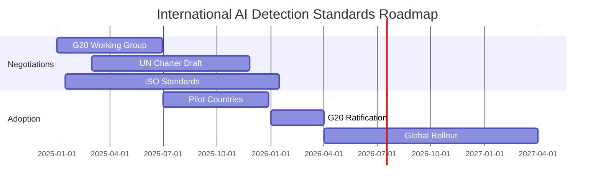

# Policy Recommendations & Ecosystem Enablers for AI Detection

*Last Updated: December 2024*

## Executive Summary

This document presents comprehensive policy recommendations and ecosystem enablers necessary to establish AI detection as critical digital infrastructure. We outline regulatory frameworks, standards adoption incentives, public-private partnerships, and international cooperation mechanisms that will accelerate deployment while protecting privacy and promoting innovation.

---

## Urgent Policy Imperatives

### The 2025 Window of Opportunity

The next 18 months represent a critical period for establishing AI detection frameworks before synthetic content becomes indistinguishable from authentic content. Policy action is needed NOW to:

1. **Prevent a "Deepfake Crisis"** - Est. $5B annual fraud by 2026
2. **Protect Democratic Processes** - 2024-2025 election cycles at risk
3. **Maintain Digital Trust** - 73% of users already doubt content authenticity
4. **Enable Innovation** - $4.1B market waiting for clear regulations

---

## Regulatory Framework Recommendations

### 1. National AI Detection Act (Proposed)

```yaml
legislative_framework:
  title: "Digital Authenticity and AI Detection Act of 2025"
  
  key_provisions:
    mandatory_detection:
      platforms: "100K+ users must implement detection"
      timeline: "18 months from enactment"
      standards: "NIST-approved detection methods"
      
    transparency_requirements:
      ai_disclosure: "Clear labeling of AI-generated content"
      detection_methods: "Public disclosure of detection approaches"
      accuracy_reporting: "Quarterly accuracy metrics publication"
      
    privacy_protections:
      data_minimization: "Detection without content storage"
      user_consent: "Opt-in for enhanced detection"
      encryption: "End-to-end encryption compatible"
      
    liability_framework:
      safe_harbor: "Platforms using certified detection"
      negligence: "Failure to implement reasonable detection"
      innovation_protection: "Research and development exemptions"
```

### 2. Regulatory Sandbox Program

**Purpose**: Enable rapid innovation while managing risks

**Structure**:
```python
# Regulatory Sandbox Framework
class AIDetectionSandbox:
    def __init__(self):
        self.participants = []
        self.exemptions = ["data_retention", "reporting_frequency"]
        self.duration = "24_months"
        self.oversight = "NIST_AI_Division"
        
    def eligibility_criteria(self):
        return {
            "innovation_score": "Novel detection approach",
            "privacy_commitment": "Strong privacy guarantees",
            "public_benefit": "Clear societal value",
            "technical_competence": "Demonstrated expertise"
        }
    
    def benefits(self):
        return {
            "regulatory_relief": self.exemptions,
            "government_data": "Access to test datasets",
            "fast_track_approval": "Expedited certification",
            "funding_eligibility": "R&D grants and contracts"
        }
```

### 3. Tiered Compliance Framework

**Small Platforms** (< 100K users)
- Voluntary adoption encouraged
- Free access to basic detection APIs
- Tax incentives for implementation
- Simplified compliance reporting

**Medium Platforms** (100K - 1M users)
- Mandatory basic detection by 2026
- Choose from approved vendors
- Annual compliance audits
- Reasonable cost allowances

**Large Platforms** (> 1M users)
- Comprehensive detection required
- Custom implementation allowed
- Quarterly reporting obligations
- Public transparency dashboards

### 4. International Harmonization

**Proposed Global Standards**:
1. **G20 AI Detection Accord** - Common principles by 2025
2. **UN Digital Authenticity Charter** - Human rights framework
3. **ISO/IEC Standards** - Technical specifications
4. **Bilateral Agreements** - Cross-border enforcement

**Implementation Timeline**:


---

## Standards Adoption Incentives

### 1. Financial Incentives

**Tax Benefits**:
```yaml
tax_incentive_structure:
  r_and_d_credit:
    detection_research: "50% credit on qualified expenses"
    open_source_contribution: "200% deduction"
    standard_implementation: "25% investment tax credit"
    
  operational_incentives:
    early_adopters: "5-year accelerated depreciation"
    small_business: "First $100K implementation costs deductible"
    nonprofit_rate: "90% discount on certification fees"
    
  innovation_rewards:
    breakthrough_detection: "$1M prize for 99%+ accuracy"
    privacy_innovation: "$500K for zero-knowledge methods"
    efficiency_improvements: "$250K for 10x speed increase"
```

**Grant Programs**:
- **SBIR/STTR**: $50M annual for detection startups
- **Academic Research**: $100M for university R&D
- **Open Source**: $25M for community projects
- **International**: $30M for developing nations

### 2. Market Advantages

**Certification Benefits**:
1. **"Verified Platform" Badge** - Marketing advantage
2. **Insurance Discounts** - 20-30% cyber insurance reduction
3. **Government Contracts** - Preference in procurement
4. **API Marketplace** - Featured placement
5. **Partnership Opportunities** - Tech giant collaborations

**Fast-Track Programs**:
```python
class FastTrackCertification:
    def __init__(self):
        self.standard_time = "6_months"
        self.fast_track_time = "6_weeks"
        
    def qualify_for_fast_track(self, applicant):
        criteria = {
            "open_source": applicant.is_open_source,
            "privacy_first": applicant.privacy_score > 0.9,
            "innovation": applicant.novel_approach,
            "public_benefit": applicant.nonprofit or applicant.education
        }
        return sum(criteria.values()) >= 3
    
    def benefits(self):
        return {
            "reduced_fees": "75% discount",
            "expedited_review": "6 weeks vs 6 months",
            "technical_support": "Free consultation",
            "marketing_support": "Joint press release"
        }
```

### 3. Technical Support

**Free Resources**:
- Detection model zoo access
- Government training datasets
- Cloud compute credits ($100K/year)
- Technical advisory services
- Security audits

**Training Programs**:
- Developer bootcamps (free)
- Certification courses (subsidized)
- Conference sponsorships
- Mentorship matching

---

## Public-Private Partnership Models

### 1. National AI Detection Infrastructure

**Structure**:
```yaml
public_private_partnership:
  name: "National Detection Infrastructure Alliance"
  
  government_role:
    funding: "$500M over 5 years"
    datasets: "Curated training/testing data"
    standards: "NIST framework development"
    coordination: "Cross-sector collaboration"
    
  private_role:
    technology: "Detection algorithms and tools"
    infrastructure: "Cloud and edge computing"
    innovation: "R&D and improvements"
    deployment: "Integration and scaling"
    
  shared_responsibilities:
    governance: "Joint steering committee"
    risk: "50/50 split on liabilities"
    benefits: "IP sharing agreements"
    operations: "Collaborative management"
```

### 2. Regional Detection Hubs

**Hub Model**:
```python
class RegionalDetectionHub:
    def __init__(self, region):
        self.region = region
        self.partners = {
            'government': ['state', 'local', 'federal'],
            'academic': ['universities', 'research_labs'],
            'private': ['tech_companies', 'startups'],
            'nonprofit': ['digital_rights', 'consumer_protection']
        }
        
    def services(self):
        return {
            'detection_api': "Free tier for local organizations",
            'training_data': "Region-specific datasets",
            'technical_support': "24/7 helpdesk",
            'education': "Community workshops",
            'innovation_lab': "Shared R&D facilities"
        }
    
    def funding_model(self):
        return {
            'government_grants': "40%",
            'private_investment': "30%",
            'service_revenue': "20%",
            'foundation_grants': "10%"
        }
```

**Planned Locations**:
1. **Silicon Valley** - Tech innovation focus
2. **Washington DC** - Policy and standards
3. **Boston** - Academic research
4. **Austin** - Startup ecosystem
5. **Atlanta** - Diversity and inclusion

### 3. Industry Consortiums

**Vertical-Specific Alliances**:

**HealthTech Detection Consortium**
- Members: Hospitals, insurers, pharma, medtech
- Focus: Medical image/record authenticity
- Budget: $50M annual
- Deliverables: HIPAA-compliant detection

**FinTech Verification Alliance**
- Members: Banks, payment processors, crypto
- Focus: Transaction and identity verification
- Budget: $75M annual
- Deliverables: Real-time fraud prevention

**MediaTech Authenticity Initiative**
- Members: News, entertainment, social platforms
- Focus: Content verification at scale
- Budget: $100M annual
- Deliverables: Industry standards

### 4. Innovation Challenges

**Annual Detection Olympics**:
```python
class DetectionOlympics:
    def __init__(self):
        self.prize_pool = "$10M"
        self.categories = [
            "Highest Accuracy",
            "Fastest Processing",
            "Best Privacy Protection",
            "Most Innovative Approach",
            "Greatest Social Impact"
        ]
        
    def challenge_tracks(self):
        return {
            'open_track': {
                'eligibility': 'Anyone',
                'prize': '$2M',
                'focus': 'General detection'
            },
            'student_track': {
                'eligibility': 'University teams',
                'prize': '$500K + internships',
                'focus': 'Novel research'
            },
            'startup_track': {
                'eligibility': 'Companies < 3 years',
                'prize': '$1M + investment',
                'focus': 'Commercialization'
            },
            'nonprofit_track': {
                'eligibility': 'NGOs',
                'prize': '$500K + resources',
                'focus': 'Social good'
            }
        }
```

---

## International Cooperation Framework

### 1. Multilateral Agreements

**G20 AI Detection Protocol**:
```yaml
g20_protocol:
  principles:
    - "Mutual recognition of detection standards"
    - "Cross-border data sharing for training"
    - "Joint response to emerging threats"
    - "Technology transfer to developing nations"
    
  commitments:
    funding: "$1B global fund over 5 years"
    standards: "Harmonized technical requirements"
    enforcement: "Coordinated regulatory action"
    research: "Shared R&D initiatives"
    
  governance:
    secretariat: "Rotating annually"
    working_groups: ["Technical", "Policy", "Ethics", "Enforcement"]
    dispute_resolution: "Binding arbitration"
    review_cycle: "Annual progress assessment"
```

### 2. Bilateral Partnerships

**US-EU Digital Authenticity Agreement**:
- Mutual recognition of detection systems
- Privacy Shield 2.0 for detection data
- Joint research funding ($200M)
- Regulatory alignment roadmap

**Five Eyes Detection Alliance**:
- Shared threat intelligence
- Coordinated R&D programs
- Interoperable systems
- Joint training exercises

### 3. Development Assistance

**Global South Initiative**:
```python
class GlobalSouthDetection:
    def __init__(self):
        self.budget = "$500M over 5 years"
        self.target_countries = 50
        self.focus_areas = [
            "Capacity building",
            "Technology transfer",
            "Infrastructure development",
            "Local innovation support"
        ]
        
    def programs(self):
        return {
            'technical_assistance': {
                'training': "10,000 developers trained",
                'infrastructure': "Regional detection centers",
                'localization': "Native language support"
            },
            'financial_support': {
                'grants': "No-strings funding",
                'loans': "0% interest for detection projects",
                'equipment': "Hardware donations"
            },
            'knowledge_transfer': {
                'open_source': "All code freely available",
                'documentation': "Translated materials",
                'mentorship': "Expert exchanges"
            }
        }
```

### 4. International Standards Bodies

**ISO/IEC JTC 1/SC 42** (AI Standards):
- WG 5: AI Detection and Verification
- Fast-track process for detection standards
- Industry-government collaboration
- 18-month development cycle

**IEEE Standards Association**:
- P2089: Synthetic Media Detection
- P3119: Privacy-Preserving Detection
- Industry working groups
- Open participation model

**W3C Web Standards**:
- Content Authenticity API
- Browser detection integration
- Provenance metadata standards
- Accessibility requirements

---

## Infrastructure Requirements

### 1. National Detection Backbone

**Technical Architecture**:
```yaml
national_infrastructure:
  compute_layer:
    gpu_clusters: "10,000 A100/H100 GPUs"
    edge_nodes: "1,000 locations nationwide"
    quantum_ready: "Post-quantum crypto throughout"
    
  network_layer:
    bandwidth: "10 Tbps backbone"
    latency: "< 10ms anywhere in country"
    redundancy: "N+2 failover capability"
    
  storage_layer:
    hot_storage: "100 PB SSD"
    cold_storage: "1 EB object storage"
    distributed: "Multi-region replication"
    
  security_layer:
    encryption: "AES-256 minimum"
    access_control: "Zero-trust architecture"
    monitoring: "24/7 SOC operations"
```

### 2. Funding Mechanisms

**Public Investment**:
- Infrastructure bill allocation: $2B
- Defense budget: $500M (national security)
- Research grants: $300M (NSF, DARPA)
- State/local matching: $700M

**Private Investment**:
- VC funding: $1B+ available
- Corporate R&D: $2B committed
- Foundation grants: $200M
- Crowdfunding: $50M potential

**Innovative Financing**:
```python
class DetectionBonds:
    """Municipal bonds for detection infrastructure"""
    def __init__(self):
        self.total_issuance = "$5B"
        self.interest_rate = "Tax-free 3.5%"
        self.maturity = "10-20 years"
        self.use_of_proceeds = [
            "Detection infrastructure",
            "Training programs",
            "Research facilities",
            "Community access centers"
        ]
```

### 3. Education & Workforce

**University Programs**:
- 50 new AI Detection degree programs
- 10,000 scholarships annually
- Research assistantships
- Industry partnerships

**Professional Development**:
- Certification programs
- Continuing education
- Boot camps
- Online courses

**K-12 Integration**:
- Digital literacy curriculum
- Detection awareness
- Critical thinking skills
- Ethics education

---

## Legal Framework Evolution

### 1. Liability and Insurance

**Safe Harbor Provisions**:
```yaml
safe_harbor_framework:
  eligibility:
    - "NIST-certified detection implementation"
    - "Regular updates and maintenance"
    - "Transparent detection policies"
    - "User notification procedures"
    
  protections:
    - "Limited liability for false positives"
    - "No liability for zero-day exploits"
    - "Reduced damages for good faith efforts"
    - "Insurance requirement caps"
    
  obligations:
    - "Prompt security updates"
    - "Incident reporting within 72 hours"
    - "Cooperation with investigations"
    - "Annual compliance audits"
```

### 2. Intellectual Property

**Patent Pools**:
- Essential detection patents
- FRAND licensing terms
- Defensive patent aggregation
- Open source protections

**Copyright Considerations**:
- Fair use for detection training
- Synthetic content ownership
- Attribution requirements
- Takedown procedures

### 3. Privacy Legislation

**Detection Privacy Act**:
```python
class DetectionPrivacyRights:
    def __init__(self):
        self.core_rights = [
            "Right to know if content is analyzed",
            "Right to opt-out of detection",
            "Right to correction of false positives",
            "Right to human review",
            "Right to detection explanation"
        ]
        
    def implementation_requirements(self):
        return {
            'transparency': "Clear detection notices",
            'consent': "Opt-in for enhanced detection",
            'data_minimization': "Delete after detection",
            'purpose_limitation': "Detection only",
            'user_control': "Dashboard and preferences"
        }
```

---

## Success Metrics & Accountability

### 1. Key Performance Indicators

**National Level KPIs**:
```yaml
national_metrics:
  adoption:
    target: "80% of major platforms by 2027"
    measurement: "Quarterly surveys"
    
  effectiveness:
    target: "90% reduction in deepfake fraud"
    measurement: "FBI/FTC statistics"
    
  innovation:
    target: "100 new detection startups"
    measurement: "Venture funding data"
    
  international:
    target: "G20 standard adoption"
    measurement: "Compliance reports"
    
  public_trust:
    target: "75% confidence in digital content"
    measurement: "Annual public surveys"
```

### 2. Oversight Mechanisms

**National AI Detection Board**:
- 15 members (government, industry, civil society)
- Quarterly public reports
- Annual congressional testimony
- Enforcement powers

**Citizens Advisory Council**:
- Public representation
- Quarterly forums
- Policy input process
- Transparency advocacy

### 3. Continuous Improvement

**Adaptive Policy Framework**:
```python
class AdaptivePolicyEngine:
    def __init__(self):
        self.review_cycle = "6_months"
        self.stakeholders = ["government", "industry", "academia", "public"]
        
    def policy_review_process(self):
        return {
            'data_collection': "Continuous monitoring",
            'analysis': "AI-assisted policy impact",
            'consultation': "Stakeholder feedback",
            'adjustment': "Rapid policy updates",
            'implementation': "Phased rollouts",
            'evaluation': "Impact assessment"
        }
```

---

## Implementation Timeline

### Year 1 (2025): Foundation
- Q1: Legislative introduction
- Q2: Standards development
- Q3: Pilot programs launch
- Q4: International agreements

### Year 2 (2026): Deployment
- Q1: Regulation enforcement begins
- Q2: Infrastructure operational
- Q3: Widespread adoption
- Q4: First compliance audits

### Year 3 (2027): Maturation
- Q1: Full ecosystem operational
- Q2: International harmonization
- Q3: Advanced features rollout
- Q4: Success evaluation

---

## Call to Action

### For Policymakers
The window for action is closing. Every day without comprehensive detection policy increases the risk of a synthetic content crisis that could undermine digital trust permanently.

### For Industry Leaders
Proactive engagement with policy development ensures regulations that promote innovation while protecting society. Your expertise is essential for crafting effective frameworks.

### For Civil Society
Your voice ensures that detection systems protect privacy and human rights while combating deception. Active participation in policy development is crucial.

### For International Partners
Only through coordinated global action can we address the borderless challenge of synthetic content. The time for cooperation is now.

---

## Conclusion

The policy recommendations and ecosystem enablers outlined in this document provide a comprehensive roadmap for establishing AI detection as critical infrastructure. Success requires immediate action, sustained commitment, and unprecedented cooperation between government, industry, academia, and civil society. The stakes could not be higher—the very nature of truth in the digital age hangs in the balance.

The time to act is now. The future of digital authenticity depends on the decisions we make today.