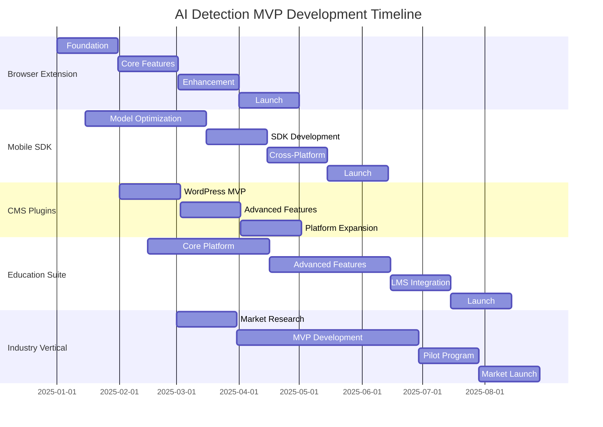

# Short-Term Roadmap: AI Detection MVP Opportunities (0-12 Months)

*Last Updated: December 2024*

## Executive Summary

This roadmap outlines actionable opportunities for developers and organizations to create high-impact AI detection solutions within 12 months. Based on comprehensive market analysis, we've identified five MVP categories that address critical gaps while remaining technically feasible for rapid deployment.

---

## Strategic Priorities

### Market-Driven Focus Areas
1. **Browser-Based Detection** - 4.9B potential users
2. **Mobile Applications** - 6.8B smartphone users
3. **Developer Tools** - 30M+ developers worldwide
4. **Educational Solutions** - 1.6B students globally
5. **Industry Verticals** - $4.1B market opportunity

---

## MVP Opportunity #1: Browser Extension Suite

### Timeline: 3-4 months to MVP

### Core Features
```javascript
// Multi-Modal Browser Detection Extension
{
  "features": {
    "text_detection": {
      "social_media": ["Twitter", "Facebook", "LinkedIn", "Reddit"],
      "news_sites": ["CNN", "BBC", "Reuters", "AP"],
      "email": ["Gmail", "Outlook", "Yahoo"],
      "chat": ["WhatsApp Web", "Telegram Web", "Discord"]
    },
    "image_detection": {
      "context_menu": "Right-click detection",
      "auto_scan": "Automatic page scanning",
      "batch_mode": "Multiple images at once"
    },
    "video_detection": {
      "youtube": "Real-time overlay",
      "social_video": "TikTok, Instagram Reels",
      "news_video": "Embedded players"
    }
  }
}
```

### Technical Requirements
- **Frontend**: TypeScript, React/Vue for popup UI
- **Backend**: WebAssembly for in-browser ML inference
- **Models**: Quantized models < 50MB
- **APIs**: Chrome Extensions Manifest V3
- **Performance**: < 100ms detection latency

### Development Phases

#### Month 1: Foundation
- [ ] Setup extension architecture
- [ ] Implement text detection for social media
- [ ] Create basic UI/UX
- [ ] Add context menu integration

#### Month 2: Expansion
- [ ] Add image detection capabilities
- [ ] Implement batch processing
- [ ] Create settings panel
- [ ] Add detection confidence indicators

#### Month 3: Enhancement
- [ ] Integrate video frame extraction
- [ ] Add multi-language support
- [ ] Implement privacy-preserving mode
- [ ] Create onboarding flow

#### Month 4: Launch Preparation
- [ ] Performance optimization
- [ ] Cross-browser compatibility (Firefox, Edge)
- [ ] User documentation
- [ ] Chrome Web Store submission

### Success Metrics
- 10,000 installs in first month
- 4.5+ star rating
- < 2% uninstall rate
- 100,000 daily detections

### Monetization Strategy
- **Freemium Model**:
  - Free: 100 detections/day
  - Pro ($4.99/month): Unlimited + advanced features
  - Team ($19.99/month): Shared dashboards + API

### Resource Requirements
- 1 Full-stack developer
- 0.5 ML engineer
- 0.5 UI/UX designer
- $5,000 cloud infrastructure budget

---

## MVP Opportunity #2: Mobile SDK for Developers

### Timeline: 4-5 months to stable release

### Architecture
```kotlin
// Android SDK Architecture
class AIDetectionSDK {
    interface DetectionCallback {
        fun onResult(result: DetectionResult)
        fun onError(error: DetectionError)
    }
    
    data class DetectionResult(
        val isAIGenerated: Boolean,
        val confidence: Float,
        val processingTime: Long,
        val modelVersion: String
    )
    
    // Core detection methods
    fun detectText(text: String, callback: DetectionCallback)
    fun detectImage(bitmap: Bitmap, callback: DetectionCallback)
    fun detectAudio(audioData: ByteArray, callback: DetectionCallback)
}
```

### Platform Support
- **iOS**: Swift Package Manager, Core ML
- **Android**: Maven Central, TensorFlow Lite
- **React Native**: Native modules
- **Flutter**: Platform channels

### Key Features
1. **Offline Detection** - On-device models
2. **Privacy-First** - No data leaves device
3. **Battery Efficient** - < 5% battery impact
4. **Small Footprint** - < 20MB SDK size

### Development Milestones

#### Months 1-2: Core Development
- [ ] Model optimization for mobile (quantization, pruning)
- [ ] iOS SDK implementation
- [ ] Android SDK implementation
- [ ] Basic documentation

#### Month 3: Cross-Platform
- [ ] React Native bridge
- [ ] Flutter plugin
- [ ] Xamarin bindings
- [ ] Unity integration

#### Month 4: Developer Experience
- [ ] Sample applications
- [ ] Interactive documentation
- [ ] CI/CD integration guides
- [ ] Performance profiling tools

#### Month 5: Launch & Support
- [ ] SDK release on package managers
- [ ] Developer forum setup
- [ ] Office hours program
- [ ] Bug bounty launch

### Target Metrics
- 500 apps integrated in 6 months
- 10M end-user reach
- < 100ms p95 latency
- 99.9% crash-free rate

### Business Model
- **Open Core**:
  - Community: Basic detection, MIT license
  - Enterprise: Advanced models, priority support
  - Custom: White-label, training services

---

## MVP Opportunity #3: WordPress/CMS Plugin Ecosystem

### Timeline: 2-3 months per plugin

### Plugin Suite
```php
// WordPress AI Detection Plugin
class WP_AI_Detection {
    // Content moderation
    function check_comment($comment_text) {
        $result = $this->detect_ai_text($comment_text);
        if ($result->confidence > 0.8) {
            return 'pending'; // Hold for moderation
        }
        return 'approved';
    }
    
    // Media library scanning
    function scan_media_library() {
        $media_items = get_posts(['post_type' => 'attachment']);
        foreach ($media_items as $item) {
            $this->check_media_authenticity($item);
        }
    }
}
```

### Target Platforms
1. **WordPress** - 810M websites (43% of web)
2. **Drupal** - 1.5M websites
3. **Joomla** - 2M websites
4. **Shopify** - 4.6M stores
5. **Wix** - 200M users

### Feature Set
- **Content Moderation**: Auto-flag AI comments/posts
- **Media Verification**: Scan uploaded images/videos
- **SEO Protection**: Detect AI-generated SEO spam
- **User Authentication**: Verify profile pictures
- **Bulk Operations**: Scan existing content

### Implementation Plan

#### Month 1: WordPress MVP
- [ ] Core plugin structure
- [ ] Admin interface
- [ ] Comment moderation
- [ ] Basic reporting

#### Month 2: Advanced Features
- [ ] Media library integration
- [ ] Bulk scanning tools
- [ ] Multisite support
- [ ] REST API endpoints

#### Month 3: Ecosystem Expansion
- [ ] Drupal module
- [ ] Joomla extension
- [ ] Documentation site
- [ ] Video tutorials

### Success Indicators
- 10,000 active installs
- 5-star rating average
- Featured in plugin directory
- 50+ customer testimonials

### Revenue Model
- **Freemium SaaS**:
  - Free: 1,000 checks/month
  - Pro ($29/month): 10,000 checks
  - Business ($99/month): Unlimited + priority
  - Enterprise: Custom pricing

---

## MVP Opportunity #4: Educational Tool Suite

### Timeline: 5-6 months to full suite

### Components
```python
# Educational AI Detection Platform
class EduDetect:
    def __init__(self):
        self.modules = {
            'plagiarism_plus': ExtendedPlagiarismChecker(),
            'assignment_verifier': AssignmentAuthenticityChecker(),
            'citation_validator': CitationVerifier(),
            'writing_assistant': AuthenticWritingHelper()
        }
    
    def comprehensive_check(self, submission):
        results = {
            'ai_generated': self.detect_ai_content(submission),
            'plagiarism': self.check_plagiarism(submission),
            'citations': self.verify_citations(submission),
            'writing_analysis': self.analyze_writing_style(submission)
        }
        return self.generate_report(results)
```

### Target Users
- **K-12 Schools**: 1.5B students worldwide
- **Universities**: 235M students globally
- **Online Learning**: 400M+ learners
- **Corporate Training**: $370B market

### Key Features
1. **Multi-Format Support**: Essays, code, presentations
2. **Learning Analytics**: Progress tracking, improvement suggestions
3. **Institutional Dashboard**: Class-wide insights
4. **API Integration**: LMS compatibility (Canvas, Blackboard, Moodle)
5. **Accessibility**: WCAG 2.1 AA compliant

### Development Roadmap

#### Months 1-2: Core Platform
- [ ] Web application framework
- [ ] Basic detection algorithms
- [ ] User authentication system
- [ ] Assignment submission flow

#### Months 3-4: Advanced Features
- [ ] Plagiarism detection integration
- [ ] Citation verification system
- [ ] Writing improvement suggestions
- [ ] Batch processing capabilities

#### Month 5: LMS Integration
- [ ] Canvas API integration
- [ ] Blackboard plugin
- [ ] Moodle module
- [ ] Google Classroom addon

#### Month 6: Launch & Scale
- [ ] Pilot program with 10 schools
- [ ] Teacher training materials
- [ ] Student guides
- [ ] Support system

### Success Metrics
- 100 institutions in first year
- 500,000 student users
- 90% accuracy rate
- 50% reduction in AI plagiarism

### Pricing Strategy
- **Institutional License**:
  - Small (< 1,000 students): $2,000/year
  - Medium (1,000-10,000): $10,000/year
  - Large (> 10,000): $25,000/year
  - Consortium: Custom pricing

---

## MVP Opportunity #5: Industry-Specific Solutions

### Timeline: 4-6 months per vertical

### Priority Verticals

#### 1. Legal Tech Solution
```python
# Legal Document Verification System
class LegalAIDetector:
    def verify_document(self, document):
        checks = {
            'ai_generated': self.detect_ai_content(document),
            'metadata_analysis': self.verify_metadata(document),
            'signature_verification': self.check_signatures(document),
            'timestamp_validation': self.validate_timestamps(document),
            'chain_of_custody': self.verify_custody_chain(document)
        }
        return LegalVerificationReport(checks)
```

**Features**:
- Contract authenticity verification
- Deposition transcript validation
- Evidence chain verification
- Court filing authentication

#### 2. Healthcare Verification
**Features**:
- Medical image authenticity
- Clinical note verification
- Research data validation
- Patient record integrity

#### 3. Financial Services
**Features**:
- Identity document verification
- Transaction record validation
- Report authenticity checks
- Compliance documentation

#### 4. Media & Journalism
**Features**:
- Source verification
- Image/video authentication
- Quote attribution
- Fact-checking integration

### Implementation Strategy

#### Phase 1: Market Research (Month 1)
- [ ] Interview 50+ potential customers
- [ ] Identify top 3 pain points
- [ ] Validate pricing assumptions
- [ ] Form advisory board

#### Phase 2: MVP Development (Months 2-4)
- [ ] Core detection engine
- [ ] Industry-specific features
- [ ] Compliance frameworks
- [ ] Security certifications

#### Phase 3: Pilot Program (Month 5)
- [ ] 5-10 pilot customers
- [ ] Iterative improvements
- [ ] Case study development
- [ ] ROI documentation

#### Phase 4: Market Launch (Month 6)
- [ ] Sales team hiring
- [ ] Marketing campaign
- [ ] Conference presence
- [ ] Partnership development

### Revenue Projections
- Year 1: $500K ARR (25 customers)
- Year 2: $2M ARR (100 customers)
- Year 3: $5M ARR (250 customers)

---

## Technical Infrastructure Requirements

### Development Stack
```yaml
# Recommended Technology Stack
infrastructure:
  cloud: AWS/GCP/Azure
  containers: Docker, Kubernetes
  ci_cd: GitHub Actions, CircleCI
  monitoring: Prometheus, Grafana
  
backend:
  languages: Python, Go, Rust
  frameworks: FastAPI, Gin, Actix
  ml_frameworks: PyTorch, TensorFlow
  databases: PostgreSQL, Redis
  
frontend:
  web: React, Vue, Svelte
  mobile: React Native, Flutter
  desktop: Electron, Tauri
  
ml_deployment:
  serving: TorchServe, TF Serving
  optimization: ONNX, TensorRT
  edge: TF Lite, Core ML
```

### Resource Allocation

#### Team Composition (per MVP)
- **Technical**: 2-3 developers, 1 ML engineer
- **Product**: 1 product manager, 0.5 designer
- **Business**: 0.5 marketing, 0.5 sales
- **Total**: 5-6 FTEs per MVP

#### Budget Estimates
- **Development**: $300-500K per MVP
- **Infrastructure**: $20-50K/year
- **Marketing**: $50-100K launch budget
- **Legal/Compliance**: $20-30K
- **Total**: $400-700K per MVP

---

## Implementation Timeline Overview



---

## Risk Mitigation Strategies

### Technical Risks
1. **Model Accuracy**
   - Mitigation: Ensemble methods, continuous training
   - Contingency: Partner with research institutions

2. **Scalability**
   - Mitigation: Cloud-native architecture, auto-scaling
   - Contingency: CDN integration, edge computing

3. **Adversarial Attacks**
   - Mitigation: Regular model updates, anomaly detection
   - Contingency: Human-in-the-loop verification

### Business Risks
1. **Market Competition**
   - Mitigation: First-mover advantage, open-source community
   - Contingency: Pivot to underserved niches

2. **Regulatory Changes**
   - Mitigation: Legal counsel, compliance framework
   - Contingency: Adaptable architecture

3. **Adoption Barriers**
   - Mitigation: Free tiers, extensive documentation
   - Contingency: Partnership strategy

---

## Success Metrics & KPIs

### Technical Metrics
- **Accuracy**: > 95% detection rate
- **Latency**: < 100ms p95
- **Uptime**: 99.9% availability
- **Scalability**: 1M+ requests/day capacity

### Business Metrics
- **User Acquisition**: 100K users in 6 months
- **Revenue**: $1M ARR by month 12
- **Retention**: > 80% monthly retention
- **NPS**: > 50 promoter score

### Community Metrics
- **Contributors**: 100+ active contributors
- **Stars**: 10K+ GitHub stars
- **Forks**: 1K+ active forks
- **Documentation**: 95% coverage

---

## Next Steps

### Immediate Actions (Week 1)
1. [ ] Prioritize 2-3 MVPs based on resources
2. [ ] Assemble core team
3. [ ] Set up development infrastructure
4. [ ] Create project repositories

### Month 1 Milestones
1. [ ] Complete technical architecture
2. [ ] Launch community engagement
3. [ ] Begin user research
4. [ ] Secure initial funding

### Quarter 1 Goals
1. [ ] MVP alpha releases
2. [ ] 1,000 beta testers recruited
3. [ ] Partnership discussions initiated
4. [ ] Press coverage secured

---

## Conclusion

The next 12 months represent a critical window for establishing leadership in the AI detection space. By focusing on these five MVP opportunities, developers and organizations can address immediate market needs while building toward a comprehensive detection ecosystem. Success requires rapid execution, community engagement, and continuous iteration based on user feedback.

The time to act is now.