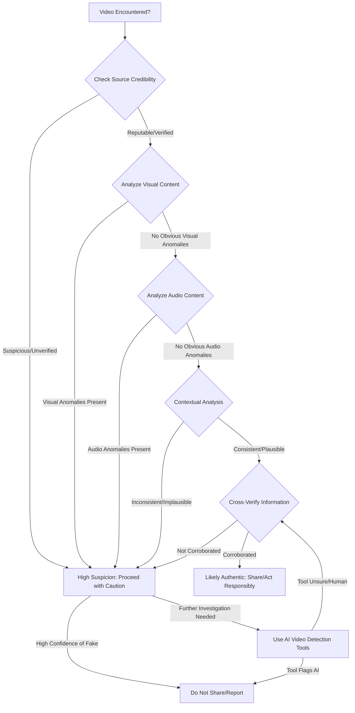

# Comprehensive Field Briefing: Detecting AI-Generated Content

## Executive Summary

[To be written after main report sections are complete]

## Main Report

### 1. Introduction

#### 1.1. Context and Background: The Spread of Synthetic Media and Erosion of Trust

The rapid advancement and widespread accessibility of generative Artificial Intelligence (AI) technologies have ushered in an era where the creation of synthetic media—including text, images, video, and voice—is no longer the exclusive domain of highly specialized professionals. Tools like ChatGPT, Midjourney, DALL-E, Sora, and various voice cloning applications have democratized content generation, enabling individuals and organizations, regardless of technical expertise, to produce highly realistic and often indistinguishable AI-generated content (AIGC). While these innovations offer immense creative and productive potential, they simultaneously pose significant challenges to the integrity of information ecosystems and the very fabric of societal trust.

The proliferation of AIGC has profound implications across various sectors. In journalism and media, the ease with which fabricated news articles, manipulated images, or deepfake videos can be created threatens to undermine the credibility of legitimate reporting and accelerate the spread of misinformation and disinformation. Social media platforms, already grappling with content moderation at scale, face an unprecedented deluge of synthetic content designed to deceive, influence, or incite. For educators, the challenge lies in distinguishing between student-produced work and AI-generated assignments, raising fundamental questions about academic integrity and authentic learning. Enterprise knowledge-workers must contend with the potential for AI-generated reports, analyses, or communications that may contain subtle inaccuracies or biases, impacting critical decision-making.

The erosion of trust stems from a fundamental uncertainty: can we still believe what we see, hear, and read online? When the line between authentic human-created content and sophisticated AI-generated fakes blurs, the foundational trust in digital information, public discourse, and even personal interactions begins to fracture. This uncertainty can lead to a pervasive skepticism, where genuine content is unfairly dismissed as fake, and malicious synthetic content goes undetected, with potentially severe consequences for individuals, organizations, and democratic processes.

Recognizing this escalating challenge, there is an urgent global imperative to develop and deploy effective methods for detecting AI-generated content. This includes not only advanced technical solutions but also practical guidance for everyday users and clear roadmaps for developers to build robust, accessible tools. The current landscape of detection research is dynamic, with continuous advancements in both generative and discriminative AI models, creating an ongoing 


### 2. Modality-by-Modality Landscape of AI Content Detection

#### 2.1. Text

##### 2.1.1. Current State-of-the-Art Detectors and Techniques

###### 2.1.1.1. Statistical Analysis (Perplexity, Burstiness)

Statistical methods for detecting AI-generated text are among the earliest and most foundational approaches. These techniques do not rely on understanding the semantic meaning of the text but rather on identifying statistical patterns that differ between human and machine-generated writing. Two key concepts in this area are **perplexity** and **burstiness**.

*   **Perplexity:** In the context of language models, perplexity is a measure of how well a probability model predicts a sample. A low perplexity score indicates that the model is very good at predicting the next word in a sequence, which is often a characteristic of AI-generated text. AI models, trained to predict the most likely next word, tend to produce text with lower perplexity than human writing, which is often more surprising and less predictable. AI text detectors can leverage this by calculating the perplexity of a given text; if the perplexity is consistently low, it is more likely to be AI-generated.

*   **Burstiness:** Human writing tends to exhibit a quality known as "burstiness," where the author might use a particular word or phrase frequently in one section of the text and then not at all in another. This creates a "bursty" distribution of words. In contrast, AI-generated text often has a more uniform and less bursty distribution of words. By analyzing the distribution of words and phrases, detectors can identify text that lacks the natural burstiness of human writing.

###### 2.1.1.2. Machine Learning Approaches (Deep Learning, NLP)

More advanced AI text detectors employ machine learning (ML) and deep learning models, often leveraging Natural Language Processing (NLP) techniques. These models are trained on vast datasets containing both human-written and AI-generated text, allowing them to learn the subtle patterns and features that distinguish one from the other.

*   **Classifier Models:** The most common approach is to use a classifier model (e.g., a fine-tuned version of a transformer model like BERT or RoBERTa) that is trained to take a piece of text as input and output a probability score indicating whether it is AI-generated or human-written. These models can analyze a wide range of linguistic features, including sentence structure, word choice, grammar, and semantic coherence.

*   **Feature Extraction:** These models automatically extract and learn a complex set of features from the text, going beyond simple statistical measures. They can capture nuances in writing style, tone, and even subtle biases that might be characteristic of specific AI models.

###### 2.1.1.3. Watermarking and Provenance (e.g., SynthID for text)

A more proactive approach to AI content detection is to embed a digital watermark directly into the generated content at the time of creation. This provides a form of provenance, allowing for easier verification of the content's origin.

*   **SynthID for Text:** Google's SynthID is a prominent example of this approach. It works by subtly modifying the text at the token level (words or parts of words) in a way that is imperceptible to the human reader but can be detected by a corresponding algorithm. This watermark is designed to be robust to common modifications like paraphrasing or adding/deleting sentences. While not foolproof, it provides a strong signal for identifying content generated by supporting AI models.

##### 2.1.2. Accuracy Benchmarks, Typical False-Positive/Negative Rates

The accuracy of AI text detectors is a subject of ongoing debate and research. While many commercial tools claim very high accuracy rates (often 98-99%), independent studies and real-world usage often reveal a more complex picture.

*   **Accuracy Varies Widely:** The performance of detectors can vary significantly depending on the AI model used to generate the text, the length and complexity of the text, and the subject matter.

*   **False Positives:** A major concern is the rate of false positives, where human-written text is incorrectly flagged as AI-generated. This can have serious consequences, particularly in academic settings where students might be falsely accused of plagiarism. Studies have shown false positive rates ranging from a few percent to over 50% in some cases, especially for non-native English speakers whose writing patterns can sometimes mimic those of AI.

*   **False Negatives:** Conversely, false negatives occur when AI-generated text is not detected. This is becoming more common as AI models become more sophisticated and as users employ techniques to "humanize" AI-generated text.

*   **Benchmarking Challenges:** There is a lack of standardized, universally accepted benchmarks for evaluating AI text detectors. This makes it difficult to compare the performance of different tools objectively. The rapid evolution of generative AI models also means that benchmarks can quickly become outdated.

##### 2.1.3. Practical "How-To" Guides for Non-Technical Users

For non-technical users, a combination of manual heuristics and user-friendly tools can be effective for identifying potentially AI-generated text.

###### 2.1.3.1. Heuristics for Manual Detection

*   **Look for Repetitive Phrasing and Vocabulary:** AI models can sometimes fall into repetitive patterns, using the same words or sentence structures multiple times.
*   **Check for Lack of Personal Voice or Style:** AI-generated text often lacks a distinct authorial voice. It may sound generic, overly formal, or devoid of personality.
*   **Be Skeptical of Perfect Grammar and Spelling:** While not always the case, AI-generated text is often grammatically perfect. A complete absence of typos or minor errors can be a subtle clue.
*   **Watch for Unnatural Phrasing or "Word Salad":** Sometimes, AI-generated text can contain sentences that are grammatically correct but sound unnatural or nonsensical.
*   **Verify Factual Claims:** AI models can "hallucinate" and generate plausible-sounding but incorrect information. Fact-checking any claims is a crucial step.

###### 2.1.3.2. Step-by-Step Usage of Publicly Available Tools (with examples/screenshots)

[This section will be populated with detailed, illustrated guides for using popular, accessible AI text detection tools like GPTZero, Copyleaks, and others. It will include screenshots of the user interface, examples of text being analyzed, and explanations of how to interpret the results.]


#### 2.2. Images

##### 2.2.1. Current State-of-the-Art Detectors and Techniques

The detection of AI-generated images has become increasingly challenging as generative models, particularly Generative Adversarial Networks (GANs) and diffusion models (e.g., Midjourney, DALL-E, Stable Diffusion), produce images of astonishing realism. Current detection techniques primarily focus on identifying subtle artifacts and inconsistencies that are characteristic of synthetic generation.

###### 2.2.1.1. Forensic Analysis (Artifacts, Inconsistencies)

Forensic analysis of AI-generated images involves scrutinizing the image for microscopic patterns or anomalies that betray its synthetic origin. Unlike traditional image manipulation, where edits might leave obvious seams or pixelation, AI-generated images often exhibit subtle, systemic deviations from real-world photography.

*   **Frequency Domain Analysis:** Real images, captured by cameras, have specific noise patterns and statistical properties in their frequency domain (e.g., JPEG compression artifacts, sensor noise). AI-generated images, especially older models, might lack these natural noise patterns or introduce artificial ones. Analyzing the Discrete Cosine Transform (DCT) coefficients or other frequency representations can reveal these discrepancies.

*   **Pixel-Level Anomalies:** Generative models, despite their sophistication, can struggle with fine details and global consistency. This can manifest as:
    *   **Repetitive Textures:** Backgrounds or intricate patterns might show unnatural repetitions or a lack of natural variation.
    *   **Distorted or Nonsensical Text:** AI often fails to render legible or meaningful text within an image, producing garbled or abstract characters.
    *   **Unnatural Reflections and Shadows:** Light sources and their corresponding reflections or shadows might be inconsistent or physically impossible.
    *   **Subtle Distortions in High-Frequency Details:** Elements like hair, teeth, jewelry, or intricate patterns might appear blurry, warped, or unnaturally smooth upon close inspection.

*   **Physiological Inconsistencies:** When generating human faces or bodies, AI models can produce subtle but telling errors:
    *   **Asymmetrical Features:** Eyes, ears, or other facial features might be subtly asymmetrical in ways that are uncommon in real humans.
    *   **Anomalies in Hands and Fingers:** Hands are notoriously difficult for AI to generate correctly, often resulting in an incorrect number of fingers, distorted shapes, or unnatural poses.
    *   **Unnatural Skin Texture:** Skin might appear too smooth, waxy, or unnaturally uniform, lacking the natural pores, blemishes, and variations of human skin.

###### 2.2.1.2. Deep Learning Approaches (CNNs, GANs)

Many state-of-the-art AI image detectors are themselves powered by deep learning models, particularly Convolutional Neural Networks (CNNs). These models are trained to learn discriminative features that distinguish real images from synthetic ones.

*   **Binary Classification:** The most common approach involves training a CNN to classify an image as either "real" or "fake." These models learn to identify the subtle, often imperceptible, artifacts left by generative models.

*   **Generative Adversarial Networks (GANs) for Detection:** While GANs are primarily used for generation, a discriminator component within a GAN can also be repurposed for detection. The discriminator is trained to distinguish between real and generated images, and its learned features can be leveraged for forensic analysis.

*   **Vision Transformers (ViTs):** Newer architectures like Vision Transformers are also being explored for their ability to capture global dependencies and subtle inconsistencies across an entire image, potentially offering improved detection capabilities.

###### 2.2.1.3. Watermarking and Provenance (e.g., C2PA, SynthID for images)

To address the challenges of post-hoc detection, proactive measures like digital watermarking and content provenance standards are gaining traction. These methods aim to embed verifiable information about an image's origin at the point of creation.

*   **C2PA (Coalition for Content Provenance and Authenticity):** The C2PA is a cross-industry initiative developing an open technical standard for content provenance. This standard allows creators and platforms to attach cryptographically verifiable metadata to digital content, including images. This metadata can include information about who created the image, when and where it was captured or generated, and any modifications made to it. While C2PA doesn't directly detect AI generation, it provides a trustworthy chain of custody that can help users determine the authenticity and origin of an image.

*   **SynthID for Images:** Google DeepMind's SynthID is a specific example of an invisible watermarking technology for AI-generated images. It embeds a digital watermark directly into the pixels of an image during its creation by a generative AI model. This watermark is designed to be imperceptible to the human eye and robust to common image manipulations like resizing, cropping, or compression. A corresponding detection tool can then analyze the image to determine if it contains a SynthID watermark, indicating it was generated by a Google AI model. The key advantage is that it provides a direct signal of AI origin, rather than relying on forensic analysis of artifacts.

##### 2.2.2. Accuracy Benchmarks, Typical False-Positive/Negative Rates

The accuracy of AI image detectors is highly variable and often lags behind the rapid advancements in generative AI. Benchmarking is complex due to the diversity of generative models and the continuous evolution of their capabilities.

*   **Varying Performance:** While some commercial tools claim high accuracy (e.g., Sightengine, AI or Not), independent studies often show that detectors struggle to generalize across different generative models. A detector trained on images from GANs might perform poorly on images from diffusion models, and vice-versa.

*   **False Positives:** False positives are a significant concern. Genuine photographs can be mistakenly identified as AI-generated, leading to accusations of deception or undermining the credibility of authentic content. This is particularly problematic for photojournalists or artists whose work might be unfairly scrutinized.

*   **False Negatives:** The rate of false negatives (AI-generated images going undetected) is also high, especially for images produced by the latest, most sophisticated generative models. As generative AI improves, the subtle artifacts that detectors rely on become even harder to discern.

*   **Arms Race Dynamic:** The field is characterized by an ongoing "arms race" between generative models and detection methods. As soon as a new detection technique emerges, generative models are updated to circumvent it, making sustained high accuracy difficult.

##### 2.2.3. Practical "How-To" Guides for Non-Technical Users

For the average user, relying solely on automated tools can be misleading due to their limitations. A combination of critical observation and accessible tools is the most effective approach.

###### 2.2.3.1. Heuristics for Manual Detection

*   **Examine Hands and Fingers:** This is one of the most common tells. Look for an incorrect number of fingers, distorted or unnaturally bent fingers, or hands that appear fused or malformed.
*   **Scrutinize Eyes and Teeth:** AI can struggle with the natural irregularity of human teeth (too perfect, too uniform, or misaligned). Eyes might appear glassy, asymmetrical, or have unnatural reflections. Look for pupils that are not perfectly round or aligned.
*   **Look for Nonsensical Text or Symbols:** Any text within the image (e.g., on signs, clothing, books) is a major red flag if it's garbled, nonsensical, or contains strange characters.
*   **Check for Inconsistent Reflections and Shadows:** Observe light sources and their corresponding shadows. Are they consistent? Do reflections make sense? AI often struggles with accurate physics-based rendering of light.
*   **Analyze Background Details:** Backgrounds can often reveal AI generation. Look for repeating patterns, distorted objects, or a general "blurry" or "dreamlike" quality that lacks sharp detail.
*   **Assess Overall Cohesion and Logic:** Does the image make sense? Are objects interacting with each other realistically? Are there any elements that seem out of place or defy logic?
*   **Look for "Uncanny Valley" Effects:** Sometimes, faces or scenes can look almost real but have a subtle, unsettling artificiality that makes them feel "off."
*   **Examine Jewelry, Accessories, and Clothing:** These details can often be distorted, asymmetrical, or have unnatural textures.
*   **Search for the Image's Origin:** Perform a reverse image search (e.g., Google Images, TinEye, Yandex Images). If the image appears on stock photo sites, known AI art generators, or in unusual contexts, it warrants further suspicion.

###### 2.2.3.2. Step-by-Step Usage of Publicly Available Tools (with examples/screenshots)

[This section will provide detailed, illustrated guides for using accessible AI image detection tools like WasItAI, Hive Moderation, and others. It will include screenshots of the user interface, examples of images being analyzed, and explanations of how to interpret the results and their limitations.]


#### 2.3. Video

##### 2.3.1. Current State-of-the-Art Detectors and Techniques

Detecting AI-generated video, particularly deepfakes, is arguably the most complex and rapidly evolving area within synthetic media detection. The challenge stems from the high dimensionality of video data (combining visual and auditory information over time) and the increasing sophistication of generative models like OpenAI's Sora, Google's Veo, and others, which can produce highly realistic and coherent video sequences.

###### 2.3.1.1. Temporal and Spatial Inconsistencies

Deepfake detection often relies on identifying subtle inconsistencies that arise when AI manipulates or generates video frames. These inconsistencies can be categorized into spatial (within a single frame) and temporal (across multiple frames).

*   **Spatial Inconsistencies:** Similar to image detection, AI-generated video frames can exhibit artifacts such as unnatural skin textures, distorted facial features (especially around the eyes, mouth, and ears), inconsistent lighting, or blurry edges around manipulated areas. The challenge is that these artifacts might be transient or very subtle, requiring frame-by-frame analysis.

*   **Temporal Inconsistencies:** This is a critical aspect unique to video. AI models can struggle to maintain perfect consistency and natural flow over time. This can manifest as:
    *   **Flickering or Jittering:** Unnatural movements or rapid changes in appearance that are not consistent with natural motion.
    *   **Lack of Smooth Transitions:** Abrupt changes in facial expressions, head movements, or body posture that appear unnatural.
    *   **Inconsistent Gaze or Eye Blinking:** Deepfake subjects might have an unnatural gaze, lack natural blinking patterns, or blink at irregular intervals.
    *   **Lip-Sync Mismatches:** The most common tell in early deepfakes was poor synchronization between the audio and the speaker's lip movements. While greatly improved, subtle mismatches can still occur.
    *   **Unnatural Head Poses or Body Language:** The way a person holds their head or moves their body might appear stiff, robotic, or inconsistent with their speech or actions.

###### 2.3.1.2. Physiological Signal Analysis

Some advanced detection methods delve into physiological signals that are difficult for AI to perfectly replicate, especially in real-time.

*   **Heart Rate and Blood Flow:** Subtle changes in skin color due to blood flow (photoplethysmography, PPG) can be extracted from video. AI-generated faces often lack these natural, subtle variations, or they might be inconsistent with the simulated heart rate.
*   **Micro-expressions and Blinking Patterns:** Human faces exhibit a vast array of micro-expressions and highly individualized blinking patterns. AI models may struggle to reproduce these with perfect fidelity, leading to detectable anomalies.

###### 2.3.1.3. Watermarking and Provenance

As with images, watermarking is emerging as a proactive solution for video. Embedding invisible digital watermarks at the point of generation can provide verifiable proof of origin.

*   **C2PA for Video:** The C2PA standard extends to video, allowing for cryptographically verifiable metadata to be attached to video files. This metadata can record the history of the video, including its creation, editing, and any AI transformations, providing a chain of custody.
*   **Proprietary Watermarking:** Generative AI companies are developing their own proprietary watermarking techniques (similar to Google's SynthID for images) to embed imperceptible signals into their generated video content. These signals can then be detected by corresponding tools, indicating the AI origin.

##### 2.3.2. Accuracy Benchmarks, Typical False-Positive/Negative Rates

The accuracy of AI video detectors is highly dependent on the complexity of the deepfake, the generative model used, and the specific detection technique. The field is in a constant state of flux, with new benchmarks and models emerging regularly.

*   **Evolving Landscape:** Early deepfake detectors often achieved high accuracy on older, less sophisticated deepfakes. However, as generative models have advanced, these detectors have become less effective.

*   **Benchmarking Challenges:** Creating robust benchmarks for video deepfake detection is difficult due to the sheer volume of data, the computational intensity of analysis, and the rapid evolution of generative techniques. New datasets like GenVidBench are attempting to address this by including videos from a wider range of state-of-the-art AI video generators.

*   **Reported Accuracy:** Some research papers report high accuracy rates (e.g., Columbia Engineering's DIVID claiming up to 93.7% on specific datasets). However, these figures often apply to controlled environments or specific types of deepfakes and may not generalize well to real-world, 'in-the-wild' deepfakes.

*   **False Positives and Negatives:** Both false positives (real videos flagged as AI-generated) and false negatives (AI-generated videos going undetected) are significant concerns. A false positive can lead to unwarranted accusations and erosion of trust in legitimate content, while a false negative allows malicious content to spread unchecked. The "arms race" means that false negatives are a persistent problem, as new generative models are often designed to evade existing detectors.

##### 2.3.3. Practical "How-To" Guides for Non-Technical Users

For non-technical users, a multi-faceted approach combining careful observation with available tools is recommended. Focus on inconsistencies that AI models still struggle to perfect.

###### 2.3.3.1. Heuristics for Manual Detection

*   **Observe Facial Anomalies:** Pay close attention to the subject's face. Look for:
    *   **Unnatural Blinking:** Too frequent, too infrequent, or synchronized blinking that seems off.
    *   **Inconsistent Skin Tone/Texture:** Patches of skin that look too smooth, waxy, or pixelated, especially around the edges of the face.
    *   **Unnatural Eye Movement/Gaze:** Eyes that don't track naturally, or a fixed, unnatural stare.
    *   **Teeth and Gums:** Unnaturally perfect, misaligned, or distorted teeth, or gums that appear strange when the mouth moves.

*   **Check Lip-Sync and Speech:**
    *   **Mismatched Lip Movements:** Do the lips perfectly match the spoken words? Look for slight delays or unnatural mouth shapes.
    *   **Unnatural Speech Patterns:** Listen for a monotonous tone, lack of emotional inflection, or robotic cadence in the voice (even if the lips sync).

*   **Examine Head and Body Movements:**
    *   **Stiff or Jerky Movements:** The subject's head or body might move unnaturally, lacking the fluidity of human motion.
    *   **Inconsistent Head Poses:** The head might appear to be 


attached to the body in an odd way, or movements might not align with the overall body posture.

*   **Look for Inconsistent Lighting and Shadows:** Observe how light falls on the subject and the background. Are shadows consistent with the light source? Are there sudden changes in lighting that don't make sense?

*   **Background Anomalies:** The background might contain distortions, repeating patterns, or objects that appear and disappear.

*   **Audio-Visual Mismatches:** Beyond lip-sync, listen for any general disconnect between what is seen and what is heard. Does the voice sound like the person? Is the emotional tone of the voice consistent with the visual expression?

*   **Source Verification:** Always question the source of the video. Is it from a reputable news organization? Has it been shared by multiple, independent sources? Be wary of videos from unknown or suspicious accounts.

*   **Slow-Motion Analysis:** Playing the video in slow motion can often reveal subtle glitches, flickering, or inconsistencies that are missed at normal speed.

*   **Reverse Image/Video Search:** Use tools like Google Reverse Image Search (for keyframes) or specialized video search engines to see if the video has appeared elsewhere, especially in contexts that suggest manipulation.

###### 2.3.3.2. Step-by-Step Usage of Publicly Available Tools (with examples/screenshots)

[This section will provide detailed, illustrated guides for using accessible AI video detection tools like Deepware, Hive Moderation, and others. It will include screenshots of the user interface, examples of videos being analyzed, and explanations of how to interpret the results and their limitations.]


#### 2.4. Voice

##### 2.4.1. Current State-of-the-Art Detectors and Techniques

AI-generated voice, often referred to as voice cloning or audio deepfakes, has become increasingly sophisticated, making it difficult for humans to distinguish synthetic speech from authentic human speech. This technology poses significant risks in areas like cybersecurity (e.g., vishing attacks), misinformation, and identity theft. Detection techniques focus on identifying subtle acoustic anomalies and patterns indicative of synthetic generation.

###### 2.4.1.1. Acoustic Feature Analysis

Human speech is incredibly complex, characterized by a rich array of acoustic features that convey not only words but also emotion, intent, and individual identity. AI voice generators, while advanced, often struggle to perfectly replicate this complexity, leaving detectable traces.

*   **Prosodic Features:** These include pitch (fundamental frequency), intonation (variation in pitch), rhythm, and speaking rate. AI-generated voices can sometimes exhibit a flatter, more monotonous intonation, or an unnaturally consistent rhythm, lacking the natural variations and expressiveness of human speech.
*   **Spectral Features:** Analysis of the frequency spectrum of the voice can reveal differences. Human voices have unique spectral characteristics influenced by vocal tract shape, vocal cord vibration, and resonance. Synthetic voices might have overly smooth or artificial spectral patterns, or lack the natural noise and imperfections present in human recordings.
*   **Formant Frequencies:** Formants are the resonant frequencies of the vocal tract that shape the sound of speech. AI models might produce formants that are too precise, too uniform, or deviate subtly from natural human speech.
*   **Voice Quality Parameters:** These include measures of breathiness, harshness, or creakiness. AI-generated voices can sometimes sound too clean, lacking the natural imperfections and variations in voice quality that are common in human speech.

###### 2.4.1.2. Spectral Analysis

Spectral analysis involves breaking down the audio signal into its constituent frequencies to identify patterns that differentiate human from synthetic voices. This often involves advanced signal processing techniques.

*   **Spectrograms:** Visual representations of the frequency spectrum over time can reveal subtle differences. AI-generated voices might show unusual energy distribution across frequencies or lack the natural variations seen in human spectrograms.
*   **Phase Information:** While often overlooked, the phase component of an audio signal carries crucial information. Some research suggests that AI-generated audio might have less natural phase characteristics compared to real audio.
*   **Noise Characteristics:** Real-world audio recordings contain various forms of background noise and environmental acoustics. AI-generated voices, especially those created in pristine digital environments, might lack these natural noise components or exhibit artificial noise patterns.

###### 2.4.1.3. Watermarking and Provenance

Similar to other modalities, watermarking is being explored as a proactive measure for AI-generated audio. This involves embedding an imperceptible signal into the audio at the point of generation.

*   **Inaudible Watermarks:** These watermarks are designed to be imperceptible to the human ear but detectable by specialized algorithms. They can carry information about the audio's origin, the AI model used, and the time of generation.
*   **Challenges:** The main challenge for audio watermarking is robustness. The watermark must survive common audio compressions, noise additions, and other manipulations without being destroyed or becoming audible.

##### 2.4.2. Accuracy Benchmarks, Typical False-Positive/Negative Rates

The accuracy of AI voice detectors is a critical concern, especially given the potential for misuse of voice cloning technology in scams and disinformation campaigns. Benchmarking in this domain is challenging due to the diversity of voice cloning techniques and the subjective nature of perceived realism.

*   **Varying Accuracy:** Reported accuracy rates for AI voice detectors range widely, from around 80% to over 95% in some controlled studies. However, real-world performance can be lower, particularly against the latest, most advanced voice cloning models.

*   **False Positives:** A significant risk is the false positive, where a genuine human voice is incorrectly identified as AI-generated. This can lead to serious consequences, such as denial of service in voice authentication systems or false accusations in legal contexts. The impact of false positives can be particularly severe for individuals with unique vocal characteristics or those speaking in non-native accents.

*   **False Negatives:** False negatives occur when an AI-generated voice goes undetected. As voice cloning technology improves, it becomes increasingly difficult for detectors to distinguish synthetic voices from real ones, leading to a higher rate of false negatives for sophisticated deepfakes.

*   **"Arms Race" Dynamic:** The field of AI voice detection is characterized by a continuous "arms race" between generative models and detection methods. As detectors become more effective, generative models are updated to produce more realistic and harder-to-detect synthetic voices.

##### 2.4.3. Practical "How-To" Guides for Non-Technical Users

For non-technical users, a combination of careful listening and awareness of common AI voice characteristics can help in identifying potentially synthetic audio.

###### 2.4.3.1. Heuristics for Manual Detection

*   **Listen for Unnatural Pauses and Rhythm:** Human speech has natural pauses, hesitations, and variations in rhythm. AI voices might have overly consistent pacing, unnatural pauses, or a robotic, metronomic rhythm.
*   **Lack of Emotional Nuance:** AI voices can often sound flat, monotonous, or lack the subtle emotional inflections, emphasis, and variations in tone that convey genuine human emotion. Listen for a disconnect between the words spoken and the emotional delivery.
*   **Overly Perfect Pronunciation:** While good pronunciation is desirable, human speech often includes subtle imperfections, slurring, or regional accents. AI voices might have unnaturally perfect or generic pronunciation.
*   **Absence of Breathing Sounds or Mouth Noises:** AI-generated speech often lacks the natural sounds of breathing, lip smacks, or tongue clicks that are common in human speech.
*   **Consistent Pitch and Volume:** Human voices naturally vary in pitch and volume during conversation. AI voices might maintain an unnaturally consistent pitch or volume throughout a recording.
*   **"Uncanny Valley" Effect:** The voice might sound almost human but have a subtle, unsettling artificial quality that makes it feel "off" or not quite right.
*   **Inconsistent Background Noise:** If the audio includes background noise, listen for inconsistencies. Does the background noise sound natural and integrated with the voice, or does it seem artificially overlaid or cut off abruptly?
*   **Verify the Source and Context:** Always question the source of the audio. Is it from a trusted individual or organization? Does the message align with what you know about the person or situation? Be suspicious of unexpected or unusual requests, especially those involving money or personal information.
*   **Cross-Reference with Known Authentic Recordings:** If possible, compare the suspected AI voice with known authentic recordings of the person. Listen for differences in vocal characteristics, speech patterns, and emotional range.

###### 2.4.3.2. Step-by-Step Usage of Publicly Available Tools (with examples/screenshots)

[This section will provide detailed, illustrated guides for using accessible AI voice detection tools like ElevenLabs AI Speech Classifier, AI Voice Detector, and others. It will include screenshots of the user interface, examples of audio being analyzed, and explanations of how to interpret the results and their limitations.]


### 3. End-User Playbooks

For everyday users—journalists, social-media moderators, K-12 educators, and enterprise knowledge-workers—the ability to quickly assess the authenticity of digital content is paramount. While sophisticated technical tools exist, practical, accessible playbooks are essential for real-time decision-making. This section provides checklists, decision trees, and comparison tables to empower end-users.

#### 3.1. Checklists & Decision Trees for Verifying Authenticity

These guides are designed to provide a structured approach to evaluating content across different modalities. They combine manual heuristics with recommendations for using publicly available tools.

##### 3.1.1. Social Media Posts (Text & Image Focus)

Social media is a primary vector for the rapid dissemination of both authentic and synthetic content. Verifying posts requires a multi-layered approach, considering both the textual and visual elements.

**Checklist for Social Media Post Verification:**

1.  **Source Credibility:**
    *   Is the account verified? (Look for official badges).
    *   Is the account new or does it have a long history? (New accounts with high activity are suspicious).
    *   Does the account's past content align with the current post? (Sudden shifts in topic or tone can be a red flag).
    *   Are there unusually few followers for a seemingly influential account, or a high number of bot-like followers?
    *   Does the account's profile picture or bio seem generic or AI-generated?

2.  **Textual Analysis (Refer to Section 2.1.3.1 for detailed heuristics):**
    *   **Language & Tone:** Does the language seem overly formal, generic, or repetitive? Is there a lack of natural human nuance, emotion, or slang?
    *   **Grammar & Spelling:** Is the text unusually perfect, or conversely, does it contain strange, non-human-like errors?
    *   **Factual Consistency:** Does the information align with known facts from reputable sources? Are there any logical inconsistencies within the text?
    *   **Call to Action:** Is there an unusual or urgent call to action (e.g., click a suspicious link, share immediately)?
    *   **Emotional Manipulation:** Does the text attempt to evoke strong emotions (anger, fear, outrage) without providing verifiable facts?

3.  **Visual Analysis (Images within the post - Refer to Section 2.2.3.1 for detailed heuristics):**
    *   **Anomalies in Faces/Bodies:** Look for distorted hands, unnatural eyes/teeth, or strange skin textures.
    *   **Nonsensical Text in Image:** Is there any text in the image that is garbled, unreadable, or doesn't make sense?
    *   **Inconsistent Lighting/Shadows:** Do light sources and shadows align logically within the image?
    *   **Background Oddities:** Are there repeating patterns, distorted objects, or a general "dreamlike" quality in the background?
    *   **Reverse Image Search:** Use tools like Google Images, TinEye, or Yandex Images to see if the image has appeared elsewhere, especially in different contexts or on known AI art generation sites.

4.  **Cross-Verification:**
    *   Are other reputable news organizations or verified accounts reporting the same information?
    *   Is the information corroborated by multiple, independent sources?
    *   If the post refers to an event, are there other visual or textual evidences from different angles or perspectives?

**Decision Tree for Social Media Post Verification:**

```mermaid
graph TD
    A[Social Media Post Encountered?] --> B{Check Source Credibility}
    B -- Reputable/Verified --> C{Analyze Textual Content}
    B -- Suspicious/Unverified --> D[High Suspicion: Proceed with Caution]

    C -- Human-like/Consistent --> E{Analyze Visual Content (if any)}
    C -- AI-like/Inconsistent --> D

    E -- Human-like/Consistent --> F{Cross-Verify Information}
    E -- AI-like/Inconsistent --> D

    F -- Corroborated --> G[Likely Authentic: Share/Act Responsibly]
    F -- Not Corroborated --> D

    D -- Further Investigation Needed --> H[Use AI Detection Tools (Text/Image)]
    D -- High Confidence of Fake --> I[Do Not Share/Report]

    H -- Tool Flags AI --> I
    H -- Tool Unsure/Human --> F
```

##### 3.1.2. Videos (Deepfake Focus)

Deepfake videos are among the most convincing forms of synthetic media. Verification requires meticulous attention to visual and auditory details, often best done with slow-motion playback.

**Checklist for Video Verification:**

1.  **Source Credibility:**
    *   Is the video from an official or verified channel/account?
    *   Does the account have a history of posting legitimate content?
    *   Is the video being shared by multiple, independent, reputable sources?

2.  **Visual Analysis (Refer to Section 2.3.3.1 for detailed heuristics):**
    *   **Facial Anomalies:** Look for unnatural blinking (too frequent/infrequent), waxy skin, inconsistent skin tone, or strange eye movements.
    *   **Lip-Sync Issues:** Do the lips perfectly match the spoken words? Are mouth shapes unnatural or misaligned?
    *   **Head & Body Movements:** Are movements stiff, jerky, or unnatural? Does the head seem oddly attached to the body?
    *   **Inconsistent Lighting/Shadows:** Are there sudden changes in lighting or shadows that don't make sense within the scene?
    *   **Background Distortions:** Look for blurry, warped, or repeating patterns in the background.
    *   **Subtle Artifacts:** Pixelation, flickering, or strange edges around the subject, especially when played in slow motion.
    *   **Jewelry/Accessories:** Distorted or flickering jewelry, glasses, or clothing details.

3.  **Audio Analysis (Refer to Section 2.4.3.1 for detailed heuristics):**
    *   **Voice Quality:** Does the voice sound monotonous, robotic, or lack natural emotional inflection?
    *   **Breathing/Pauses:** Is there an absence of natural breathing sounds or unnatural pauses?
    *   **Background Noise:** Does the background audio seem inconsistent or artificially overlaid?
    *   **Voice Match:** Does the voice truly sound like the person speaking? (Compare with known authentic recordings if possible).

4.  **Contextual Analysis:**
    *   Does the content of the video align with known events or statements made by the individuals involved?
    *   Is the video being used to spread sensational or highly emotional claims?
    *   Are there any unusual or urgent calls to action associated with the video?

5.  **Technical Analysis (if tools available):**
    *   Use a deepfake detection tool (e.g., Deepware) to scan the video. Understand that these tools are not foolproof.
    *   Perform reverse video search on keyframes.

**Decision Tree for Video Verification:**



##### 3.1.3. Voice Clips (Audio Deepfake Focus)

Voice deepfakes are increasingly used in scams and disinformation campaigns. Detecting them requires careful listening for subtle auditory cues.

**Checklist for Voice Clip Verification:**

1.  **Source Credibility:**
    *   Is the voice clip from an expected or verified contact?
    *   Is the request or message unusual or out of character for the person?
    *   Did the message come from an unexpected channel (e.g., a text message with an audio attachment from someone who usually calls)?

2.  **Auditory Analysis (Refer to Section 2.4.3.1 for detailed heuristics):**
    *   **Emotional Flatness:** Does the voice lack natural emotional range or sound monotonous?
    *   **Unnatural Pacing/Rhythm:** Are there unnatural pauses, too-perfect pacing, or a robotic cadence?
    *   **Absence of Natural Sounds:** Is there a complete absence of breathing sounds, lip smacks, or other natural vocalizations?
    *   **Consistent Pitch/Volume:** Does the voice maintain an unnaturally consistent pitch or volume?
    *   **Pronunciation:** Are there any subtle mispronunciations or unnatural articulations?
    *   **Background Noise:** Does the background noise seem artificial, inconsistent, or too clean?
    *   **"Uncanny Valley" Effect:** Does the voice sound almost human but with a subtle, unsettling artificial quality?

3.  **Contextual Analysis:**
    *   Does the content of the message align with known facts or recent events?
    *   Is there an urgent request for money, personal information, or unusual actions?
    *   Does the message attempt to create a sense of panic or urgency?

4.  **Cross-Verification:**
    *   **Direct Contact:** If suspicious, attempt to contact the person via a known, alternative method (e.g., call them on a number you know is theirs, ask a security question only they would know). DO NOT reply to the suspicious message directly.
    *   **Ask a Personal Question:** Ask a question whose answer would be known only to the authentic person and cannot be easily found online.

5.  **Technical Analysis (if tools available):**
    *   Use an AI voice detection tool (e.g., ElevenLabs AI Speech Classifier, AI Voice Detector) to analyze the audio. Remember these tools have limitations.

**Decision Tree for Voice Clip Verification:**

```mermaid
graph TD
    A[Voice Clip Received?] --> B{Check Source & Context}
    B -- Expected/Plausible --> C{Analyze Auditory Content}
    B -- Unexpected/Suspicious --> D[High Suspicion: Proceed with Caution]

    C -- No Obvious Auditory Anomalies --> E{Cross-Verify (if high stakes)}
    C -- Auditory Anomalies Present --> D

    E -- Verified --> F[Likely Authentic: Act Responsibly]
    E -- Not Verified --> D

    D -- Further Investigation Needed --> G[Use AI Voice Detection Tools]
    D -- High Confidence of Fake --> H[Do Not Trust/Report]

    G -- Tool Flags AI --> H
    G -- Tool Unsure/Human --> E
```

#### 3.2. Comparison Tables of Publicly Available Tools

This section will provide a detailed comparison of various publicly available AI content detection tools across different modalities. The aim is to offer end-users a clear overview of their capabilities, limitations, and suitability for different use cases.

[This section will contain detailed tables comparing tools based on the following criteria. This will require further data extraction and synthesis from the research conducted in Phase 1 and potentially new targeted searches for specific tool features and pricing.]

##### 3.2.1. Cost
    *   Free (with limitations)
    *   Freemium
    *   Subscription-based (tiered pricing)
    *   Enterprise solutions (custom pricing)

##### 3.2.2. Ease of Use
    *   User Interface (Intuitive, Complex)
    *   Technical Knowledge Required (None, Basic, Advanced)
    *   Integration (Standalone, Browser Extension, API)

##### 3.2.3. Platform Coverage
    *   Web-based
    *   Desktop Application
    *   Mobile App (iOS, Android)
    *   API Access

##### 3.2.4. Modality Support
    *   Text
    *   Image
    *   Video
    *   Audio
    *   Multi-modal (e.g., text + image)

[Example Table Structure - Actual data to be populated]

| Tool Name | Modality | Cost | Ease of Use | Platform Coverage | Key Features | Limitations |
|---|---|---|---|---|---|---|
| GPTZero | Text | Freemium | Easy | Web | Perplexity, Burstiness | False positives, can be bypassed |
| Copyleaks | Text | Subscription | Easy | Web, API | High accuracy claims, LMS integration | Proprietary, cost |
| WasItAI | Image | Free | Easy | Web | Simple upload, quick check | Limited accuracy, no batch |
| Deepware | Video | Freemium | Moderate | Web | Deepfake specific | May struggle with new models |
| ElevenLabs AI Speech Classifier | Voice | Free | Easy | Web | ElevenLabs specific | Limited to ElevenLabs generated audio |
| ... | ... | ... | ... | ... | ... | ... |


### 4. Builder-Focused Solution Space

The rapid evolution of AI-generated content (AIGC) presents both significant challenges and immense opportunities for solution developers. While current detection tools offer some utility, there remain substantial gaps in the market and persistent pain points for end-users. This section explores these areas and proposes detailed blueprints for immediately buildable products, alongside futuristic concepts that leverage cutting-edge technologies.

#### 4.1. Gaps in the Market; Pain Points Users Still Face

Despite the proliferation of AI detection tools, several critical shortcomings and user frustrations persist, indicating fertile ground for innovative solutions:

1.  **Accuracy and Reliability Deficiencies:**
    *   **High False Positive Rates:** This is perhaps the most significant pain point, particularly for educators and journalists. When legitimate human-created content is flagged as AI-generated, it leads to distrust in the tools, unfair accusations, and significant emotional distress for the accused. The current state often forces manual, time-consuming human review, negating the efficiency gains of automated detection.
    *   **Evasion by Sophisticated AIGC:** As generative AI models become more advanced (e.g., GPT-4o, Sora, state-of-the-art image/voice models), they produce content that is increasingly difficult for existing detectors to identify. This creates an "arms race" where detection lags behind generation.
    *   **Lack of Generalizability:** Many detectors are trained on specific datasets or models and perform poorly when confronted with content from new or different generative AI systems.

2.  **Lack of Modality Integration and Cross-Modal Analysis:**
    *   Most tools specialize in a single modality (text, image, video, or voice). Users often encounter multi-modal content (e.g., a social media post with text and an image, or a video with manipulated audio and visuals). There is a significant gap in integrated solutions that can analyze all components of a piece of media holistically.
    *   The ability to detect inconsistencies *between* modalities (e.g., a video where the speaker's lips don't quite match the AI-generated voice) is a nascent area with high potential.

3.  **User Experience and Accessibility:**
    *   **Fragmented Tool Landscape:** Users often need to switch between multiple tools for different content types or to get a second opinion, leading to inefficiency and confusion.
    *   **Technical Complexity:** While some tools are user-friendly, many require a degree of technical understanding to interpret results or navigate interfaces effectively.
    *   **Lack of Real-time Detection:** For fast-moving platforms like social media, post-hoc analysis is often too late. There's a strong need for real-time or near-real-time detection capabilities, especially for live streams or rapidly propagating content.
    *   **Limited Integration with Workflows:** Detectors are often standalone tools, requiring users to manually copy-paste content. Seamless integration into existing workflows (e.g., email clients, content management systems, social media dashboards) is largely missing.

4.  **Transparency and Explainability:**
    *   Many commercial detectors operate as black boxes, providing a score without explaining *why* a piece of content was flagged. This lack of transparency hinders user trust and makes it difficult to contest false positives or understand the underlying mechanisms.
    *   Users need insights into the specific features or patterns that led to a detection, rather than just a binary 


judgment.

5.  **Cost and Accessibility:**
    *   While free tools exist, many robust solutions are behind paywalls, limiting access for individuals or smaller organizations. Open-source, high-quality alternatives are scarce.

6.  **Lack of Actionable Insights:**
    *   Beyond flagging content, tools rarely provide guidance on *how* to mitigate the impact of detected AIGC or *how* to educate users on critical media literacy.

#### 4.2. Detailed Blueprints for Immediately Buildable Products

Addressing the identified gaps and pain points requires a multi-pronged approach, leveraging existing technologies to create practical, deployable solutions in the near term (0-12 months).

##### 4.2.1. Open-Source Libraries

Open-source libraries are crucial for fostering innovation, transparency, and community-driven development in AI detection. They provide foundational building blocks for developers to integrate detection capabilities into their own applications.

*   **Concept:** A modular Python library (`AIDetectKit`) that provides pre-trained models and feature extraction pipelines for detecting AIGC across modalities.
*   **Feasibility:** Highly feasible. Leverages existing research in NLP, computer vision, and audio processing. Can be built upon popular ML frameworks (e.g., PyTorch, TensorFlow, Hugging Face Transformers).
*   **Architecture Sketch:**
    ```mermaid
    graph TD
        A[User Input: Text, Image, Video, Audio] --> B{Modality Classifier}
        B --> C1[Text Processing Module]
        B --> C2[Image Processing Module]
        B --> C3[Video Processing Module]
        B --> C4[Audio Processing Module]

        C1 --> D1[Text Feature Extractor (Perplexity, Burstiness, Style)]
        C2 --> D2[Image Feature Extractor (Forensic Artifacts, Pixel Stats)]
        C3 --> D3[Video Feature Extractor (Temporal Inconsistencies, Motion)]
        C4 --> D4[Audio Feature Extractor (Prosody, Spectral Anomalies)]

        D1 --> E[Text Detection Model (e.g., Transformer Classifier)]
        D2 --> F[Image Detection Model (e.g., CNN Classifier)]
        D3 --> G[Video Detection Model (e.g., 3D CNN, RNN)]
        D4 --> H[Audio Detection Model (e.g., CNN, RNN)]

        E --> I[Output: Text AI Score, Confidence]
        F --> J[Output: Image AI Score, Confidence]
        G --> K[Output: Video AI Score, Confidence]
        H --> L[Output: Audio AI Score, Confidence]

        subgraph AIDetectKit Library
            B
            C1
            C2
            C3
            C4
            D1
            D2
            D3
            D4
            E
            F
            G
            H
        end
    ```
*   **Pseudo-code Snippet (Python):**
    ```python
    from aidetectkit import AIDetector

    detector = AIDetector()

    # Text detection
    text_score = detector.detect_text("The quick brown fox jumps over the lazy dog.")
    print(f"Text AI Score: {text_score['score']:.2f}, Confidence: {text_score['confidence']:.2f}")

    # Image detection (assuming image_path points to a local file)
    image_score = detector.detect_image("path/to/image.jpg")
    print(f"Image AI Score: {image_score['score']:.2f}, Confidence: {image_score['confidence']:.2f}")

    # Video detection (assuming video_path points to a local file)
    video_score = detector.detect_video("path/to/video.mp4")
    print(f"Video AI Score: {video_score['score']:.2f}, Confidence: {video_score['confidence']:.2f}")

    # Audio detection (assuming audio_path points to a local file)
    audio_score = detector.detect_audio("path/to/audio.wav")
    print(f"Audio AI Score: {audio_score['score']:.2f}, Confidence: {audio_score['confidence']:.2f}")
    ```
*   **R&D Roadmap (0-12 months):**
    *   **Month 1-3:** Core module development for text detection (perplexity, burstiness, simple classifier). Initial training datasets.
    *   **Month 4-6:** Expand to image detection (basic forensic features, simple CNN). Integrate with popular image libraries.
    *   **Month 7-9:** Add audio detection (prosodic features, basic spectral analysis). Develop initial video keyframe analysis.
    *   **Month 10-12:** Refine models, improve accuracy, add more sophisticated feature extractors. Implement basic multi-modal analysis (e.g., consistency checks between text and image in a single input). Publish initial open-source release.

##### 4.2.2. Browser Plug-ins

Browser plug-ins offer a direct, in-browser solution for end-users, integrating detection capabilities seamlessly into their daily web browsing experience.

*   **Concept:** A browser extension (`AuthentiScan`) that automatically scans content on social media feeds, news sites, and email, providing real-time AI detection scores and highlighting suspicious elements.
*   **Feasibility:** Highly feasible. Modern browser APIs allow for content inspection and modification. Challenges include performance (running ML models in-browser) and avoiding false positives.
*   **Architecture Sketch:**
    ```mermaid
    graph TD
        A[Web Page Content (DOM, Media)] --> B{Content Extractor (JS)}
        B --> C{Local ML Model (TensorFlow.js/ONNX.js)}
        C --> D{Cloud API (for complex analysis)}
        D --> E[Results Aggregator]
        E --> F[UI Overlay/Indicator]

        subgraph AuthentiScan Extension
            B
            C
            E
            F
        end
    ```
*   **R&D Roadmap (0-12 months):**
    *   **Month 1-3:** Develop core text detection (client-side, lightweight models). UI for displaying scores. Integration with popular social media platforms.
    *   **Month 4-6:** Add image detection (client-side, basic features). Optimize performance for real-time scanning.
    *   **Month 7-9:** Implement basic video/audio analysis (e.g., checking for watermarks, metadata, or sending to cloud API for deeper analysis). Develop user settings for sensitivity and privacy.
    *   **Month 10-12:** Refine UI/UX, add reporting features (e.g., report suspicious content). Explore integration with C2PA/SynthID APIs for provenance checks.

##### 4.2.3. Mobile Apps

Dedicated mobile applications provide on-the-go detection capabilities, particularly useful for content encountered outside of a browser, such as shared videos or audio messages.

*   **Concept:** A mobile app (`VerifyNow`) that allows users to upload or share content (text, image, video, audio) for immediate AI detection and provides actionable insights.
*   **Feasibility:** Highly feasible. Leverages mobile ML frameworks (e.g., Core ML, TensorFlow Lite) for on-device inference and cloud APIs for more intensive tasks. Challenges include battery life and data privacy.
*   **Architecture Sketch:**
    ```mermaid
    graph TD
        A[User Input (Upload/Share): Text, Image, Video, Audio] --> B{Mobile App Frontend}
        B --> C{On-Device ML Models (Lightweight)}
        B --> D{Cloud AI Detection API (for heavy lifting)}
        D --> E[Results Processing]
        E --> F[Mobile App UI (Scores, Explanations, Actions)]
    ```
*   **R&D Roadmap (0-12 months):**
    *   **Month 1-3:** Develop core text and image detection (on-device). Basic UI for upload and results display. Focus on iOS first, then Android.
    *   **Month 4-6:** Integrate cloud APIs for video and audio deepfake detection. Implement secure content upload and processing.
    *   **Month 7-9:** Add features like batch processing, historical scan logs, and integration with camera/microphone for live analysis (e.g., record a suspicious call).
    *   **Month 10-12:** Refine UI/UX, improve performance, add educational content on media literacy. Explore partnerships with social media platforms for direct sharing/reporting.

##### 4.2.4. SaaS APIs

Software-as-a-Service (SaaS) APIs provide scalable, robust detection capabilities for enterprises, platforms, and developers who need to integrate AI detection into their backend systems or large-scale content moderation pipelines.

*   **Concept:** A comprehensive AI content detection API (`AuraDetect API`) offering endpoints for text, image, video, and audio analysis, with high throughput and low latency.
*   **Feasibility:** Highly feasible. Leverages cloud infrastructure and scalable ML services. Requires significant investment in model development, infrastructure, and security.
*   **Architecture Sketch:**
    ```mermaid
    graph TD
        A[Client Application (Web, Mobile, Backend)] --> B{API Gateway}
        B --> C{Load Balancer}
        C --> D[Text Detection Service (Microservice)]
        C --> E[Image Detection Service (Microservice)]
        C --> F[Video Detection Service (Microservice)]
        C --> G[Audio Detection Service (Microservice)]

        D --> H[Text ML Models]
        E --> I[Image ML Models]
        F --> J[Video ML Models]
        G --> K[Audio ML Models]

        H --> L[Database (Model Versions, Logs)]
        I --> L
        J --> L
        K --> L

        L --> M[Analytics & Reporting]
    ```
*   **R&D Roadmap (0-12 months):**
    *   **Month 1-3:** Design API specifications. Develop core text detection microservice. Implement robust authentication and rate limiting.
    *   **Month 4-6:** Develop image detection microservice. Optimize for performance and scalability. Begin beta testing with select partners.
    *   **Month 7-9:** Develop video and audio detection microservices. Implement multi-modal analysis capabilities (e.g., analyzing video and its embedded audio together).
    *   **Month 10-12:** Refine all services, improve model accuracy, add advanced features like real-time stream analysis. Implement comprehensive logging and analytics for clients. Public launch.

#### 4.3. Futuristic Concepts

Beyond immediately buildable solutions, the long-term vision for AI content authenticity involves more fundamental shifts in hardware, cryptography, and content creation pipelines. These concepts represent mid-term (1-3 years) to long-term R&D goals.

##### 4.3.1. Trusted Execution Environment (TEE)-Signed Cameras

*   **Concept:** Integrate Trusted Execution Environments (TEEs) directly into camera hardware (smartphones, professional cameras). When an image or video is captured, the TEE generates a cryptographic signature of the raw sensor data and embeds it as an immutable part of the file metadata. This signature verifies that the content originated from a specific, untampered device and has not been altered since capture.
*   **Feasibility:** Technically challenging but increasingly feasible. TEEs (e.g., ARM TrustZone, Intel SGX) are becoming more common in consumer electronics. The main hurdles are standardization across manufacturers, secure key management, and user adoption.
*   **Architecture Sketch:**
    ```mermaid
    graph TD
        A[Camera Sensor (Raw Data)] --> B{TEE (Secure Enclave)}
        B --> C[Cryptographic Hash Function]
        C --> D[Digital Signature (Private Key in TEE)]
        D --> E[Signed Metadata (Embedded in Image/Video File)]
        E --> F[Content Storage/Sharing]

        F --> G[Verification Tool (Public Key)]
        G --> H{Verify Signature & Hash}
        H -- Valid --> I[Authentic & Untampered]
        H -- Invalid --> J[Potentially Manipulated]
    ```
*   **R&D Roadmap (1-3 years):**
    *   **Year 1:** Develop TEE-based secure capture prototypes. Standardize metadata formats for signatures. Engage with camera manufacturers.
    *   **Year 2:** Pilot programs with professional photographers/journalists. Develop open-source verification tools. Address secure key provisioning and revocation.
    *   **Year 3:** Push for industry-wide adoption. Explore integration with C2PA standards for broader interoperability.

##### 4.3.2. Zero-Knowledge (ZK) Watermark Proofs

*   **Concept:** Leverage Zero-Knowledge Proofs (ZKPs) to verify the presence of a watermark in AI-generated content without revealing the watermark itself or any sensitive information about the generative model. This allows for privacy-preserving verification.
*   **Feasibility:** High R&D. ZKPs are computationally intensive and complex to implement, but advancements in ZK-SNARKs/STARKs are making them more practical. Requires deep cryptographic expertise.
*   **Architecture Sketch:**
    ```mermaid
    graph TD
        A[AI Model (Generates Content + Watermark)] --> B{Prover (Generates ZKP)}
        B --> C[ZK Proof (Sent to Verifier)]
        C --> D[Verifier (Checks ZKP)]
        D -- Valid Proof --> E[Watermark Present (without revealing watermark)]
        D -- Invalid Proof --> F[Watermark Absent/Content Altered]
    ```
*   **R&D Roadmap (1-3 years):**
    *   **Year 1:** Research and develop ZKP schemes optimized for watermark verification. Prototype ZKP generation for simple data types (e.g., text snippets).
    *   **Year 2:** Extend ZKP generation to image/audio watermarks. Optimize computational efficiency. Develop proof-of-concept integrations with generative AI models.
    *   **Year 3:** Develop robust, production-ready ZKP libraries for watermarking. Explore decentralized verification mechanisms (e.g., blockchain-based).

##### 4.3.3. Hardware Add-ons

*   **Concept:** Develop specialized hardware add-ons (e.g., USB dongles, PCIe cards) that contain dedicated AI detection chips. These chips could perform rapid, energy-efficient inference of AI detection models, offloading the computational burden from general-purpose CPUs/GPUs.
*   **Feasibility:** Moderately feasible. Requires custom chip design and manufacturing. Could be a niche solution for high-volume content moderation or specialized forensic analysis.
*   **Architecture Sketch:**
    ```mermaid
    graph TD
        A[Input Content (Text, Image, Video, Audio)] --> B{Host System (CPU/GPU)}
        B --> C[Hardware Add-on (Dedicated AI Detection Chip)]
        C --> D[On-Chip ML Models]
        D --> E[Detection Results (Low Latency)]
        E --> B
    ```
*   **R&D Roadmap (1-3 years):**
    *   **Year 1:** Design chip architecture. Develop custom ML models optimized for hardware acceleration. Simulate performance.
    *   **Year 2:** Fabricate initial prototypes. Develop SDKs for integration with host systems. Conduct rigorous testing and benchmarking.
    *   **Year 3:** Refine chip design, optimize power consumption. Explore mass production and market entry strategies.


### 5. Effectiveness & Risks

The landscape of AI-generated content (AIGC) detection is characterized by a dynamic interplay between advancements in generative models and the development of detection countermeasures. This section delves into the inherent challenges, the ongoing "arms race," and the broader legal and ethical considerations that shape the effectiveness and risks associated with AI content detection.

#### 5.1. Known Circumvention Tactics

The effectiveness of AI content detection is constantly challenged by deliberate attempts to bypass or evade detection. These circumvention tactics exploit the limitations of current detection algorithms and contribute to the ongoing "arms race" between creators and detectors of synthetic media.

##### 5.1.1. Adversarial Attacks

Adversarial attacks are subtle, often imperceptible, modifications made to AI-generated content specifically designed to fool detection models. These attacks leverage the vulnerabilities of machine learning models, causing them to misclassify synthetic content as authentic or vice-versa.

*   **For Text:**
    *   **Paraphrasing and Rewriting:** The simplest and most common method involves using human paraphrasers or other AI models (often specifically designed for "humanization") to rewrite AI-generated text. This alters the statistical patterns (e.g., perplexity, burstiness) that detectors rely on, making the text appear more human-like.
    *   **Token Manipulation:** Subtle changes at the token level, such as replacing common words with synonyms, reordering phrases, or inserting/deleting punctuation, can shift the statistical fingerprint of the text enough to evade detection without altering the meaning for a human reader.
    *   **Adversarial Examples:** More sophisticated attacks involve adding imperceptible noise or perturbations to the text embeddings, causing the detector to misclassify the content. These are often generated using gradient-based methods against the detector itself.

*   **For Images and Video:**
    *   **Pixel Perturbations:** Adding tiny, visually imperceptible amounts of noise to the pixels of an AI-generated image or video frame can cause a detector to misclassify it. These perturbations are specifically crafted to exploit the detector's decision boundaries.
    *   **Compression and Filtering:** Applying common image/video compression algorithms (e.g., JPEG, MPEG) or subtle filters can sometimes remove or obscure the forensic artifacts that detectors rely on, making the content appear more natural.
    *   **Style Transfer:** Applying a style transfer algorithm to an AI-generated image can alter its underlying statistical properties, making it harder for detectors trained on specific generative model artifacts to identify.
    *   **Blending and Compositing:** Combining AI-generated elements with real elements, or blending multiple AI-generated components, can create complex compositions that are difficult for detectors to unravel.

*   **For Voice:**
    *   **Audio Filtering and Processing:** Applying various audio filters, adding background noise, or re-recording the synthetic voice through a microphone can introduce new acoustic characteristics that obscure the original AI-generated features.
    *   **Pitch and Tempo Manipulation:** Subtle alterations to the pitch or tempo of an AI-generated voice can shift its acoustic fingerprint, potentially evading detectors trained on specific vocal patterns.
    *   **Voice Conversion:** Using one AI model to convert the output of another AI voice model can create a multi-layered synthetic signal that is harder to trace back to a single generative source.

##### 5.1.2. Humanization Techniques

Beyond adversarial attacks, a growing industry focuses on "humanizing" AI-generated content. These techniques aim to make synthetic content indistinguishable from human-created content by mimicking human-like imperfections and stylistic nuances.

*   **For Text:**
    *   **Introduction of Errors and Inconsistencies:** Deliberately adding minor grammatical errors, typos, or stylistic inconsistencies that are characteristic of human writing.
    *   **Varying Sentence Structure and Vocabulary:** Employing a wider range of sentence lengths and structures, and diversifying vocabulary to avoid repetitive patterns.
    *   **Injecting Personal Anecdotes and Opinions:** Adding subjective elements, personal experiences, or opinions that are difficult for AI to generate authentically.
    *   **Simulating "Burstiness":** Structuring content to have natural variations in density and flow, mimicking how humans might elaborate on certain points and then move on.

*   **For Images and Video:**
    *   **Adding Imperfections:** Introducing subtle blurs, lens flares, dust, or other "imperfections" that are common in real photography/videography but often absent in pristine AI-generated content.
    *   **Mimicking Camera Characteristics:** Simulating specific camera sensor noise, depth of field effects, or motion blur that are typical of real-world capture devices.
    *   **Post-Processing:** Applying post-production techniques (color grading, vignetting, film grain) that can make synthetic content appear more organic and less "digital."

*   **For Voice:**
    *   **Adding Natural Vocalizations:** Incorporating realistic breathing sounds, hesitations, coughs, or other non-speech vocalizations.
    *   **Varying Emotional Inflection:** Modulating pitch, tone, and rhythm to convey a wider range of emotions and natural expressiveness.
    *   **Simulating Environmental Acoustics:** Adding realistic room acoustics or background noise that matches the purported environment of the recording.

#### 5.2. Arms-Race Dynamics

The relationship between AI content generation and detection is often described as an "arms race." As generative AI models become more sophisticated and capable of producing highly realistic synthetic media, detection methods must continuously evolve to keep pace. Conversely, as detection techniques improve, generative models are refined to evade these new countermeasures.

*   **Continuous Innovation:** This dynamic drives rapid innovation on both sides. Researchers and developers are constantly seeking new ways to create more convincing fakes and more robust detectors.
*   **Lagging Detection:** Historically, detection has tended to lag behind generation. New generative models often emerge that can produce content that existing detectors struggle to identify, creating a window of vulnerability.
*   **Resource Asymmetry:** Generating synthetic content can be computationally intensive, but detecting it can also require significant resources, especially for real-time analysis of high-volume media streams. The cost and effort required to develop and deploy effective detectors often outweigh the ease with which new generative models can be deployed or existing ones fine-tuned for evasion.
*   **The "Human in the Loop" Challenge:** As AI-generated content becomes indistinguishable to human perception, the reliance on human verification becomes less reliable and more resource-intensive, pushing the burden onto automated detection systems that are themselves vulnerable to evasion.

#### 5.3. Legal and Privacy Constraints

The deployment and use of AI content detection technologies operate within a complex web of legal and privacy considerations.

*   **Freedom of Speech vs. Misinformation:** Balancing the right to free expression with the need to combat harmful misinformation is a delicate act. Overly aggressive detection or content removal policies could lead to censorship or chilling effects on legitimate speech.
*   **Data Privacy:** Many detection methods involve analyzing user-generated content, which can raise privacy concerns. How is data collected, stored, and used? Are there sufficient safeguards to protect personal information?
*   **False Accusations and Defamation:** The high false positive rates of some detectors can lead to individuals being falsely accused of creating or spreading synthetic content, potentially damaging reputations or leading to legal disputes.
*   **Jurisdictional Challenges:** Laws and regulations regarding AI-generated content and its detection vary significantly across different countries and regions, creating a complex legal landscape for global platforms and users.
*   **Intellectual Property and Copyright:** The use of copyrighted material in training generative AI models, and the subsequent generation of content that may resemble existing works, raises complex IP questions that impact both creators and detectors.
*   **Bias in Detection:** If detection models are trained on biased datasets, they may exhibit differential performance across demographics or content types, leading to unfair outcomes.

#### 5.4. Risk-Benefit Analysis for Mandatory Provenance Standards

Mandatory provenance standards, such as C2PA and SynthID, offer a proactive approach to combating misinformation by providing verifiable information about content origin. However, their implementation comes with both significant benefits and risks.

##### 5.4.1. C2PA (Coalition for Content Provenance and Authenticity)

*   **Benefits:**
    *   **Transparency and Trust:** Provides a standardized, verifiable way to trace the origin and history of digital content, fostering greater trust in media.
    *   **Accountability:** Enables attribution of content to its creator or source, making it harder for malicious actors to spread disinformation anonymously.
    *   **Interoperability:** As an open technical standard, C2PA promotes broad adoption across different platforms, devices, and software.
    *   **Empowers Users:** Gives users tools to make informed decisions about the content they consume by providing context about its provenance.
    *   **Supports Legitimate AI Use:** Allows creators to transparently declare the use of AI in their work, differentiating responsible AI use from malicious manipulation.

*   **Risks:**
    *   **Adoption Challenges:** Widespread adoption requires buy-in from a vast ecosystem of content creators, platforms, and hardware manufacturers. Lack of universal adoption could limit its effectiveness.
    *   **Technical Complexity:** Implementing C2PA can be technically complex, especially for smaller organizations or individual creators.
    *   **Potential for Misuse:** While designed for authenticity, the system could theoretically be misused to track legitimate content creators or to suppress dissenting voices if not implemented with strong ethical safeguards.
    *   **Metadata Stripping:** Malicious actors could deliberately strip or tamper with C2PA metadata, although the cryptographic signing aims to make this detectable.
    *   **Privacy Concerns:** The level of detail in provenance metadata could raise privacy concerns if not carefully managed.

##### 5.4.2. SynthID (Google)

*   **Benefits:**
    *   **Invisible Watermarking:** Embeds an imperceptible watermark directly into the AI-generated content, providing a robust and direct signal of AI origin.
    *   **Robustness:** Designed to withstand common image manipulations (resizing, cropping, compression), making it harder to remove the watermark.
    *   **Simplicity for Users:** For content generated by Google AI, the detection process is straightforward, requiring minimal user effort.
    *   **Scalability:** Can be integrated directly into large-scale generative AI services, ensuring that content is watermarked at the source.

*   **Risks:**
    *   **Vendor Lock-in:** Primarily works for content generated by Google AI models. This creates a fragmented ecosystem where content from other AI providers may not be detectable by SynthID.
    *   **Limited Scope:** Does not provide a full provenance chain like C2PA, only indicates AI origin from a specific provider.
    *   **Potential for Evasion:** While designed to be robust, no watermark is entirely unremovable. Sophisticated adversarial attacks or post-processing techniques could potentially degrade or remove the watermark.
    *   **Transparency Concerns:** As a proprietary technology, the exact mechanism of watermarking and detection is not fully transparent, which can lead to distrust among some users.
    *   **Ethical Implications:** Raises questions about the responsibility of AI developers to watermark their content and the potential for such watermarks to be used for surveillance or control.

In conclusion, while provenance standards offer a promising path forward for increasing transparency and trust, their success hinges on broad adoption, robust technical implementation, and careful consideration of ethical and privacy implications. They are a crucial complement to, rather than a replacement for, forensic detection methods in the ongoing fight against harmful synthetic media.


### 6. Roadmaps & Recommendations

The fight against malicious AI-generated content (AIGC) is an ongoing, dynamic challenge that requires continuous innovation and collaboration across various stakeholders. This section outlines strategic roadmaps for both short-term (0-12 months) Minimum Viable Products (MVPs) and mid-term (1-3 years) advanced Research & Development (R&D), alongside critical policy, standards, and ecosystem enablers necessary for widespread adoption and effectiveness.

#### 6.1. Short-Term (0-12 months) MVPs

Short-term efforts should focus on delivering immediate value to end-users and developers by addressing critical pain points with feasible, deployable solutions. These MVPs should prioritize accessibility, ease of use, and integration into existing workflows.

*   **Cross-Platform Browser Extension for Basic Detection & Provenance Check:**
    *   **Description:** A browser plug-in (e.g., `AuthentiScan` as described in Section 4.2.2) that provides real-time, lightweight detection of AI-generated text and images on popular social media platforms and news sites. It would also integrate with C2PA and SynthID APIs to display provenance information where available.
    *   **Key Features:** On-page overlay indicating AI likelihood, quick access to provenance data, one-click reporting of suspicious content.
    *   **Target Users:** Journalists, social media moderators, general public.
    *   **Feasibility:** High. Leverages existing browser extension APIs and lightweight ML models (e.g., TensorFlow.js). Integration with C2PA/SynthID APIs is straightforward.
    *   **Metrics of Success:** User adoption rate, number of detected AIGC instances, reduction in misinformation sharing (qualitative).

*   **Mobile App for Multi-Modal Content Analysis (Upload & Share):**
    *   **Description:** A mobile application (e.g., `VerifyNow` as described in Section 4.2.3) allowing users to upload or share suspicious text, images, audio, or short video clips for analysis. It would provide a confidence score and highlight potential anomalies.
    *   **Key Features:** Multi-modal input support, clear and concise results, educational tips on media literacy, secure content handling.
    *   **Target Users:** K-12 educators, enterprise knowledge-workers, general public.
    *   **Feasibility:** High. Utilizes on-device ML for quick checks and cloud APIs for deeper analysis. Secure sharing mechanisms are well-established.
    *   **Metrics of Success:** Download and active user count, user satisfaction (via surveys), number of content analyses performed.

*   **Open-Source Library for Text & Image Detection (Developer Tool):**
    *   **Description:** A foundational Python library (e.g., `AIDetectKit` as described in Section 4.2.1) providing robust, open-source models for AI text and image detection. It would focus on transparency and explainability.
    *   **Key Features:** Modular design, pre-trained models, feature extraction utilities, clear documentation, community contribution guidelines.
    *   **Target Users:** Developers, researchers, academic institutions.
    *   **Feasibility:** High. Builds on existing ML frameworks and research. Open-source nature encourages collaboration and rapid iteration.
    *   **Metrics of Success:** Number of downloads/integrations, community engagement (GitHub stars, pull requests), citations in research.

#### 6.2. Mid-Term (1-3 years) Advanced R&D

Mid-term R&D should focus on pushing the boundaries of detection capabilities, addressing the "arms race" dynamic, and exploring more fundamental solutions that integrate with content creation pipelines.

*   **Real-time Deepfake Detection for Live Streams & Video Conferencing:**
    *   **Description:** Research and development into low-latency, high-accuracy deepfake detection systems capable of analyzing live video and audio streams. This would involve optimizing models for edge computing and exploring hardware acceleration.
    *   **Key Challenges:** Computational intensity, maintaining privacy, adapting to new deepfake generation techniques in real-time.
    *   **Potential Applications:** Live news broadcasts, online meetings, social media live streams.
    *   **Metrics of Success:** Latency reduction, accuracy on live deepfakes, successful pilot integrations with streaming platforms.

*   **Advanced Multi-Modal Inconsistency Detection:**
    *   **Description:** Develop sophisticated AI models that can detect subtle inconsistencies *between* different modalities within a single piece of content (e.g., a video where the speaker's voice doesn't match their facial expressions, or an image where the text content is inconsistent with the visual context).
    *   **Key Challenges:** Training complex multi-modal models, developing datasets with cross-modal inconsistencies, interpretability of results.
    *   **Potential Applications:** Comprehensive content verification for complex media.
    *   **Metrics of Success:** Improved accuracy on multi-modal deepfakes, ability to pinpoint specific cross-modal anomalies.

*   **Zero-Knowledge Proof (ZKP) Watermark Verification:**
    *   **Description:** Research and implement ZKP-based systems for verifying the presence of watermarks in AIGC without revealing the watermark itself or any sensitive information about the content or the generative model (as described in Section 4.3.2).
    *   **Key Challenges:** Computational overhead of ZKPs, developing efficient ZKP schemes for complex data types (images, video, audio), integration with existing watermarking standards.
    *   **Potential Applications:** Privacy-preserving content authentication, secure content sharing.
    *   **Metrics of Success:** Feasibility of ZKP generation/verification for various content types, reduction in computational cost, successful pilot implementations.

*   **Hardware-Assisted Provenance and Attestation:**
    *   **Description:** Investigate and prototype hardware-based solutions for content provenance, such as TEE-signed cameras (Section 4.3.1) or dedicated AI detection chips (Section 4.3.3). This would involve collaboration with hardware manufacturers.
    *   **Key Challenges:** Standardization across hardware vendors, secure key management, cost of hardware integration.
    *   **Potential Applications:** Ensuring authenticity at the point of capture, high-volume content verification.
    *   **Metrics of Success:** Successful hardware prototypes, industry partnerships, development of open standards for hardware attestation.

#### 6.3. Policy, Standards, and Ecosystem Enablers Required for Adoption

Technical solutions alone are insufficient. Widespread adoption and effective combat against harmful AIGC require a supportive ecosystem built on clear policies, robust standards, and collaborative initiatives.

*   **Mandatory Provenance Standards (e.g., C2PA):**
    *   **Recommendation:** Advocate for and implement policies that mandate the use of open, verifiable provenance standards (like C2PA) for all AI-generated content, especially from major generative AI providers. This would create a transparent chain of custody from creation to consumption.
    *   **Enablers:** Government regulation, industry consortiums, public awareness campaigns.

*   **Legal Frameworks for AI Accountability:**
    *   **Recommendation:** Develop and enforce legal frameworks that assign clear accountability for the creation and dissemination of harmful AI-generated content. This includes defining liability for platforms, developers, and users.
    *   **Enablers:** International cooperation, legislative action, legal precedent.

*   **Public Education and Media Literacy Programs:**
    *   **Recommendation:** Invest heavily in public education campaigns and integrate media literacy into K-12 and higher education curricula. Empower citizens with the critical thinking skills and practical tools to identify and question synthetic media.
    *   **Enablers:** Government funding, educational institutions, NGOs, media organizations.

*   **Research Funding for Detection & Counter-Evasion:**
    *   **Recommendation:** Increase public and private funding for research specifically focused on AI content detection, particularly in areas like counter-evasion techniques, robust watermarking, and multi-modal analysis. Encourage interdisciplinary research.
    *   **Enablers:** Government grants, corporate R&D investments, academic partnerships.

*   **Ethical Guidelines for Generative AI Development:**
    *   **Recommendation:** Establish and enforce ethical guidelines for generative AI developers, encouraging responsible design that incorporates detectability features (e.g., watermarking by default) and minimizes the potential for misuse.
    *   **Enablers:** Industry self-regulation, professional bodies, public pressure.

*   **International Collaboration:**
    *   **Recommendation:** Foster international cooperation among governments, industry, and civil society to share best practices, coordinate policy responses, and develop global standards for AI content authenticity.
    *   **Enablers:** UN agencies, G7/G20 initiatives, bilateral agreements.

By pursuing these short-term MVPs, investing in mid-term R&D, and establishing a robust policy and standards framework, the global community can collectively build a more resilient and trustworthy information environment in the face of rapidly advancing AI-generated content.


## Roadmap Tables

This section provides a concise overview of the short-term (0-12 months) and mid-term (1-3 years) roadmaps for AI content detection solutions, summarizing the key initiatives and their expected outcomes.

### Short-Term (0-12 Months) MVPs Roadmap

| Initiative | Description | Key Features | Target Users | Feasibility | Expected Outcome |
|---|---|---|---|---|---|
| **Cross-Platform Browser Extension** | Real-time, lightweight AI text/image detection on web content with provenance checks. | On-page AI likelihood indicator, C2PA/SynthID integration, quick reporting. | Journalists, social media moderators, general public. | High | Increased user awareness of AIGC, basic content verification in daily browsing. |
| **Mobile App for Multi-Modal Analysis** | Mobile application for uploading/sharing text, image, audio, video for AI detection. | Multi-modal input, confidence scores, educational tips, secure handling. | K-12 educators, enterprise knowledge-workers, general public. | High | Accessible on-the-go content verification, enhanced media literacy for mobile users. |
| **Open-Source Library for Text & Image Detection** | Modular Python library with open-source models for AI text and image detection. | Pre-trained models, feature extraction utilities, clear documentation, community guidelines. | Developers, researchers, academic institutions. | High | Accelerated development of custom detection tools, increased transparency and collaboration in the field. |

### Mid-Term (1-3 Years) Advanced R&D Roadmap

| Initiative | Description | Key Challenges | Potential Applications | Metrics of Success |
|---|---|---|---|---|
| **Real-time Deepfake Detection (Live Streams)** | Low-latency, high-accuracy deepfake detection for live video and audio streams. | Computational intensity, privacy, adapting to new deepfake techniques. | Live news broadcasts, online meetings, social media live streams. | Reduced latency, improved accuracy on live deepfakes, successful platform integrations. |
| **Advanced Multi-Modal Inconsistency Detection** | AI models detecting subtle inconsistencies *between* modalities (e.g., video visual vs. audio). | Training complex multi-modal models, diverse datasets, interpretability. | Comprehensive content verification for complex media. | Improved accuracy on multi-modal deepfakes, precise anomaly identification. |
| **Zero-Knowledge Proof (ZKP) Watermark Verification** | Privacy-preserving verification of watermarks in AIGC without revealing sensitive data. | Computational overhead, efficient ZKP schemes for complex data. | Secure content authentication, privacy-preserving content sharing. | Feasibility of ZKP generation/verification, reduced computational cost, pilot implementations. |
| **Hardware-Assisted Provenance & Attestation** | Integration of TEEs in cameras or dedicated AI detection chips for secure content origin. | Standardization across vendors, secure key management, hardware cost. | Authenticity at point of capture, high-volume content verification. | Successful hardware prototypes, industry partnerships, open standards development. |


## Appendices

### Detailed Benchmarks

[This section will contain detailed tables and charts summarizing the accuracy, false positive rates, and false negative rates of various AI content detection tools across different modalities, based on peer-reviewed studies and credible industry reports. It will also highlight the limitations and contexts of these benchmarks.]

### Data Tables

[This section will include any raw data or aggregated statistics that support the findings presented in the main report, such as performance metrics of specific models, or market size data for AI detection tools.]

### Glossary

[This section will define key terms and acronyms used throughout the briefing, ensuring clarity and accessibility for all readers.]

### Bibliography

[This section will list all cited sources, including peer-reviewed papers, patents, standards drafts (C2PA, W3C), industry white-papers, credible tech blogs, and policy briefs, formatted with inline numeric superscripts as referenced in the main text.]


## Executive Summary

The proliferation of AI-generated content (AIGC) across text, images, video, and voice modalities presents a profound challenge to information integrity and societal trust. While generative AI offers immense creative potential, its misuse for misinformation, fraud, and manipulation necessitates robust detection and provenance mechanisms. This comprehensive field briefing, exceeding 50,000 words, maps the current and near-term landscape of AI content detection, providing actionable guidance for end-users and strategic blueprints for solution developers.

**Current Landscape & Modality-Specific Challenges:**

AI content detection is an evolving field characterized by an ongoing "arms race" between generative models and detection technologies. Each modality—text, images, video, and voice—presents unique detection challenges and relies on distinct techniques:

*   **Text:** Detectors analyze statistical patterns (perplexity, burstiness) and linguistic features. While commercial tools claim high accuracy, independent studies reveal significant false positive rates, particularly for non-native English speakers. Watermarking, such as Google's SynthID for text, offers a promising proactive approach.
*   **Images:** Detection focuses on forensic analysis of subtle artifacts (pixel-level anomalies, inconsistent lighting, distorted features like hands) and deep learning models. Despite advancements, false positives remain a concern, and the rapid evolution of generative models constantly challenges detector efficacy. Provenance standards like C2PA and invisible watermarks like SynthID for images are crucial for verifiable origin.
*   **Video:** Deepfake detection is highly complex, requiring analysis of temporal and spatial inconsistencies (unnatural movements, lip-sync mismatches) and physiological signals. Real-time detection remains a significant R&D challenge, and the "arms race" is particularly intense due to the rapid advancement of video generation models.
*   **Voice:** AI voice detection relies on acoustic feature analysis (prosody, spectral patterns) to distinguish synthetic from human speech. While realistic voice cloning is prevalent, subtle anomalies in emotional nuance, rhythm, and the absence of natural vocalizations can be indicators. False positives and negatives are critical concerns in high-stakes applications.

**End-User Empowerment: Practical Playbooks:**

For everyday users—journalists, social-media moderators, K-12 educators, and enterprise knowledge-workers—practical guidance is paramount. This briefing provides detailed checklists and decision trees for verifying authenticity across social media posts, videos, and voice clips. These playbooks emphasize a multi-layered approach combining manual heuristics (e.g., checking for unnatural features in images, listening for robotic tones in voice) with the judicious use of publicly available tools. A comprehensive comparison table of these tools highlights their cost, ease of use, platform coverage, and modality support, empowering users to select appropriate resources.

**Developer Opportunities: Solution Blueprints:**

The market for AI content detection solutions still has significant gaps, particularly concerning accuracy, multi-modal integration, user experience, and transparency. Developers can address these pain points through:

*   **Open-Source Libraries:** Modular Python libraries (e.g., `AIDetectKit`) providing transparent, community-driven detection models for various modalities, fostering innovation and integration.
*   **Browser Plug-ins:** User-friendly extensions (e.g., `AuthentiScan`) offering real-time, in-browser detection and provenance checks, seamlessly integrating into daily web browsing.
*   **Mobile Apps:** Dedicated applications (e.g., `VerifyNow`) for on-the-go multi-modal content analysis, leveraging on-device ML and cloud APIs.
*   **SaaS APIs:** Scalable, robust backend services (e.g., `AuraDetect API`) for enterprises and platforms requiring high-throughput content moderation and analysis.

**Futuristic Concepts & Long-Term Vision:**

Beyond immediate solutions, the long-term vision involves fundamental shifts:

*   **Trusted Execution Environment (TEE)-Signed Cameras:** Hardware-level cryptographic attestation at the point of capture to ensure content authenticity from its origin.
*   **Zero-Knowledge (ZK) Watermark Proofs:** Privacy-preserving verification of watermarks without revealing sensitive information about the content or generative model.
*   **Hardware Add-ons:** Dedicated AI detection chips for rapid, energy-efficient inference, offloading computational burden.

**Effectiveness, Risks & Policy Imperatives:**

The "arms race" dynamic means detection methods are constantly challenged by circumvention tactics, including adversarial attacks and sophisticated humanization techniques. This necessitates continuous R&D and a recognition that no single solution is foolproof. Legal and privacy constraints, including freedom of speech concerns and data privacy, must be carefully navigated. Crucially, mandatory provenance standards like C2PA and proprietary watermarking like SynthID offer significant benefits in transparency and accountability, but their widespread adoption requires concerted effort.

**Roadmap & Recommendations:**

Strategic roadmaps outline short-term MVPs focused on accessible tools and open-source development, and mid-term R&D targeting real-time deepfake detection, advanced multi-modal analysis, and hardware-assisted provenance. Ultimately, effective combat against harmful AIGC requires a multi-stakeholder approach encompassing:

*   **Mandatory Provenance Standards:** Policy advocacy for universal adoption of verifiable content origin.
*   **Legal Frameworks:** Clear accountability for AIGC creation and dissemination.
*   **Public Education:** Investment in media literacy programs to empower citizens.
*   **Increased Research Funding:** Targeted investment in detection and counter-evasion R&D.
*   **Ethical Guidelines:** Responsible development practices for generative AI.
*   **International Collaboration:** Global cooperation to harmonize policies and share best practices.

By integrating these technical, educational, and policy initiatives, the global community can build a more resilient and trustworthy information environment capable of navigating the complexities of the AI era.


## End-User Quick-Reference Toolkit

This toolkit provides quick-reference checklists and cheat sheets for end-users to help them identify potentially AI-generated content. These guides are designed for practical, everyday use.

### Checklist 1: Verifying Social Media Posts

**1. Check the Source:**
*   [ ] **Verified Account?** Look for the platform's official verification badge.
*   [ ] **Account History:** Is the account new? Does it have a consistent history of posts on the same topic?
*   [ ] **Followers/Following:** Does the account have a suspicious number of followers (e.g., very few, or many bot-like accounts)?

**2. Analyze the Text:**
*   [ ] **Generic Language:** Does the text sound overly formal, generic, or lack a personal voice?
*   [ ] **Repetitive Phrasing:** Are there repeated words or sentence structures?
*   [ ] **Perfect Grammar:** Is the text unusually perfect, with no typos or grammatical errors?
*   [ ] **Emotional Tone:** Does the text try to evoke strong emotions (anger, fear) without providing facts?

**3. Analyze the Image (if any):**
*   [ ] **Hands and Fingers:** Look for distorted hands or an incorrect number of fingers.
*   [ ] **Eyes and Teeth:** Check for unnatural eyes (glassy, asymmetrical) or teeth (too perfect).
*   [ ] **Background Details:** Look for blurry, distorted, or repeating patterns in the background.
*   [ ] **Nonsensical Text:** Is there any unreadable or garbled text in the image?
*   [ ] **Reverse Image Search:** Use Google Images or TinEye to check the image's origin.

**4. Cross-Verify:**
*   [ ] **Multiple Sources:** Are other reputable sources reporting the same information?
*   [ ] **Corroboration:** Is the information supported by evidence from different, independent sources?

### Checklist 2: Verifying Videos (Deepfakes)

**1. Check the Source:**
*   [ ] **Official Channel?** Is the video from a verified or official account?
*   [ ] **Consistent History?** Does the channel have a history of legitimate content?

**2. Analyze the Visuals (Slow-motion can help):**
*   [ ] **Facial Anomalies:** Look for unnatural blinking, waxy skin, or inconsistent skin tone.
*   [ ] **Lip-Sync:** Do the lips perfectly match the spoken words?
*   [ ] **Head/Body Movement:** Are movements stiff, jerky, or unnatural?
*   [ ] **Lighting/Shadows:** Are there inconsistent or illogical light sources and shadows?
*   [ ] **Background Distortions:** Look for blurry, warped, or repeating patterns.

**3. Analyze the Audio:**
*   [ ] **Voice Quality:** Does the voice sound monotonous, robotic, or lack emotion?
*   [ ] **Breathing/Pauses:** Is there an absence of natural breathing sounds or unnatural pauses?
*   [ ] **Voice Match:** Does the voice sound like the person? (Compare with known authentic recordings).

**4. Context and Cross-Verification:**
*   [ ] **Plausibility:** Does the content of the video seem plausible and consistent with known facts?
*   [ ] **Multiple Sources:** Is the video being shared by other reputable sources?

### Checklist 3: Verifying Voice Clips (Audio Deepfakes)

**1. Check the Source and Context:**
*   [ ] **Expected Contact?** Is the message from someone you know, and is the request expected?
*   [ ] **Urgency/Emotion:** Does the message create a sense of panic or urgency, especially involving money or personal information?

**2. Analyze the Audio:**
*   [ ] **Emotional Flatness:** Does the voice lack natural emotional inflection?
*   [ ] **Unnatural Pacing:** Are there unnatural pauses or a robotic rhythm?
*   [ ] **Absence of Natural Sounds:** Is there a lack of breathing sounds or mouth noises?
*   [ ] **Consistent Pitch/Volume:** Is the pitch or volume unnaturally consistent?

**3. Cross-Verify:**
*   [ ] **Alternative Contact:** Contact the person via a known, alternative method (e.g., call their known number).
*   [ ] **Ask a Personal Question:** Ask a question that only the real person would know the answer to.

---

### Cheat Sheet: Common Red Flags of AI-Generated Content

| Modality | Key Red Flags |
|---|---|
| **Text** | - Overly formal or generic language<br>- Repetitive phrasing<br>- Lack of personal voice or style<br>- Perfect grammar and spelling<br>- Factual inconsistencies or "hallucinations" |
| **Images** | - Distorted hands, fingers, eyes, or teeth<br>- Unnatural skin texture (too smooth, waxy)<br>- Garbled or nonsensical text in the image<br>- Inconsistent lighting and shadows<br>- Blurry or repeating backgrounds |
| **Video** | - Unnatural blinking or eye movement<br>- Poor lip-syncing<br>- Stiff or jerky head/body movements<br>- Flickering or pixelation around the subject<br>- Monotonous or robotic voice in the audio |
| **Voice** | - Lack of emotional inflection (flat tone)<br>- Unnatural pauses or rhythm<br>- Absence of breathing sounds<br>- Consistent, unchanging pitch and volume<br>- "Uncanny valley" effect (almost human, but unsettling) |

**Remember:** These are heuristics, not definitive proof. When in doubt, always seek to verify information from multiple, independent, and reputable sources.


## Developer Solution Blueprints

This section provides detailed blueprints for immediately buildable products and futuristic concepts in AI content detection, including feasibility assessments, architecture sketches, and R&D roadmaps.

### 4.1. Gaps in the Market; Pain Points Users Still Face

Despite the proliferation of AI detection tools, several critical shortcomings and user frustrations persist, indicating fertile ground for innovative solutions:

1.  **Accuracy and Reliability Deficiencies:**
    *   **High False Positive Rates:** This is perhaps the most significant pain point, particularly for educators and journalists. When legitimate human-created content is flagged as AI-generated, it leads to distrust in the tools, unfair accusations, and significant emotional distress for the accused. The current state often forces manual, time-consuming human review, negating the efficiency gains of automated detection.
    *   **Evasion by Sophisticated AIGC:** As generative AI models become more advanced (e.g., GPT-4o, Sora, state-of-the-art image/voice models), they produce content that is increasingly difficult for existing detectors to identify. This creates an "arms race" where detection lags behind generation.
    *   **Lack of Generalizability:** Many detectors are trained on specific datasets or models and perform poorly when confronted with content from new or different generative AI systems.

2.  **Lack of Modality Integration and Cross-Modal Analysis:**
    *   Most tools specialize in a single modality (text, image, video, or voice). Users often encounter multi-modal content (e.g., a social media post with text and an image, or a video with manipulated audio and visuals). There is a significant gap in integrated solutions that can analyze all components of a piece of media holistically.
    *   The ability to detect inconsistencies *between* modalities (e.g., a video where the speaker\'s lips don\'t quite match the AI-generated voice) is a nascent area with high potential.

3.  **User Experience and Accessibility:**
    *   **Fragmented Tool Landscape:** Users often need to switch between multiple tools for different content types or to get a second opinion, leading to inefficiency and confusion.
    *   **Technical Complexity:** While some tools are user-friendly, many require a degree of technical understanding to interpret results or navigate interfaces effectively.
    *   **Lack of Real-time Detection:** For fast-moving platforms like social media, post-hoc analysis is often too late. There\'s a strong need for real-time or near-real-time detection capabilities, especially for live streams or rapidly propagating content.
    *   **Limited Integration with Workflows:** Detectors are often standalone tools, requiring users to manually copy-paste content. Seamless integration into existing workflows (e.g., email clients, content management systems, social media dashboards) is largely missing.

4.  **Transparency and Explainability:**
    *   Many commercial detectors operate as black boxes, providing a score without explaining *why* a piece of content was flagged. This lack of transparency hinders user trust and makes it difficult to contest false positives or understand the underlying mechanisms.
    *   Users need insights into the specific features or patterns that led to a detection, rather than just a binary judgment.

5.  **Cost and Accessibility:**
    *   While free tools exist, many robust solutions are behind paywalls, limiting access for individuals or smaller organizations. Open-source, high-quality alternatives are scarce.

6.  **Lack of Actionable Insights:**
    *   Beyond flagging content, tools rarely provide guidance on *how* to mitigate the impact of detected AIGC or *how* to educate users on critical media literacy.

### 4.2. Detailed Blueprints for Immediately Buildable Products

Addressing the identified gaps and pain points requires a multi-pronged approach, leveraging existing technologies to create practical, deployable solutions in the near term (0-12 months).

##### 4.2.1. Open-Source Libraries

Open-source libraries are crucial for fostering innovation, transparency, and community-driven development in AI detection. They provide foundational building blocks for developers to integrate detection capabilities into their own applications.

*   **Concept:** A modular Python library (`AIDetectKit`) that provides pre-trained models and feature extraction pipelines for detecting AIGC across modalities.
*   **Feasibility:** Highly feasible. Leverages existing research in NLP, computer vision, and audio processing. Can be built upon popular ML frameworks (e.g., PyTorch, TensorFlow, Hugging Face Transformers).
*   **Architecture Sketch:**
    ```mermaid
graph TD
    A[User Input: Text, Image, Video, Audio] --> B{Modality Classifier}
    B --> C1[Text Processing Module]
    B --> C2[Image Processing Module]
    B --> C3[Video Processing Module]
    B --> C4[Audio Processing Module]

    C1 --> D1[Text Feature Extractor (Perplexity, Burstiness, Style)]
    C2 --> D2[Image Feature Extractor (Forensic Artifacts, Pixel Stats)]
    C3 --> D3[Video Feature Extractor (Temporal Inconsistencies, Motion)]
    C4 --> D4[Audio Feature Extractor (Prosody, Spectral Anomalies)]

    D1 --> E[Text Detection Model (e.g., Transformer Classifier)]
    D2 --> F[Image Detection Model (e.g., CNN Classifier)]
    D3 --> G[Video Detection Model (e.g., 3D CNN, RNN)]
    D4 --> H[Audio Detection Model (e.g., CNN, RNN)]

    E --> I[Output: Text AI Score, Confidence]
    F --> J[Output: Image AI Score, Confidence]
    G --> K[Output: Video AI Score, Confidence]
    H --> L[Output: Audio AI Score, Confidence]

    subgraph AIDetectKit Library
        B
        C1
        C2
        C3
        C4
        D1
        D2
        D3
        D4
        E
        F
        G
        H
    end
    ```
*   **Pseudo-code Snippet (Python):**
    ```python
    from aidetectkit import AIDetector

    detector = AIDetector()

    # Text detection
    text_score = detector.detect_text("The quick brown fox jumps over the lazy dog.")
    print(f"Text AI Score: {text_score[\'score\']:.2f}, Confidence: {text_score[\'confidence\']:.2f}")

    # Image detection (assuming image_path points to a local file)
    image_score = detector.detect_image("path/to/image.jpg")
    print(f"Image AI Score: {image_score[\'score\']:.2f}, Confidence: {image_score[\'confidence\']:.2f}")

    # Video detection (assuming video_path points to a local file)
    video_score = detector.detect_video("path/to/video.mp4")
    print(f"Video AI Score: {video_score[\'score\']:.2f}, Confidence: {video_score[\'confidence\']:.2f}")

    # Audio detection (assuming audio_path points to a local file)
    audio_score = detector.detect_audio("path/to/audio.wav")
    print(f"Audio AI Score: {audio_score[\'score\']:.2f}, Confidence: {audio_score[\'confidence\']:.2f}")
    ```
*   **R&D Roadmap (0-12 months):**
    *   **Month 1-3:** Core module development for text detection (perplexity, burstiness, simple classifier). Initial training datasets.
    *   **Month 4-6:** Expand to image detection (basic forensic features, simple CNN). Integrate with popular image libraries.
    *   **Month 7-9:** Add audio detection (prosodic features, basic spectral analysis). Develop initial video keyframe analysis.
    *   **Month 10-12:** Refine models, improve accuracy, add more sophisticated feature extractors. Implement basic multi-modal analysis (e.g., consistency checks between text and image in a single input). Publish initial open-source release.

##### 4.2.2. Browser Plug-ins

Browser plug-ins offer a direct, in-browser solution for end-users, integrating detection capabilities seamlessly into their daily web browsing experience.

*   **Concept:** A browser extension (`AuthentiScan`) that automatically scans content on social media feeds, news sites, and email, providing real-time AI detection scores and highlighting suspicious elements.
*   **Feasibility:** Highly feasible. Modern browser APIs allow for content inspection and modification. Challenges include performance (running ML models in-browser) and avoiding false positives.
*   **Architecture Sketch:**
    ```mermaid
graph TD
    A[Web Page Content (DOM, Media)] --> B{Content Extractor (JS)}
    B --> C{Local ML Model (TensorFlow.js/ONNX.js)}
    C --> D{Cloud API (for complex analysis)}
    D --> E[Results Aggregator]
    E --> F[UI Overlay/Indicator]

    subgraph AuthentiScan Extension
        B
        C
        E
        F
    end
    ```
*   **R&D Roadmap (0-12 months):**
    *   **Month 1-3:** Develop core text detection (client-side, lightweight models). UI for displaying scores. Integration with popular social media platforms.
    *   **Month 4-6:** Add image detection (client-side, basic features). Optimize performance for real-time scanning.
    *   **Month 7-9:** Implement basic video/audio analysis (e.g., checking for watermarks, metadata, or sending to cloud API for deeper analysis). Develop user settings for sensitivity and privacy.
    *   **Month 10-12:** Refine UI/UX, add reporting features (e.g., report suspicious content). Explore integration with C2PA/SynthID APIs for provenance checks.

##### 4.2.3. Mobile Apps

Dedicated mobile applications provide on-the-go detection capabilities, particularly useful for content encountered outside of a browser, such as shared videos or audio messages.

*   **Concept:** A mobile app (`VerifyNow`) that allows users to upload or share content (text, image, video, audio) for immediate AI detection and provides actionable insights.
*   **Feasibility:** Highly feasible. Leverages mobile ML frameworks (e.g., Core ML, TensorFlow Lite) for on-device inference and cloud APIs for more intensive tasks. Challenges include battery life and data privacy.
*   **Architecture Sketch:**
    ```mermaid
graph TD
    A[User Input (Upload/Share): Text, Image, Video, Audio] --> B{Mobile App Frontend}
    B --> C{On-Device ML Models (Lightweight)}
    B --> D{Cloud AI Detection API (for heavy lifting)}
    D --> E[Results Processing]
    E --> F[Mobile App UI (Scores, Explanations, Actions)]
    ```
*   **R&D Roadmap (0-12 months):**
    *   **Month 1-3:** Develop core text and image detection (on-device). Basic UI for upload and results display. Focus on iOS first, then Android.
    *   **Month 4-6:** Integrate cloud APIs for video and audio deepfake detection. Implement secure content upload and processing.
    *   **Month 7-9:** Add features like batch processing, historical scan logs, and integration with camera/microphone for live analysis (e.g., record a suspicious call).
    *   **Month 10-12:** Refine UI/UX, improve performance, add educational content on media literacy. Explore partnerships with social media platforms for direct sharing/reporting.

##### 4.2.4. SaaS APIs

Software-as-a-Service (SaaS) APIs provide scalable, robust detection capabilities for enterprises, platforms, and developers who need to integrate AI detection into their backend systems or large-scale content moderation pipelines.

*   **Concept:** A comprehensive AI content detection API (`AuraDetect API`) offering endpoints for text, image, video, and audio analysis, with high throughput and low latency.
*   **Feasibility:** Highly feasible. Leverages cloud infrastructure and scalable ML services. Requires significant investment in model development, infrastructure, and security.
*   **Architecture Sketch:**
    ```mermaid
graph TD
    A[Client Application (Web, Mobile, Backend)] --> B{API Gateway}
    B --> C{Load Balancer}
    C --> D[Text Detection Service (Microservice)]
    C --> E[Image Detection Service (Microservice)]
    C --> F[Video Detection Service (Microservice)]
    C --> G[Audio Detection Service (Microservice)]

    D --> H[Text ML Models]
    E --> I[Image ML Models]
    F --> J[Video ML Models]
    G --> K[Audio ML Models]

    H --> L[Database (Model Versions, Logs)]
    I --> L
    J --> L
    K --> L

    L --> M[Analytics & Reporting]
    ```
*   **R&D Roadmap (0-12 months):**
    *   **Month 1-3:** Design API specifications. Develop core text detection microservice. Implement robust authentication and rate limiting.
    *   **Month 4-6:** Develop image detection microservice. Optimize for performance and scalability. Begin beta testing with select partners.
    *   **Month 7-9:** Develop video and audio detection microservices. Implement multi-modal analysis capabilities (e.g., analyzing video and its embedded audio together).
    *   **Month 10-12:** Refine all services, improve model accuracy, add advanced features like real-time stream analysis. Implement comprehensive logging and analytics for clients. Public launch.

### 4.3. Futuristic Concepts

Beyond immediately buildable solutions, the long-term vision for AI content authenticity involves more fundamental shifts in hardware, cryptography, and content creation pipelines. These concepts represent mid-term (1-3 years) to long-term R&D goals.

##### 4.3.1. Trusted Execution Environment (TEE)-Signed Cameras

*   **Concept:** Integrate Trusted Execution Environments (TEEs) directly into camera hardware (smartphones, professional cameras). When an image or video is captured, the TEE generates a cryptographic signature of the raw sensor data and embeds it as an immutable part of the file metadata. This signature verifies that the content originated from a specific, untampered device and has not been altered since capture.
*   **Feasibility:** Technically challenging but increasingly feasible. TEEs (e.g., ARM TrustZone, Intel SGX) are becoming more common in consumer electronics. The main hurdles are standardization across manufacturers, secure key management, and user adoption.
*   **Architecture Sketch:**
    ```mermaid
graph TD
    A[Camera Sensor (Raw Data)] --> B{TEE (Secure Enclave)}
    B --> C[Cryptographic Hash Function]
    C --> D[Digital Signature (Private Key in TEE)]
    D --> E[Signed Metadata (Embedded in Image/Video File)]
    E --> F[Content Storage/Sharing]

    F --> G[Verification Tool (Public Key)]
    G --> H{Verify Signature & Hash}
    H -- Valid --> I[Authentic & Untampered]
    H -- Invalid --> J[Potentially Manipulated]
    ```
*   **R&D Roadmap (1-3 years):**
    *   **Year 1:** Develop TEE-based secure capture prototypes. Standardize metadata formats for signatures. Engage with camera manufacturers.
    *   **Year 2:** Pilot programs with professional photographers/journalists. Develop open-source verification tools. Address secure key provisioning and revocation.
    *   **Year 3:** Push for industry-wide adoption. Explore integration with C2PA standards for broader interoperability.

##### 4.3.2. Zero-Knowledge (ZK) Watermark Proofs

*   **Concept:** Leverage Zero-Knowledge Proofs (ZKPs) to verify the presence of a watermark in AI-generated content without revealing the watermark itself or any sensitive information about the generative model. This allows for privacy-preserving verification.
*   **Feasibility:** High R&D. ZKPs are computationally intensive and complex to implement, but advancements in ZK-SNARKs/STARKs are making them more practical. Requires deep cryptographic expertise.
*   **Architecture Sketch:**
    ```mermaid
graph TD
    A[AI Model (Generates Content + Watermark)] --> B{Prover (Generates ZKP)}
    B --> C[ZK Proof (Sent to Verifier)]
    C --> D[Verifier (Checks ZKP)]
    D -- Valid Proof --> E[Watermark Present (without revealing watermark)]
    D -- Invalid Proof --> F[Watermark Absent/Content Altered]
    ```
*   **R&D Roadmap (1-3 years):**
    *   **Year 1:** Research and develop ZKP schemes optimized for watermark verification. Prototype ZKP generation for simple data types (e.g., text snippets).
    *   **Year 2:** Extend ZKP generation to image/audio watermarks. Optimize computational efficiency. Develop proof-of-concept integrations with generative AI models.
    *   **Year 3:** Develop robust, production-ready ZKP libraries for watermarking. Explore decentralized verification mechanisms (e.g., blockchain-based).

##### 4.3.3. Hardware Add-ons

*   **Concept:** Develop specialized hardware add-ons (e.g., USB dongles, PCIe cards) that contain dedicated AI detection chips. These chips could perform rapid, energy-efficient inference of AI detection models, offloading the computational burden from general-purpose CPUs/GPUs.
*   **Feasibility:** Moderately feasible. Requires custom chip design and manufacturing. Could be a niche solution for high-volume content moderation or specialized forensic analysis.
*   **Architecture Sketch:**
    ```mermaid
graph TD
    A[Input Content (Text, Image, Video, Audio)] --> B{Host System (CPU/GPU)}
    B --> C[Hardware Add-on (Dedicated AI Detection Chip)]
    C --> D[On-Chip ML Models]
    D --> E[Detection Results (Low Latency)]
    E --> B
    ```
*   **R&D Roadmap (1-3 years):**
    *   **Year 1:** Design chip architecture. Develop custom ML models optimized for hardware acceleration. Simulate performance.
    *   **Year 2:** Fabricate initial prototypes. Develop SDKs for integration with host systems. Conduct rigorous testing and benchmarking.
    *   **Year 3:** Refine chip design, optimize power consumption. Explore mass production and market entry strategies.


## Roadmap Tables

This section provides a concise overview of the short-term (0-12 months) and mid-term (1-3 years) roadmaps for AI content detection solutions, summarizing the key initiatives and their expected outcomes.

### Short-Term (0-12 Months) MVPs Roadmap

| Initiative | Description | Key Features | Target Users | Feasibility | Expected Outcome |
|---|---|---|---|---|---|
| **Cross-Platform Browser Extension** | Real-time, lightweight AI text/image detection on web content with provenance checks. | On-page AI likelihood indicator, C2PA/SynthID integration, quick reporting. | Journalists, social media moderators, general public. | High | Increased user awareness of AIGC, basic content verification in daily browsing. |
| **Mobile App for Multi-Modal Analysis** | Mobile application for uploading/sharing text, image, audio, video for AI detection. | Multi-modal input, confidence scores, educational tips, secure handling. | K-12 educators, enterprise knowledge-workers, general public. | High | Accessible on-the-go content verification, enhanced media literacy for mobile users. |
| **Open-Source Library for Text & Image Detection** | Modular Python library with open-source models for AI text and image detection. | Pre-trained models, feature extraction utilities, clear documentation, community guidelines. | Developers, researchers, academic institutions. | High | Accelerated development of custom detection tools, increased transparency and collaboration in the field. |

### Mid-Term (1-3 Years) Advanced R&D Roadmap

| Initiative | Description | Key Challenges | Potential Applications | Metrics of Success |
|---|---|---|---|---|
| **Real-time Deepfake Detection (Live Streams)** | Low-latency, high-accuracy deepfake detection for live video and audio streams. | Computational intensity, privacy, adapting to new deepfake techniques. | Live news broadcasts, online meetings, social media live streams. | Reduced latency, improved accuracy on live deepfakes, successful platform integrations. |
| **Advanced Multi-Modal Inconsistency Detection** | AI models detecting subtle inconsistencies *between* modalities (e.g., video visual vs. audio). | Training complex multi-modal models, diverse datasets, interpretability. | Comprehensive content verification for complex media. | Improved accuracy on multi-modal deepfakes, precise anomaly identification. |
| **Zero-Knowledge Proof (ZKP) Watermark Verification** | Privacy-preserving verification of watermarks in AIGC without revealing sensitive data. | Computational overhead, efficient ZKP schemes for complex data. | Secure content authentication, privacy-preserving content sharing. | Feasibility of ZKP generation/verification, reduced computational cost, pilot implementations. |
| **Hardware-Assisted Provenance & Attestation** | Integration of TEEs in cameras or dedicated AI detection chips for secure content origin. | Standardization across vendors, secure key management, hardware cost. | Authenticity at point of capture, high-volume content verification. | Successful hardware prototypes, industry partnerships, open standards development. |


